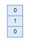

# Softmax 
다중 분류 활성화 함수  

## 1. 개요
시그모이드 함수는 연산 결과를 0과 1사이로 출력하게 하여 해당 값이 둘 중 하나에 속하도록 도와주는 역할로 많이 사용된다. 예를 들어 0이 정상 메일, 1이 스팸 메일이라고 정의해놓는다면 시그모이드 함수의 0과 1사이의 출력값을 스팸 메일일 확률로 해석할 수 있다. 확률값이 0.5를 넘으면 1에 더 가까우니까 스팸 메일로 판단하면 되고, 그 반대라면 정상 메일로 판단하면 된다.  
하지만 분류 대상이 2가지를 넘는다면 시그모이드로는 한계를 보인다. 이를 해결하기 위해 모든 연산 결과의 확률의 합인 확률 분포로 설정을 한다면 확률의 최대 값을 이용하여 다중 분류가 가능하다. 이러한 특성을 가지는 함수가 소프트맥스 함수다.  

## 2. 소프트맥스(Softmax)  
  
소프트맥스 함수는 분류해야하는 클래스의 개수를 k라고 할 때, k차원의 벡터를 입력받아 각 클래스에 대한 확률을 추정한다.  
  
p1, p2, p3 각각은 1번, 2번, 3번 클래스가 정답일 확률을 나타내며 각각 0과 1사이의 값으로 총 합은 1이 된다.  
  
소프트맥스의 함수의 입력으로 사용되는 벡터는 벡터의 차원이 분류하고자 하는 클래스의 개수가 되어야 하므로 어떤 가중치 연산을 통해 3차원 벡터로 변환되어야 한다. 3차원 벡터로 변환하기 위해 가중치 곱을 진행한다. 학습을 진행하면서 Loss를 최소화하는 방향으로 이 가중치 값을 변경한다.  
  
Loss를 구하기 위해서는 실제 값과 비교할 지표가 필요한데 소프트 맥스에서는 결과를 One-Hot Vector로 표현한다. 정답 클래스만 1로 표시하고 나머지는 전부 0으로 표시한다.  

## 3. One-Hot Vector 무작위성  
다수의 클래스를 분류하는 문제에서는 이진 분류처럼 2개의 숫자 레이블이 아니라 클래스의 개수만큼 숫자 레이블이 필요하다. 이때 직관적으로 생각해볼 수 있는 레이블링 방법은 분류해야 할 클래스 전체에 정수 인코딩것이다. 이러한 경우에는 클래스 간 오차범위가 균등하지 못하다는 단점이 있다.  
예를 들어, Banana, Tomato, Apple라는 3개의 클래스가 존재하는 문제가 있다고 하고 MSR로 오차를 구한다고 가정해보자. 실제 값이 토마토이고 예측값이 바나나면 1, 실제 값이 사과고 예측값이 바나나면 4로 결과가 나온다. 즉 네트워크는 바나나가 사과보다 토마토에 가깝다고 학습을 진행한다.  
이처럼 클래스간 관계성이 필요한(자연어처리) 특수한 경우를 제외하고 분류 문제에서는 클래스간 관계를 가지지 않고 균등하게 분배를 하는 것이 중요하다. 이러한 문제를 해결하는 것이 One-Hot Vector방식이다. One-Hot Encoding을 통해 얻은 One-Hot Vector들은 모든 쌍에 대해서 유클리드 거리를 구해도 전부 유클리드 거리가 동일하다. 따라서 One-Hot Vector는 클래스의 표현 방법이 무작위성을 가진다는 점을 표현할 수 있다.  

## 4. 코드
```python
import torch
x = torch.Tensor([[0.8982, 0.805, 0.6393, 0.9983, 0.5731, 0.0469, 0.556, 0.1476, 0.8404, 0.5544]])
log_softmax = torch.nn.LogSoftmax(dim=1)
x_log = log_softmax(x)
```