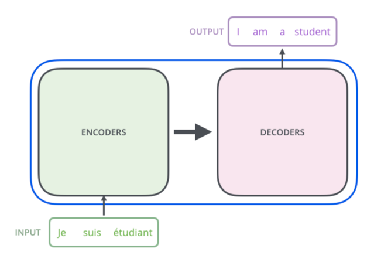
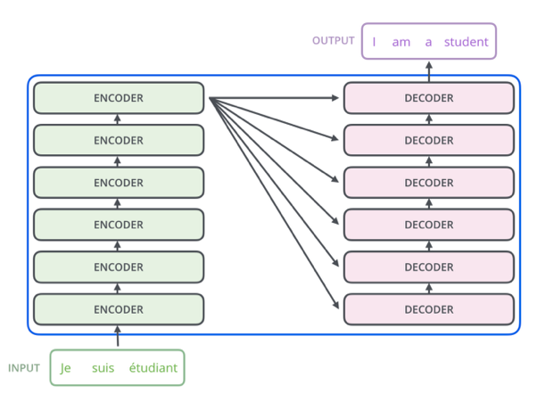
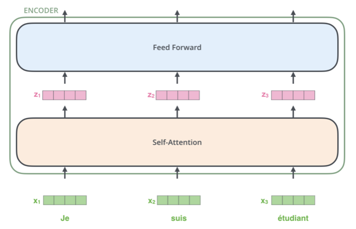
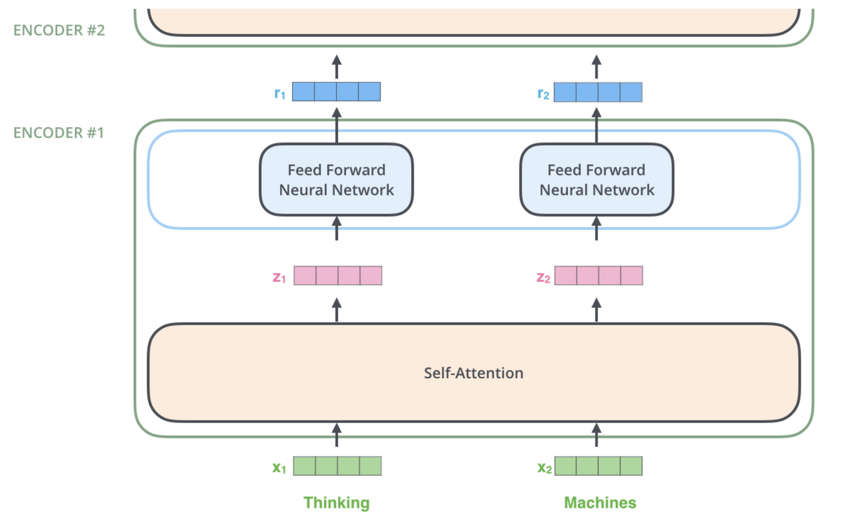
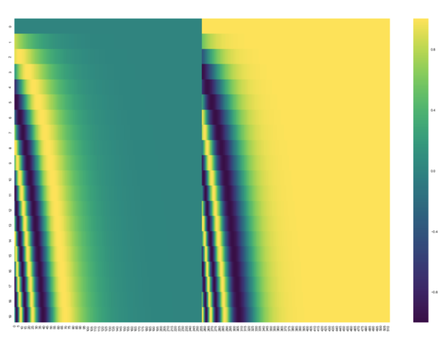
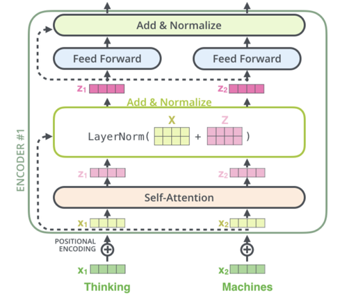

# Transformer  
Transformer  

## 1. 개요  
기존 모델은 CNN, RNN 두 가지를 Base로 설계한 모델이 전부였다. 하지만 2017 NIPS에서 Google이 Transformer라는 새로운 Base를 제안했다. 모델의 핵심은 multi-head sefl-attention을 이용한 sequential computation을 줄여 더 많은 부분을 병렬 처리가 가능하게 만들면서 동시에 더 많은 dependency를 모델링하는 점이다.  

## 2. 전체 구조  
  
번역의 경우를 예시로, 모델을 Block Box형태로 정의하면 모델은 하나의 문장을 입력으로 받아 다른 언어로 된 번역 문장을 출력할 것이다.  

  
Block Box 내부는 encoding, decoding, 사이를 이어주는 connection들이 있다. encoding 부분은 여러개의 encoder를 쌓아 올려 만드는 것이고, decoding 부분은 encoding 부분과 동일한 개수만큼의 decoder를 쌓은 것이다.  

  
  
encoder들은 모두 정확히 똑같은 구조를 가지고 있다. 하나의 encoder는 두 개의 sub-layer로 구성되어 있다. 인코더에 들어온 입력은 먼저 self-attention layer를 지나가게 된다. self-attention layer는 encoder가 하나의 특정한 단어를 encode하기 위해서 입력 내의 모든 다른 단어들과의 관계를 살펴본다. 입력이 self-attention layer를 통과하여 나온 출력은 다시 feed-forward 신경망으로 들어가게 된다. 똑같은 feed-forward 신경망이 각 위치의 단어마다 독립적으로 적용돼 출력을 만든다.  

  
decoder 또한 encoder에 있는 두 layer를 모두 가지고 있다. 다른 점은 두 층 사이에 encoder-decoder attention이 포함되어 있는 것이다. 이는 decoder가 입력 문장 중에서 각 타임 스텝에서 가장 관련 있는 부분에 집중할 수 있도록 해준다.  

## 3. 모델 작동 과정  
  
우선 모든 입력 단어들을 embedding 알고리즘을 이용해 벡터로 바꾼다. 모든 encoder들은 크기 512의 벡터의 리스트를 입력으로 받는다.  

  
각 위치에 있는 단어가 개별적인 path를 통해 encoder에서 흘러간다. self-attention layer에서 이 위치에 따른 path들 사이에 다 dependency가 있는데, feed-forward layer에서는 없기 때문에 feed-forward layer 내의 다양한 path들은 병렬 처리될 수 있다.  

  
encoder는 입력으로 리스트를 받는다. 이 리스트를 먼저 self-attention layer에, 그 다음으로 feed-forward 신경망에 통과시키고 그 결과물을 그 다음 encoder에게 전달한다. 각 위치의 단어들은 각각 다른 self-encoding 과정을 거친다. 그 다음으로 모두에게 같은 과정인 feed-forward 신경망을 거친다.  

## 4. Self-Attention  
### 1. 개요  
  
"그 동물은 길을 건너지 않았다 왜냐하면 그것은 너무 피곤했기 때문이다" 라는 문장을 예시로 든다. 이 문장에서 "그것"이 가리키는 것은 사람에게는 간단한 문제지만 신경망 모델에게는 간단하지 않은 문제다. 모델은 "그것은"이라는 단어를 처리할 때 self-attention을 이용하여 "그것"과 "동물"을 연결할 수 있다. 모델이 입력 문장 내의 각 단어를 처리해 나감에 따라, self-attention은 입력 문장 내의 다른 위치에 있는 단어들을 보고 거기서 힌트를 받아 현재 타켓 위치의 단어를 더 잘 encoding할 수 있다. Transformer에게는 self-attention이 현재 처리 중인 단어에 다른 연관 있는 단어들의 맥락을 붙여주는 method다. "그것"이라는 단어를 encoding할 때, attention 메커니즘은 입력의 여러 단어들 중에서 "그 동물"이라는 단어에 집중하고 이 단어의 의미 중 일부를 "그것"이라는 단어를 encoding할 때 이용한다.  

### 2. 벡터를 이용한 연산방식  
self-attention 계산의 가장 첫 단계는 encoder에 입력된 벡터들로부터 각 3개의 벡터를 만드는 것이다. 각 단어에 대하여 Query 벡터 Key 벡터, Value 벡터를 생성하는데, 이 벡터들은 입력 벡터에 대해서 세 개의 학습 가능한 행렬들을 곱함으로써 만들어진다. 이 새로운 벡터들은 기존의 벡터들 보다 더 작은 64의 크기를 가지고 있다. 이를 통해 multi-head attention의 계산 복잡도를 일정하게 만들 수 있다.  

  
x1에 weight행렬인 WQ를 곱하여 현재 단어와 연관된 query벡터인 q1을 생성한다. 같은 방법으로 각 단어에 대한 query, key, value 벡터를 만든다. query, key, value 벡터는 추상적인 개념으로 attention이 어떻게 계산되는지 알게 되면, 세 개의 벡터들이 어떤 역할을 하는지 알 수 있다.  

  
다음은 점수를 계산하는 과정이다. 단어와 입력 문장 속의 다른 모든 단어들에 대해서 각각 점수를 계산해야 한다. 점수는 현재 위치의 이 단어를 encode할 때 다른 단어들에 대해서 얼마나 집중을 해야 할지를 결정한다. 점수는 현재 단어의 query vector와 점수를 매기려 하는 다른 위치에 있는 단어의 key vector의 내적으로 계산된다.   

  
점수를 계산하고 난 뒤, 이 점수들을 8로 나눈다. 8이라는 숫자는 key 벡터의 사이즈인 64의 제곱 근이라는 식으로 계산된다. 나눗셈을 통해 더 안정적인 gradient를 가진다. 이 값들을 softmax 계산을 통과시켜 모든 점수들을 양수로 만들고 그 합을 1로 만든다. softmax 점수는 현재 위치의 단어의 encoding에 있어서 각 단어들의 표현이 얼마나 들어갈 것인지 결정한다.  

입력의 각 단어들의 value 벡터를 곱해준다. 집중을 하고 싶은 관련이 있는 단어들은 그래도 남겨두고, 관련이 없는 단어들은 0.001과 같은 작은 숫자(점수)를 곱해 없애버리기 위함이다.  

  
마지막으로 이 점수로 곱해진 weighted value 벡터들을 전부 합한다. 이 출력이 현재 위치에 대한 self-attention layer의 출력이다. 이 결과로 나온 벡터를 feed-forward 신경망으로 보낸다. 실제 구현에서는 이 모든 과정이 벡터가 아닌 행렬의 형태로 진행된다.  

### 3. 행렬을 이용한 연산방식  
가장 먼저 할 일은 입력 문장에 대해서 Query, Key, Value 행렬들을 계산하는 것이다. 입력 벡터들을 하나의 행렬 X로 쌓아 올리고, 그것을 학습할 weight 행렬들인 WQ, WK, WV로 곱한다.  

  

행렬 X의 각 행은 입력 문장의 각 단어에 해당한다. 마지막으로, 벡터를 이용한 2단계 ~ 6단계 과정을 하나의 식으로 압축할 수 있다.  

  

## 5. Network Architecture  
### 1. The Beast With Many Heads  
본 논문은 self-attention layer에다 multi-headed attention이라는 메커니즘을 더해 더욱더 이를 개선한다. 이것은 두 가지 방법으로 attention layer의 성능을 향상시킨다.  
- 모델이 다른 위치에 집중하는 능력을 확장시킨다. 위의 예시는 z1이 모든 다른 단어들의 encoding을 조금씩 포함했지만, 자기 자신에게만 높은 점수를 줘 자신만을 포함해도 가능했을 것이다. "그 동물은 길을 언너지 않았다 왜냐하면 그것은 너무 피곤했기 때문이다"와 같은 문장을 번역할 때 "그것"이 무엇을 가리키는지에 대해 알아낼 때 유용하다.  
- attention layer가 여러 개의 representation 공간을 가지게 해준다. multi-headed attention을 이용함으로써 여러 개의 query, key, value weight 행렬들을 가지게 된다. 각각의 행렬들은 랜덤으로 초기화되어 학습된다. 학습된 후에는 각각의 행렬은 입력 벡터들에 곱해져 벡터들을 각 목적에 맞게 투영시킨다. 각 벡터들은 각각 다른 representation 공간으로 나타낸다.  

  

입력 벡터들의 모음인 행렬 X를 WQ, WK, WV 행렬들로 곱해 각 head에 대한 Q, K, V 행렬들을 생성한다. self-attention 계산 과정을 8개의 다른 weight 행렬들에 대해 8번 거치게 되면, 8개의 서로 다른 Z행렬이 생성된다.  

  

여기서 발생하는 문제는 이 8개의 행렬을 바로 feed-forward layer으로 보낼 수 없다는 것이다. 이를 위해 8개의 행렬을 하나의 행렬로 합치기 위해 모두 이어 붙이고, 하나의 또다른 weight 행렬인 W0을 곱한다. 그 결과는 Z행렬이 되고 FFNN으로 보낼 수 있게 된다.  

  

  

"그것"이란 단어를 encode 할 때 여러 개의 attention이 각각 어디에 집중하는지 분석하려고 한다. "그것"이란 단어를 encode 할 때, 주황색의 attention head는 "그 동물"에 가장 집중하고 있는 반면 초록색의 head는 "피곤"이라는 단어에 집중을 하고 있다. 모델은 이 두 개의 attention head를 이용하여 "동물"과 "피곤" 두 단어 모두에 대한 representation을 "그것"의 representation에 포함시킬 수 있다. 하지만 이 모든 attention head들을 하나의 그림으로 표현하면 attention의 의미는 해석하기가 어렵다.  

  

  

### 2. Positional Encoding을 이용한 시퀸스 순서  
Transformer 모델에서 한 가지 부족한 부분은 입력 문장에서 단어들의 순서에 대해서 고려하고 있지 않다는 점이다. 이것을 위해 모델은 각각의 입력 embedding에 "positional encoding"이라고 불리는 하나의 벡터를 추가한다. 이 벡터들은 모델이 학습하는 특정한 패턴을 따르는데, 이러한 패턴은 모델이 각 단어의 위치와 시퀸스 내의 다른 단어 간의 위치 차이에 대한 정보를 알 수 있게 해준다. 이 벡터들을 추가하기로 한 배경에는 이 값들을 단어들의 embedding에 추가하는 것이 query, key, value 벡터들로 나중에 투영되었을 때 단어들 간의 거리를 늘릴 수 있다는 점이다.  

  

모델에게 단어의 순서에 대한 정보를 주기 위하여, 위치 별로 특정한 패턴을 따르는 positional encoding 벡터들을 추가한다. embedding의 사이즈가 4라고 가정한다면, 실제로 각 위치에 따른 positional encoding은 아래와 같다.  

  

아래 그림을 보면 각 행은 하나의 벡터에 대한 positional encoding에 해당한다. 첫 번째 행은 입력 문장의 첫 번째 단어의 embedding 벡터에 더할 positional encoding 벡터다. 각 행은 사이즈 512인, 즉 512개의 셀을 가진 벡터이며 각 셀의 값은 1과 -1사이를 가진다.  

  

20개의 단어와 크기 512인 embedding에 대한 positional encoding의 실제 예시다. 이 벡터들은 중간 부분이 반으로 나눠져 있다. 이유는 왼쪽 반은 sine함수에 의해서 생성되었고, 나머지 오른쪽 반은 또 다른 함수인 cosine 함수에 이해 생성되었기 때문이다. 그 후 이 두 값들은 연결되어 하나의 positional encoding 벡터를 이루고 있다. 이것은 본 적이 없는 길이의 시퀸스에 대해서도 positional encoding을 생성할 수 있기 때문에 scalability에서 큰 이점을 가진다. 예를 들어, 이미 학습된 모델이 자신의 학습 데이터보다도 더 긴 문장에 대해서 번역을 해야 할 때에도 현재의 sinc과 cosine으로 이루어진 식은 positional encoding을 생성할 수 있다.  

### 3. The Residuals  
각 encoder 내의 sub-layer가 residual connection으로 연결되어 있으며, 그 후에는 layer-normalization 과정을 거친다.  

  

이 벡터들과 layer normalization 과정을 시각화하면 아래 그림과 같다.  

  

이것은 decoder 내에 있는 sub-layer에도 똑같이 적용되어 있다. 2개의 encoder, decoder으로 이루어진 단순한 형태의 Transformer를 생각한다면 아래 그림과 같을 것이다.  

  

### 4. Decoder  
Decoder를 설명하기에 앞서 Encoding 단계를 간단하게 아래와 같이 정리한다.  
- encoder가 먼저 입력 시퀸스를 처리하기 시작한다.  
- 그 다음 가장 윗단의 encoder의 출력은 attention 벡터들인 K와 V로 변형된다.  
- 이 벡터들은 각 decoder의 encoder-decoder attention layer에서 decoder가 입력 시퀸스에서 적절한 장소에 집중할 수 있도록 도와준다.  

  

이 encoding 단계가 끝나면 이제 decoding 단계가 시작된다.  
- decoding 단계의 각 스텝은 출력 시퀸스의 한 element를 출력한다.  
- decoding step은 decoder가 출력을 완료했다는 special 기호인 <end of sentence>를 출력할 때 까지 반복된다.  
- 각 스텝마다의 출력된 단어는 다음 스텝의 가장 밑단의 decoder에 들어가고 encoder와 마찬가지로 여러 개의 decoder를 거쳐 올라간다.  
- encoder의 입력에 했던 것과 동일하게 embed를 한 후 positional encoding을 추가하여 decoder에게 각 단어의 위치 정보를 더해준다.  

  

decoder 내에 있는 self-attention layer들은 encoder와는 다르게 동작한다. decoder에서의 self-attention layer는 output sequence 내에서 현재 위치의 이전 위치들에 대해서만 attend 할 수 있다. 이 것은 self-attention 계산 과정에서 softmax를 취하기 전에 현재 스텝 이후의 위치들에 대해서 maskng을 해줌으로써 가능해진다. encoder-decoder attention layer는 multi-head self-attention과 한 가지를 제외하고는 똑같은 방법으로 작동하는데, 한 가지 차이점은 Query 행렬들을 그 밑의 layer에서 가져오고 Key와 Value 행렬들을 encoder의 출력에서 가져온다는 점이다.  

### 5. Linear Layer AND Softmax Layer  
여러 개의 decoder를 거치고 난 후에는 소수로 이루어진 벡터 하나가 남게된다. 이 벡터를 단어로 바꾸는 Layer가 Linear Layer AND Softmax Layer에서 수행한다.  

Linear layer는 fully-connected 신경망으로 decoder가 마지막으로 출력한 벡터를 그보다 훨씬 더 큰 사이즈의 벡터인 logits 벡터로 투영시킨다. 학습 데이터에서 10000개의 단어를 학습했다고 가정하면, logits vector의 크기는 10000이 될 것이다. 벡터의 각 셀은 그에 대응하는 각 단어에 대한 점수가 된다.  

Softmax layer는 위에서 계산된 점수들을 확률로 변환해주는 역할을 한다. 셀들의 변화된 확률 값들은 모두 양수 값을 가지며 다 더하게 되면 1이 된다. 가장 높은 확률 값을 가지는 셀에 해당하는 단어가 해당 스텝의 최종 결과물로서 출력되게 된다.  

  

## 6. Training Strategy  
### 1. Training  
학습 과정 동안, 학습이 되지 않은 모델은 정확이 같은 forward pass 과정을 거칠 것이다. 그러나 label이 있는 학습 데이터 셋을 학습시키는 중이므로 모델의 결과를 실제 정답과 비교할 수 있다.  

  

모델의 output vocabulary는 학습을 시작하기 전인 preprocessing 단계에서 완성된다. 이 output vocabulary를 정의한 후에는, 이 vocabulary 크기의 벡터를 이용하여 각 단어를 표현할 수 있다.  

### 2. Loss Function  
"merci"라는 불어를 "thanks"로 번역하는 예를 든다. 원하는 모델의 출력은 "thanks"라는 단어를 가리키는 확률 벡터다. 하지만 아직 학습이 되지 않았기 때문에, 모델의 출력이 그렇게 나올 확률은 매우 작다.  

  

학습이 시작될 때 모델의 parameter들 즉 weight들은 랜덤으로 값을 부여하기 때문에, 아직 학습이 되지 않은 모델은 그저 각 셀(word)에 대해서 임의의 값을 출력한다. 이 출력된 임의의 값을 가지는 벡터와 데이터 내의 실제 출력 값을 비교하여, 그 차이와 backpropagation 알고리즘을 이용해 현재 모델의 weight들을 조절해 원하는 출력 값에 더 가까운 출력이 나오도록 만든다. 두 확률 벡터를 비교하는 방법은 하나의 벡터에서 다른 하나의 벡터를 빼는것이다.  

문제는 실제 학습상황에서는 한 단어보다는 긴 문장을 사용할 것이다. 이러한 상황에서 모델의 출력은 각 단어에 대한 확률 분포를 output vocabulary 크기를 가지는 벡터에 의해서 나타내 진다. decoder가 첫 번째로 출력하는 확률 분포는 "i"라는 단어와 연관이 있는 셀에 가장 높은 확률 값을 줘야 한다. 두 번째로 출력하는 확률 분포는 "am"라는 단어와 연관이 있는 cell에 가장 높은 확률을 줘야 한다. 마지막 "end of sentence"를 나타내는 다섯 번째 출력까지 이 과정은 반복된다.  

  

위 그림은 학습에서 목표로 하는 확률 분포를 나타낸 것이다. 모델을 큰 사이즈의 데이터 셋에서 충분히 학습을 시키고 나면, 그 결과로 생성되는 확률 분포들은 아래와 같아질 것이다.  

  

한 가지 특이한 점은, 학습의 목표로 하는 벡터들과는 달리, 모델의 출력 값은 비록 다른 단어 들이 최종 출력이 될 가능성이 거의 없다 해도 모든 단어가 0보다는 조금씩 더 큰 확률을 가진다. 이것은 학습 과정을 도와주는 softmax layer의 매우 유용한 성질이다.  

모델은 한 타임 스텝당 하나의 벡터를 출력하기 때문에, 모델이 가장 높은 확률을 가지는 하나의 단어만 저장하고 나머지는 버린다고 생각하기 쉽다. 하지만 그것은 greedy decoding이라고 부르는 한 가지 방법일 뿐이며 다른 방법들도 존재한다.  

예를 들어 가장 확률이 높은 두 개의 단어를 저장할 수 있다. 이러한 경우 모델을 두 번 돌리게 된다. 한 번은 첫 번째 출력이 "I"라고 가정하고 다른 한 번은 "student"라고 가정하고 두 번째 출력을 생성해보는 것이다. 이렇게 나온 결과에서 첫 번째와 두 번째 출력 단어를 동시에 고려했을 때 더 낮은 에러를 보이는 결과의 첫 번째 단어가 실제 출력으로 선택된다. 이 과정을 두 번째, 세 번째, 그리고 마지막 타임 스텝까지 반복해 나간다. 이렇게 출력을 결정하는 방법을 "beam search"라고 부르며, 고려하는 단어의 수를 beam size, 고려하는 미래 출력 개수를 top_beams라고 부른다.  

## 7. 출처  
본 글은 아래 블로그를 참고로하여 정리한 내용입니다.  
https://ahnjg.tistory.com/57  