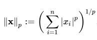
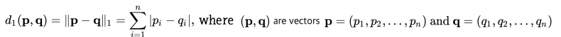
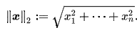
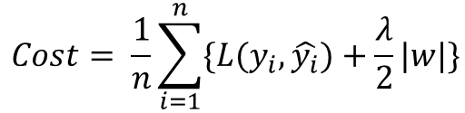
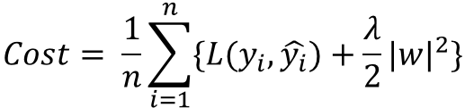

# L1L2    

## 1. Diffrence Norm  
Norm은 벡터의 크기(혹은 길이)를 측정하는 방법(혹은 함수)이다. 두 벡터 사이의 거리를 측정하는 방법이기도 하다.  
  
＊p = 1 이면 L1 Norm, P = 2 이면 L2 Norm.  
＊n은 해당 벡터의 원소 수  

### 1. L1 Norm  
  
L1 Norm 은 벡터 p, q 의 각 원소들의 차이의 절대값의 합이다.
예를 들어 벡터 p =(4, 1, -2), q = (5, 0, 7) 이라면 p, q의 L1 Norm 은 |4-5| + |1-0| + |-2 -7| = 1 + 1 + 9 = 11 이다  

### 2. L2 Norm  
  
L2 Norm 은 벡터 p, q 의 유클리디안 거리(직선 거리)다. 여기서 q 가 원점이라면 벡터 p, q의 L2 Norm 은 벡터 p 의 원점으로부터의 직선거리다.  

이러한 특성 때문에 L2 Norm은 오직 두 점사이의 직선으로만 표현될 수 있지만 두 점사이의 거리를 표현하는데 비교적 다양한 방식으로 표현될 수 있다.  

## 2. Difference Loss  
  
y_i 는 실제 값을, f(x_i)는 예측치를 의미한다. 실제 값과 예측치 사이의 오차 값의 절대값을 구하고 그 오차들의 합을 L1 Loss 라고 한다.  

  
L2 Loss는 오차의 제곱의 합으로 정의된다.  

L2 Loss는 오차의 제곱을 더하기 때문에 Outlier에 더 큰 영향을 받는다. 즉 L1 Loss가 Outlier에 둔감하다라고 표현할 수 있다.  

Outlier가 적당히 무시하는 방향이면 L1 Loss, 많이 신경을 써야하면 L2 Loss를 사용하는 것이 대중적이다.  

주의할 점은 L1 Loss는 0인 지점에서는 미분이 불가능하다.  

## 3. Diffrence Regularization  
Regularization(일반화)는 Overfitting을 예방하고 Generalization 성능을 높이는데 도움을 주는 방법이다. L1 Regularization, L2 Regularization, Dropout 등이 있다.  

model이 overfitting으로 진행되는 원인 중 하나는 cost값이 작아지는 과정에서 특정 weight값이 너무 커지기 때문에 일반화가 힘들어지는 것이다.  

위 수식은 L1 Regularization을 표현한 것인데, 가장 중요한 것은 cost function에 weight의 절대값을 더해준다는 것이다. 기존 함수에 수식이 사용되면서 weight값이 너무 크지 않은 방향으로 학습되도록 한다.  

위 수식은 L2 Regularization을 표현한 것인데, weight의 제곱을 더하여 값이 너무 커지지 않도록 학습되게 한다.  

벡터 p,q의 값을 p = (0.3, -0.3, 0.4), q = (0.5, -0.5, 0)로 가정한다.  
L1 Norm으로 계산하면 수식은 아래와 같다.  
|0.3| + |-0.3| + |0.4| = 1  
|0.5| + |-0.5| + |0| = 1  

L2 Norm으로 계산하면 결과는 각각 0.583095, 0.707107이다.  

위 수식의 결과로 L2 Norm은 각각의 벡터에 관해서 항상 특정한 결과를 출력한다. 하지만 L1 Norm은 경우데 따라 특정 요소가 달라도 같은 결과를 나타낼 수 있다. 즉, L1 Norm은 Feature Selection이 가능하고 Sparse Model에 적합하다. 이러한 특징 때문에 convex optimization에 유용하게 쓰인다.  