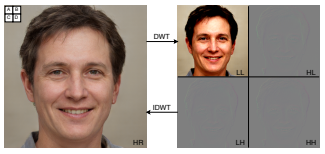

# Wavlet 웨이블릿    

## 1. 정의  
  
웨이블릿 변환은 Low BandPass Filter, High BandPass Filter를 이미지에 적용하여 주파수 대역으로 이미지를 압축하는 기법이다. 2차원 이미지의 각 행에 대해 저역 통과 필터와 고역 통과 필터를 적용시켜 저주파 대역과 고주파 대역으로 분리해서 4개의 서브이미지를 생성한다.  
- LL : 원본 이미지에 수평과 수직방향으로 저역 통과 필터를 적용하여 2로 서브 샘플링 된 것
- HL : 수직방향으로 고역 통과 필터를 적용한 것으로 수직방향의 주파수의 오차 성분을 포함하고 있다.
- LH : 수평방향으로 고역 통과 필터를 적용한 것으로 수평방향 주파수의 오차 성분을 포함하고 있다.
- HH : 수평과 수직 방향에 고역 통과 필터를 적용한 것이다.  

웨이블릿은 디지털 신호 처리 및 이미지 압축에 사용되는 유용한 수학 함수로 푸리에 분석과 비슷하다. 이를 이용하여 잡음 속에 섞인 약한 신호를 복원할 수 있다.  

## 2. 효과  
웨이블릿 기반 방식은 픽셀 접근 방식보다 더 많은 구조적 정보를 포함하기 때문에 정확도 손실 없이 저해상도 Feature Map을 사용해서 고화질 이미지를 생성할 수 있다.