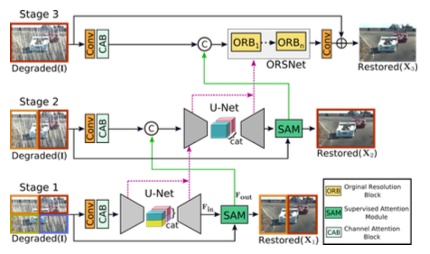
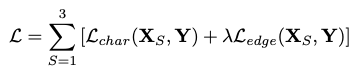
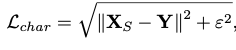
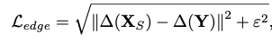
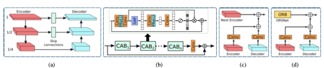
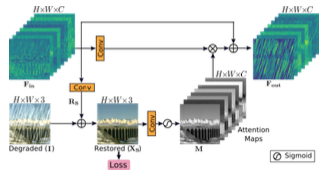

# MPRNet  
Multi-Stage Progressive Image Restoration   

## 1. 개요  
이미지 복원은 spatial details, high-level conceptualized information 사이의 복잡한 균형을 요구한다. 본 논문에서는 이 둘 사이의 균형을 최적의 조건으로 해결할 수 있는 새로운 synergistic design 을 제안한다. 제안하는 구조는 다단계 구조인데, 입력 값의 열화를 복원하기 위한 학습을 점진적으로 진행하고 전체적인 복원과정을 더 많이 관리할 수 있는 단계로 분할한다. 구체적으로, 제안하는 모델은 우선 encoder-decoder 구조를 통해 contextualized features를 학습한뒤, local information을 유지한 HR 이미지와 함께 결합한다. 각각의 단계에서, reweight the local features를 위해 in-situ supervised attention을 사용하는 새로운 per-pixel adaptive design을 도입한다. Multi-stage 구조에서 중요한 부분은 다른 단계 사이의 정보교환이다. 이를 위해, two faceted(양면) 접근법을 제안한다. 이 방법은 가까운 곳에서 먼 단계까지 순차적으로 교환될 뿐만 아니라 feature processing blocks 사이의 연결도 정보의 손실을 피하기위해 존재한다. 내부의 단단하게 결합하는 multi-stage architecture를 MPRNet라고 부르며, deraining, deburring, denoising을 포함한 다양한 분야의 데이터 셋 안에서 강력한 성능을 보여준다.  

## 2. Introduction  
이미지 복원은 열화된 이미지로부터 깨끗한 이미지를 복원하는 작업이다. 일반적인 열화의 예로 noise, blur, rain, haze 등이 있다. 이것들은 무한하게 존재하는 매우 안좋은 문제점이다. 실제 이미지의 Solution Space를 제한하기 위하여 명시적으로 경험적 관측과 수동으로 제작된 image priors를 명시적으로 사용하는 기술이 등장하였다. 그러나 priors를 설계하는 것은 어렵고, 종종 일반화할 수 없다. 이 것을 개선하기 위해 최근 발표된 논문은 큰 규모의 데이터로부터 자연적인 이미지 상태를 포착하여 묵시적으로 general priors 배우는 CNN을 사용한다. CNN기반 방식의 성능은 주로 모델의 구조에 따라 정해진다. 이미지 복원을 위한 수 많은 네트워크 모델과 함수들은 residual learning, dilated convolutions, attention mechanisms, dense connections, encoder-decoders, generative models 등을 포함하여 개발된다.  

그럼에도 불구하고, low level vision 분야에서 사용되는 이러한 모델들은 single-stage 형태로 설계된다. 대조적으로 multi-stage 네트워크는 pose-estimation, scene parsing, action segmentation 등과 같은 high level vision 분야에서 single-stage에 비해 더 효과적으로 알려져있다. 최근에는 debarring, deraining 등에 multi-stage 형식의 설계를 위해 많이 노력하고 있다. 본 논문에서는 성능에 영향을 주는 구조적인 bottlenecks들을 확인하기 위해 이러한 접근법들을 분석한다.  

첫 번째로, 존재하는 multi-stage 기술은 넓은 범위의 contextual information을 encoding 하는데 효과적이지만 spatial image details를 보존하는데 신뢰성이 떨어지는encoder-decoder 구조를 사용하거나 spatially 정확도를 제공하지만 의미적으로 덜 신뢰되는 결과를 제공하는 single-scale pipline 을 사용한다. 그러나, multi-stage 구조에서 두 가지 설계방법을 합치는것이 효과적인 이미지 복원에 필요하다.
두 번째로, 단순하게 하나의 단계의 출력을 다음 단계로 통과시키는 것은 차선책인 결과를 생산한다. 세 번째로, round-truth supervisiion을 점진적인 복원을 위해 각각의 단계에 제공하는 것은 중요하다. 마지막으로, multi-stage 처리과정에서 intermediate features들을 가까운 곳에서 먼 곳으로 전파하기 위한 기법은 encoder-decoder branches로부터 conceptualized features를 보존하는데 필수적이다.  

Multi-stage progressive image restoration architecture, MPRNet을 중요한 요소와 함께 제안한다.  
1) earlier stages는 multi-scale contextual information을 학습하기 위해 encoder-decoder를 사용하고, 마지막 stage는 fine spatial details를 보존하기 위해 원본 이미지의 해상도에서 작동한다.  

2) Supervised attention module (SAM)은 점진적인 학습을 가능하게 하기위해 모든 두 단계사이를 연결한다. Ground-truth 이미지의 안내와 함께 이 모듈은 다음 단계로 넘기기 전에 이전 단계의 features를 개선하는데 사용되는 attention maps을 계산하기 위해 이전 단계의 예측을 이용한다.  

3) cross-stage feature fusion (CSFF) 기법이 추가되며, 이 기법은 가까운 단계부터 마지막 단계까지 multi-scale contextualized features를 전파하는데 도움이된다. 더욱이, 이 방법은 단계를 수행하는 중에 information flow를 완화시킨다, 그리고 multi-stage 네트워크 최적화과정을 안정화하는데 효과적이다.  

contextually-enriched and spatially accurate 결과를 생성하는데 유용한 새로운 multi-stage 접근법. Multi-stage 때문에, 본 논문의 framework는 열화된 이미지를 점진적으로 복원하기위해 서브 task를 통해 이미지 복원 분야의 한계점을 무너뜨린다. 효과적인 supervised attention module은 features들을 전파하기 전에 들어오는 features들을 개선하는 모든 단계에서 복원된 이미지에 대한 모든 장점을 가진다. 본 논문에서는 새로운 최신 열 개의 구조와 deraining, deblurring, denoising 등을 포함한 실생활의 데이터셋을 이용한 다양한 해상도를 설정하여 MPRNet모델의 효과를 증명한다. 더욱이 구체적인 ablations, qualitative 결과, 생성 test를 제공한다.  

## 3. Method  
  
### 3.1 Multi-Stage Progressive Restoration  
이미지 복원을 위한 프레임워크는 그림 2와 같으며, 점진적인 이미지 복원을 위한 3개의 단계로 구성되어 있다. 처음 두 개의 단계들은 거대한 receptive fields들 때문에 넓은 contextual information을 학습하는 encoder-decoder subnetworks 구조를 기반으로 하고있다. 이미지 복원이 입력과 출력 사이의 pixel-to-pixel 상관관계를 필요로 하는 position-sensitive task이기 때문에, 마지막 단계는  다운 샘플링 연산 없이 원본 입력 이미지의 해상도에서 작동하는 subnetwork를 사용하여 설계된 올바른 texture를 보존한다. 간단한 계단식 다중 stages 대신에, 본 논문에서는 모든 두 stages 사이에서 supervised attention module을 통합한다. Ground-truth 이미지의 supervision과 함께, 모듈은 이전 stage의 feature maps들을 다음 stage로 넘기기 전에 재조정한다. 더욱이, earlier subnetwork의 intermediate multi-scale contextualized features들이 latter subnetwork의 intermediate features들을 통합하는데 도움이 되는 cross-stage feature fusion 기법을 도입한다.  

비록 MPRNet이 다양한 stages들을 쌓아도, 각각의 stage는 입력 이미지에 대한 접근성을 가지고 있다. 본 논문에서도 입력이미지에 multi-patch hierachy를 적용하고 이미지를 non-overlapping patches로 분할하고, 원본 이미지를 마지막 단계에서 사용한다. 주어진 단계 S에서 복원된 이미지 XS를 직접 예측하는 대신 제안된 모델은 다음을 얻기 위해 열화 입력 이미지 I가 추가된 residual 이미지 RS를 예측한다. XS = I + RS . 본 논문에서는 다음과 같은 손실 함수로 MPRNet을 최적화한다.  

  

Y는 ground-truth 이미지를 표현하고, Lchar는 Charbonnier Loss를 의미한다.  

  

ε값은 1e-3값으로 설정하고, Ledge는 edge loss를 의미한다.  

  

∆는 Laplacian 함수를 의미한다. 파라미터 λ는 두 loss 사이의 간격의 연관된 중요성을 조절하고 0.05로 설정한다.  

### 3.2 Complementary Feature Processing  
대부분의 이미지 복원을 위한 single-stage CNN 모델은 아래 구조들로 설계된다.  

- Encoder-decoder  
- Single-scale feature pipeline  

Encoder-decoder 네트워크는 처음으로 입력 값을 low-resolution으로 점진적으로 매핑시키고, 반대 과정도 점진적으로 원본 이미지와 매핑시킨다. 이러한 과정을 진행하면서 down sampling의 반복으로 인하여 spatial detail 정보가 손실된다. 대조적으로 single-scale feature pipeline 방식은 올바른 spatial details 들을 가지는 이미지를 생성하는 것과 관련이 있다. 하지만 출력 결과들은 제한적인 receptive field 때문에 의미론적으로 덜 견고하다. 즉, spatially accurate, contextually outputs들 중 하나를 선택해야 하는 제한사항이 발생한다. 두 설계 방식의 장점을 가져오기 위하여 인접 네트워크는 encoder-decoder network, 마지막 단계는 original input 해상도에서 작동하는 방식인 multi-stage framework 을 제안한다.  

  

위 그림a 가 encoder-decoder U-Net 기반으로 설계된 네트워크다. 처음으로 각각의 scale의 특징을 추출하기 위하여 channel attention blocks을 추가한다. 두 번째로, U-Net의 feature maps의 Skip connections들을 사용한다. 마지막으로 Transposed convolution 대신에 convolution layer 후에 bilinear upsampling을 사용한다. 이것은 Transpose convolution 과정에서 이미지에서 종종 발견되는 checkerboader artifacts를 제거하는데 도움이된다.  

그림의 b와 같이 입력 이미지에서 출력 이미지 까지 올바른 세부사항들을 보존하기 위하여, 마지막 단계에 original-resolution subnetwork (ORSNet)을 사용한다. OSRNet은 downsampling operation을 사용하지 않고 spatially-enriched high-resolution features들을 생성한다. 이 것은 다수의 original resolution blocks (ORBs)로 구성되고, 각각은 CABs를 포함한다.  

### 3.3 Cross-stage Feature Fusion  
본 논문에서는 두 encoder-decoders 사이, encoder-decoder와 OSRNet 사이에 CSFF를 사용한다. 하나의 단계의 특징들은 다음 단계로 전파되기 전에, 1x1 convolution에 의해 재정의된다. 제안하는 CSFF는 몇몇 장점을 가지고 있다. 첫 번째로 encoder-decoder 구조에서 반복적인 up-down 연산을 사용하기 때문에, 정보 손실로 인한 네트워크의 취약점을 줄여준다. 두 번째는 하나의 단계의 다수의 scale features는 다음 단계의 정보를 풍부하게 하는데 도움을 준다. 세번째는 네트워크 최적화 절차는 전체 네트워크에 몇몇 단계를 추가하게 해서 정보의 흐름을 쉽게하는데 더 안정적이게 한다.  

### 3.4 Supervised Attention Module  
최근 이미지 복원을 위한 multi-stage network는 각각의 단계에서 직접적으로 예측을 하고, 그 후에 다음 연속적인 단계로 통과시킨다. 본 논문에서는 기존 방법 대신에, 모든 두 개의 단계 사이에 supervised attention module을 사용하고, 이것은 상당한 성능을 얻는데 용이하게 할 것이다. SAM의 개략도는 그림 4, 이 것은 두가지 관점에서 도움이 된다. 첫번째로 각각의 단계에서 점진적인 이미지 복원에 도움이 되는 ground-truth supervisory를 제공한다. 두 번째는 현재 단계에서 다음 단계로의 전파를 위해 정보 손실을 줄이고 유용한 것만 허용하기 위해 locally supervised predictions과 함께 attention maps를 생성한다.  

  

위 그림과 같이 SAM은 초기 단계의 features를 사용하고, 처음으로 생성된 residual 이미지를 1x1 convolution과 함께 사용한다. Reisdual 복원 이미지를 얻기 위한 이미지는 열화가 추가된 입력 이미지다. 결과를 예측하기 위해서 원본 이미지의 explicit supervision을 제공한다. 다음으로, per pixel attentiion masks들은 이미지 Xs로 부터 1x1 convolution 연산과 뒤 이어오는 sigmoid 연산에 의해 생성된다. 이러한 마스크들은 local features의 변형을 재 조정하기 위해 사용되고, 결과로 identity mapping path를 위해 추가된 attention-guided features를 생성한다. 마지막으로 SAM에 의하여 생성된 attention-augmented feature representation Fout은 더 좋은 처리를 위하여 다음 단계로 통과된다.