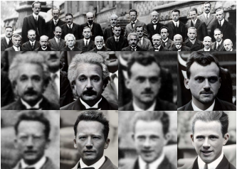
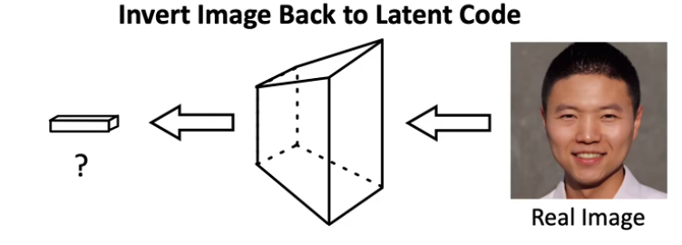
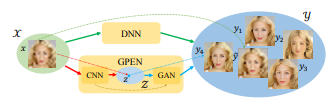
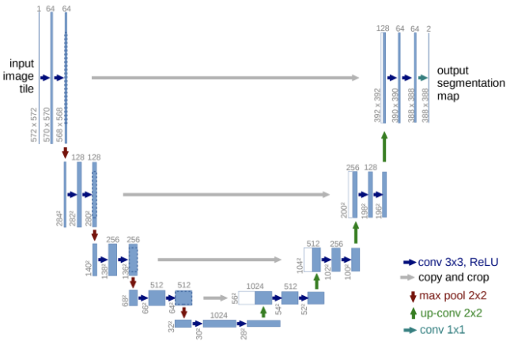
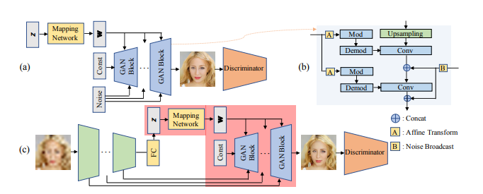
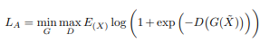
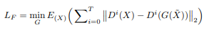
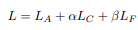
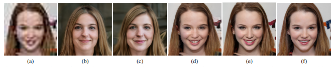

# GPEN  
GAN Prior Embedded Network for Blind Face Restoration in the Wild  

## 1. 개요  
  
기존 에는 얼굴 이미지를 복원하기 위해 Degradation Model 및 Handcrafted Priors를 기반으로 저하된 얼굴 이미지를 복원하였다. 하지만 이러한 방식들은 제한되는 성능을 많이 보인다. 최근에는 다양한 연구가 진행되어 많은 진전이 있었지만 실생활에서 발생한 알 수 없고 복잡한 저하로 인한 LQ(Low Quality) 얼굴 이미지의 블라인드 복원(BFR)은 여전히 어려운 연구 과제로 남아있다.  
이러한 문제를 해결하기 위하여 [49], [29, 28, 9], [16], [27] 등 여러 BFR(Blind face restoration) 방법이 제안되었다.  [47] 논문 또한 얼굴 디테일을 점진적으로 보충하기 위한 CSR 접근법을 제안하였지만 인위적으로 손상된 얼굴 이미지에는 인상적인 결과를 보이지만 실생활에서 저하된 이미지에 대하여 좋은 결과를 보이지 못했다.  
Pix2Pix, CGAN 방식으로 입력 이미지에서 출력이미지로의 HR 직접 매핑을 학습하면 보다 현실적인 결과를 얻지만 지나치게 매끄럽게 만드는 경향이 있다.  
[38] 최근에는 GAN이 급속도로 발전하는 가운데 인코더 네트워크를 사용하여 일련의 스타일 벡터를 사전 훈련된 Generator에 공급하기 전에 생성하여 일반적인 Image to Image 변환 프레임워크를 구축하였다. 하지만 이러한 방법은 비시각적 이미지 초고해상도 문제에만 적용될 수 있다.  
하지만 기존 GAN 훈련 방식은 사전 훈련된 GAN을 변경하지 핞고 유지를 하는데 그렇게 하면 복잡한 배경의 실제 LQ 얼굴 이미지를 처리할 때 복원된 얼굴의 화질이 불안정하게 된다.  

이러한 문제를 해결하기 위해 제안하는 모델은 일련의 합성 LQ-GQ 얼굴 이미지 쌍에 의해 미세 조정되며 U형태 DNN에 적합하도록 깊게 설계, 깊은 특징은 Global 얼굴 재현을 위한 Code를 생성하는데 사용되고 얕은 특징은 노이즈로 사용되어 Local 얼굴 디테일을 생성하고 이미지 배경을 유지한다. 이러한 방식으로 과도한 부드러움 문제를 피할 수 있다.

## 2. 이전까지의 연구
### 1. Face Image Restoration
이전까지 얼굴 이미지 복원에 대한 다양한 연구가 이루어졋다.
[50] LQ 이미지에서 얼굴 인식을 처리하기 위하여 Sparse 표현을 사용하여 공동 Blind 이미지 복원 및 인식 방법을 제시를 하였다. [13], [24, 40], [48, 31], [25, 30] 등의 이미지 복원 작업을 해결하는 데 있어 DNN의 전례 없는 성공과 함께, 많은 DNN 기반 얼굴 이미지 복원 방법도 제안되었다. [7, 23, 33] 얼굴 이미지가 특정 구조를 가지고 있다는 점을 감안해 성능 저하 모델을 알지 못한 채 심하게 저하된 이미지에서 선명한 얼굴 이미지를 복원하는지 흥미로운 조사도 진행하였다. [17] 초 저해상도 얼굴 이미지를 초 고해상도화 할 수 있는 웨이블릿 기반 접근방식을 제시하였다. [7] HR 얼굴을 복원하기 전에 얼굴 형상 학습, [33] 얼굴 이미지 복구와 랜드마크 평가에 대한 두 반복 네트워크 간의 반복적인 협업을 통해 얼굴 초고해상도 작업을 수행, [29] 가이드 이미지와 래퍼 하위 네트워크를 사용하여 LR 입력과 HR 가이드 이미지 간의 외관 변화를 처리, 해당 작업은 제약없는 얼굴 이미지[9], 다중 예시 이미지[28], 다중 스케일 구성요소 사전[27]을 사용하여 더욱 확장시킴 [16] 날카로운 얼굴 구조를 파악하기 위해 3D 안면 이전을 명시적으로 통합 [47] 얼굴 디테일을 점진적으로 보충한다.  
기존 모델들은 인위적으로 저하된 얼굴 이미지에는 인상적인 결과를 만들어 냈지만 실제 시나리오에서는 실패하는 경우가 많았다. 이는 실생활에서 심각하게 저하된 얼굴 이미지에서는 얻기 어려운 정보로 예측할 수 없는 실패로 이어지기 때문이다.

### 2. Generative Adversarial Network(GAN)  
[11]등 다양한 논문으로 GAN 모델을 학습하는데 큰 진전이 있었다. GAN은 사실적인 이미지를 생성할 수 있는 강력한 모델로 다양한 애플리케이션이 있는데 대표적으로 이미지 인페이팅[48], 초해상도[25, 44], 이미지 컬러화[18, 42], 텍스처 합성[41] 등이 있다.  
특히 영상 합성을 위한 더 많은 사용자 제어를 제공하기 위해 조건부 GAN(cGAN)은 서로 다른 조건 정보를 가진 정보를 공급해서[37, 18, 52] 다양한 Image To Image 변환 문제를 성공적으로 처리한다. [18]에서 cGAN이 Image To Image 변환 문제에 대한 범용 해결책으로 사용될 수 있음을 보여준다.  
무감독 학습[52], 분리 학습[26], 소수점 학습[32], 고해상도 이미지 합성[43], 다중 도메인 변환[8], 다중 모드 변환[53]과 같은 많은 후속 작업이 CGAN을 다른 시나리오로 확장하기 위해 제안되었다.  
하지만 cGAN은 입력 도메인에서 출력 도메인으로의 직접적인 매핑을 학습하지만 불행하게도 생성된 결과는 BFR과 같이 매우 적절하지 않은 작업에서 지나치게 부드러워 진다.  

### 3. GAN Prior for Image Generation  
  
GAN inversion의 목표는 input image를 복원할 수 있는 가장 적절한 latent code를 찾아내는 것이다. 기존 방식은 latent code[1]를 최적화 하거나 추가 인코더를 학습하여 이미지 공간을 잠재 공간으로 다시 투영한다.[12, 38]  
이후 발표된 StyleGAN의 확장된 latent space에 이미지를 내장하여 추가 의미 이미지 편집 작업을 수행할 수 있다. [12] 여러 latent code를 사용하여 최종 이미지를 출력하기 위한 여러 피쳐 맵을 생성했습니다. 하지만 이러한 방식은 속도가 느리기때문에 PixelToStyleToPixel(pSp)[38] 방식으로 추가적인 최적화 과정없이 실제 이미지를 확장된 잠복 공간에 내장하여 광범위한 Image To Image 변환 작업에 사용할 수 있다.  
[34] HR 자연 이미지 다양체를 횡단하여 원본 LR 이미지로 축소할 수 있는 이미지를 검색하는 자체 감독 방식을 제안했습니다. GAN 반전은 실제 애플리케이션에 GAN을 적용하기 위한 중요한 단계다. 그러나  이미지 공간을 다시 잠재 공간으로 완벽하게 투영하기는 어렵다. [46] GAN을 사용한 이미지 생성에 도메인 적응 적용하는 일부 작업도 제안이 되었다.  
이러한 작업은 원본 도메인에서 다른 대상 도메인으로 지식을 전달하는 것을 목표로 하며, 이 작업에서는 원본 도메인과 대상 도메인이 동일하다

## 3. GPEN 네트워크  
### 1. Motivation and Framework  
  
BFR의 기본적인 과정은 LQ x를 매핑함수를 통해 HQ Y로 변환하는 것이다. 하지만 Y에는 입력 x와 일치할 수 있는 수 많은 이미지가 있다. 이러한 이유로 일대일 매칭이 아닌 일대다 매칭이 된다. 또한 이러한 이유로 최종적인 결과는 HQ의 평균이 되는 경향이 있고이는 지나치게 부드러워지는 문제가 발생해 Detail을 잃어버리게 된다.[6]  
cGAN 방법[18, 43]은 매핑의 불확실성을 줄이기 위하여 적대적 훈련을 통해 이 문제를 부분적으로 희석시킬 수 있다. 하지만 성능저하가 심각하면 cGAN은 사실적인 텍스처와 Detail을 가진 선명한 얼굴 이미지를 거의 생성하지 못한다. 그림5참고  
GPEN 네트워크는 이러한 문제를 해결하기 위해 이전 방법과 달리 먼저 GAN 이전 네트워크를 학습한 다음 HQ 얼굴 이미지 복원을 위한 디코더로 DNN에 내장한다.  
CNN 인코더는 입력 성능 저하 이미지 x를 GAN의 잠재 공간 Z에서 원하는 잠재 코드 z에 매핑하는 방법을 배운다. 또한 Generator를 통해 원하는 HQ얼굴 이미지를 재현할 수 있다. 이렇게해서 일대일 매핑으로 변경하고 일대일 매핑으로 기존 일대다 매핑의 불확실성을 크게 완화한다.  
GAN 반전 방법[12,34, 38]은 우리의 GPEN과 유사한 아이디어를 공유하지만 일관되고 편리한 얼굴 조작을 위해 사전 훈련된 GAN을 변경하는 GPEN과 달리 변경하지 않고 유지하는것에 유의해야 한다.  

### 2. Network Architecture
#### 1. The GAN prior network.  
  
U-Net [39]은(는) 많은 이미지 복원 작업에서 성공적이고 광범위하게 사용되었으며 [43, 13] 이미지 세부 정보 보존에 있어 그 효과를 입증했다.  
  
GPEN은 전반적으로 U자형 인코더-디코더 아키텍처를 따른다. GAN 선행 네트워크는 1) HQ 얼굴 이미지를 생성할 수 있으며 2) Ushaped GPEN에 디코더로 쉽게 내장할 수 있는 두 가지 요건을 충족하도록 설계되어야 한다. GAN [21, 22], 우리는 그림 3(a)에서와 같이 잠재 코드 z를 덜 얽힌 공간에 투영하기 위해 매핑 네트워크를 사용합니다. w가 각 GAN 블록으로 브로드캐스트됩니다 U-shaped DNN에 내장되기 때문에 Ushaped DNN의 인코더가 추출한 생략 피쳐 맵에 대한 공간을 남겨 두어야 합니다  각 GAN 블록에 추가 노이즈 입력을 제공합니다  
이 작품에서 우리는 스타일의 아키텍처를 채택합니다. HQ 이미지를 생성할 수 있는 높은 기능으로 인해 GAN v2(그림 3(b) 참조)GAN v1 [21], PGAN [20], BigGAN [4]도 GPEN에 쉽게 채택할 수 있다.) GAN 블록 수는 입력면 이미지 해상도와 관련된 U자형 DNN에서 추출된 생략 피쳐 맵의 수(및 노이즈 입력의 수)와 같다 노이즈 입력은 모든 GAN 블록에 대해 동일한 공간 분해능에서 재사용됩니다 노이즈 입력은 StyleGAN의 컨볼루션에 sum연산이 아니라 concat연산을 수행한다. 이러한 방식은 복원된 얼굴 이미지에 더 많은 세부사항을 가져올 수 있다.  

#### 2. Network Architecture
GAN Prior 네트워크를 학습한 후, 그림 3(c)에서와 같이 U자형 DNN에 디코더로 내장시킨다. 잠재 코드 z와 GAN 네트워크에 대한 노이즈 입력은 각각 DNN의 인코더의 완전히 연결된 레이어(즉, 더 깊은 피쳐)와 더 얕은 레이어의 출력으로 대체한다. 이러한 구조는 얼굴 이미지의 배경뿐만 아니라 전역 얼굴 구조의 재구성을 제어합니다
제안된 모델이 완전히 컨볼루션되지 않기 때문에 먼저 LQ 얼굴 영상은 GPEN에 입력되기 전에 단순 선형 보간기를 사용하여 원하는 해상도(예: 1024*1024)로 크기가 조정된다. 임베딩 후 전체 GPEN이 미세 조정되어 인코더 부분과 디코더 부분이 서로 적응하는 방법을 배울 수 있다.

#### 3. Training Strategy
HQ 얼굴 이미지 데이터 세트를 사용하여 GAN 이전 네트워크를 사전 교육합니다 합성 LQ-HQ 얼굴 이미지 쌍 세트를 사용하여 전체 네트워크를 미세 조정 힌다.  
적대적 손실 LA, 콘텐츠 손실 LC 및 기능 일치 손실 LF의 세 가지 손실 기능을 채택합니다.  
  
LA는 GAN Prior 네트워크에서 상속된다.  
  
LC는 제너레이터의 최종 결과와 해당 접지 진실 영상 사이의 L1-norm 거리로 정의됩니다. L1 Norm은 두 개의 벡터를 빼고, 절대값을 취한 뒤, 합한 것 LC는 미세 기능을 적용하고 원래 색상 정보를 보존합니다.  

LF는 지각 손실[19]과 유사하지만, 우리의 과제에 적합하도록 사전 훈련된 VGG 네트워크가 아닌 판별자에 기초한다  
  
T는 피쳐 추출에 사용되는 중간 레이어의 총 수입니다. Di(X)는 판별자 D의 i번째 층에서 추출된 피쳐입니다.  
  
α = 1과 β = 0.02를 설정했다.  
LQ-HQ 이미지 쌍을 구축하기 위해 다음 분해 모드를 사용하여 FFHQ의 HQ 이미지에서 분해된 면을 합성합니다. 이러한 심각한 성능 저하 이미지를 사용하여 모델을 미세 조정함으로써 GPEN의 인코더 부분은 GAN 이전 디코더 네트워크에 적합한 잠복 코드 및 노이즈 입력을 생성하는 방법을 배울 수 있습니다.
배치 크기가 1인 Adam Optimizer를 채택합니다. 학습 속도(LR)는 인코더, 디코더 및 Discriminator를 포함한 GPEN의 여러 부분에 따라 달라집니다. 구현 시 LR 인코더 = 0.002를 허용하고 LR 인코더 : LR 디코더 : LR 분별기 = 100 : 10 : 1 비유로 설정한다.

### 3. Ablation Study  
  
성능 비교를 위해 각 네트워크 수정의 역할을 정리하려고 한다.  
[b] 우선 내장된 GAN Prior Network(StyleGAN2)를 Fine Tuning 과정에서 Weight 갱신을 하지 않고 학습을 진행한다. 이러한 결과는 깨끗한 HQ 면 이미지를 생성할 수 있다는 것을 알 수 있다. 그러나 얼굴의 외관은 실제와 다소 다르며, 이미지의 배경도 완전히 다르다. 이는 GAN Prior Network를 Fine Tuning 하지 않고서는, 원하는 latent code를 latent space Z로 생성하기 어렵기 때문이다.  
[c] 두 번째 변형은 Noise 입력이 없는 GPEN 모델을 시험하려고 한다. 이 변형의 결과는 전체적인 이미지가 흐려지고 영상의 경계부분에 약간의 artifact가 생성된다. 이는 Noise 입력이 Image Detail을 합성하는데 중요한 역할을 한다는 것을 의미한다.  
[d] 세 번째 변형은 GPEN Noise 연산을 Sum으로 진행한 상황을 시험한다. 결과는 GPEN[e]과 비슷한 결과를 보이지만 Face Detail이 약간 부족하고 이미지 배경에 자연스럽지 못한 Detail이 생성되는 모습을 보인다.  