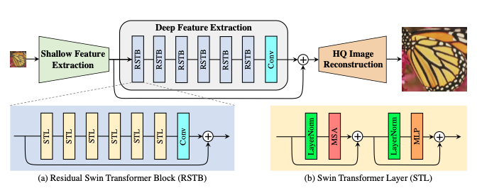
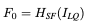
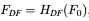
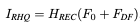
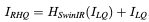
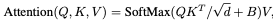
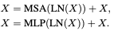

# SwinIR  
Image Restoration Using Swin Transformer  

## 1. 개요  
이미지 복원은 컴퓨터 비전분야에서 low-level 문제로 계속 다루어져왔고, low-quality 이미지를 high-quality 이미지로 복원하는 솔루션이다. 대부분의 복원 솔루션이 CNN 기반 딥러닝 네트워크를 기반으로 하면서도, 일부는 강렬한 인상을 심어주는 Transformer 기반의 솔루션도 연구되고 있다.  

대부분의 CNN 기반 방법은 정교한 모델 구조를 설계하는데 초점을 맞춘다. 이러한 방식은 성능이 좋아졌지만 2가지 문제를 동반한다. 첫 번째는 이미지와 convolution kernel 사이에 내용이 독립적이라는 것이다. 같은 커널을 다른이미지를 복원하는데 사용하기 때문에 최고의 선택이 아닐 수 밖에 없다. 두 번째는 넓은 범위에 의존하는 모델링은 효과적이지 않다.  

CNN의 대안으로 Transformer는 contexts사이의 global interactions을 찾기위해 self-attention 구조를 설계했고, 몇몇 비전 문제에서 유망한 성능을 보여줬다. 그러나, 대부분의 비전 문제는 학습 과정에서 입력 이미지를 패치단위로 학습하기 때문에 두 가지 결점이 발생한다. 첫 번째는, 이미지 복원을 위해 패치가 주변에 인접한 패치를 활용하지 못한다는 점이다. 두 번째는 복원된 이미지는 각각의 패치마다 테두리에 artifacts들이 생길 가능성이 크다. 이 문제는 패치 중첩으로 완화될 수 있지만 추가 계산 부담이 발생한다.  

최근 발표된 Swin Transformer는 CNN, Transformer 양쪽의 장점을 합한 유망한 성능을 보여주고 있다. Local attention mechanism을 이용하여 CNN의 장점인 큰 이미지를 처리하는 것과, 변화하는 window scheme의 넓은 dependency를 반영할 수 있는 Transformer의 장점을 통합했다.  

본 논문에서는 Swin Transformer를 기반으로 한 이미지 복원 모델인 SwinIR을 제안한다.  

## 2. 모델 요약  
SwinIR은 Shallow Feature Extraction, Deep Feature Extraction, High Quality Image Reconstruction 3가지로 구성된다. 2번째 단계인 Deep Feature Extraction 단계는 residual Swin Transformer blocks (RSTB)로 구성되고, 각각의 layer는 Swin Transformer + residual connection 구조로 구성한다.  

Shallow Feature Extraction 부분은 convolution layer를 이용하여 shallow feature를 추출하고, 이 것은 low-informaion을 보존하기위해 바로 reconstruction 부분으로 전송된다. Deep Feature Extraction 부분은 주로 RSTB로 구성되어있고, 각각은 local attention, cross-window interaction을 활용하기 위한 Swin Transformer를 사용한다. 추가로 특징을 강화하기 위해 블록의 끝부분에 convolution layer를 더하고, 특징 집합을 제공하기 위해 residual connection을 사용한다. 마지막으로 앞서 두 단계의 결과물이 혼합되어 최종 high-quality reconstruction 과정에서 사용된다.  

이전 CNN기반 모델과 비교하여 SwinIR이 가지는 3가지 이점이 있다. 첫 번째는 image content, attention weights 사이의 content-based interactions들을 가지고 있고 이것들은 spatially varying convolution 으로 해석될 수 있다. 두 번째는 shifted window mechanism으로 인하여 넓은 범위의 도메인을 가지고 있는 모델을 설계할 수 있다. 세 번째는 PSNR, SSIM 등을 통해 적은 파라미터를 이용하여 더 좋은 성능을 낼 수 있다.  

## 3. Method  
### 1. Network Architecture  
  
같은 feature extraction 모듈을 사용할 예정이고, 각각의 task에서는 서로 다른 복원 모듈을 사용할 예정이다. 우선 Low-Quaility (LQ)이미지로 부터 shallow feature를 추출하기 위해 3x3 convolutional layer Hsf를 사용한다.  

  

이러한 convolutional layer는 안정적인 최적화, 더 좋은 결과를 위해 좋은 처리과정을 수행할 수 있다. 이것은 또한 입력 이미지 공간을 더 고차원의 feature 공간으로 매핑하는 간단한 방식을 제공한다. 그 후, F0로 부터 Deep Feature를 추출하기 위해 Hdf를 수행한다.  

  

Hdf는 deep feature extraction module이며, 이 모듈은 RSTB, 3x3 convolutional layer를 포함하고 있다.  더 구체적으로 중간 features들 F1, F2, … 등은 RSTB 블록과 블록에 의해 추출되고 마지막에는 convolutional layer를 사용한다. 마지막에 convolutional layer를 사용해서 Transformer-based network를 향한 convolution operation으로 inductive bias를 가져올 수 있고,  나중에 shallow features, deep features들을 통합할 수 있는 더 좋은 기반을 마련할 수 있다. F0, Fdf를 합하여 Irhq를 복원한다.  

  

Hrec는 reconstruction module 이다. Shallow feature는 주로 저주파 영역의 정보를 가지고 있고, Deep feature는 고주파 영역의 정보를 가지고 있다. Long Skip connection을 통해 저주파 영역의 정보를 복원과정에 바로 전달할 수 있고, 이를 통해 deep feature extract 과정에서 고주파 영역에 더 집중을 할 수 있고 안정적인 학습을 진행할 수 있다. Upsample을 위해 sub-pixel convolution layer를 사용한다. Upsample을 진행하지 않을 경우 single convolution layer를 사용하여 이미지를 복원한다. 또한 residual 학습방식을 사용하여 LQ와 HQ사이의 residual을 복원할 것이다.  

  

Loss는 pixel loss로 L1 Loss를 사용한다. 가벼운 모델에서는 L1 loss만 사용하고 Real World 정보를 더 학습하기 위해서 Gan Loss, Perceptual Loss를 추가로 사용한다. JPEG noise 학습을 위해서는 Charbonnier Loss를 사용한다.  

### 2. Residual Swin Transformer Block  
RSTB는 STL Layer로 구성된 Residual Block이다. 우선은 STL Layer를 통해 F0를 중간 feature F1, F2, … 등으로 추출한다. 마지막에는 convolution layer를 추가하고 그 결과와 이전 결과를 합치는 구조다. 이러한 설계는 두 가지 이점을 가지고 있다.  
첫 번째는 Transformer가 spatially varying convolution의 특정 instance라고 보여질 수 있지만, spatially invariant filters를 가지고 있는 convolution layers들은 SwinIR의 translational equivariance을 강화시킨다. 두 번째로 reidual connection은 서로 다른 블록으로부터 identity-based connection을 제공하고, 서로 다른 수준의 features들을 통합하도록 한다.  

@ translation equivariance 이미지 위치 변화에 대한 반영율 - 위치 관련 문제 이러한 문제는 이미지 분류나 객체감지 같이 객체가 여러번 발생하거나 움직일 수 있는 곳에 유용하다.  

Swin Transformer layer (STL)은 Original Transformer layer의 standard multi-head self-attention을 기반으로 한다. 차이점은 local attention, shifted window mechanism 두 개에 있다. STL은 우선 입력 feature를 M × M local windows로 겹치지 않게 Reshape 과정을 진행한다. 그 후, 각각의 window를 위해 standard self-attention separately를 계산한다. Attention matrix는 그래서 self-attention mechanism에 의하여 계산된다.  

  

B는 학습이 가능한 관련된 positional encoding이다. 실제로, h time동안 병렬적으로 수행하고 결과를 concatenate 한다 (MSA) Multi layer perception MLP는 두 개의  fully connected layers와 함께 그 들 사이의 GELU 비선형 함수를 가졌고, feature transformation을 위해 사용된다. LayerNorm (LN) layer는 MSA, MLP 이전에 추가된다. 전체 과정은 아래와 같다.  

  

그러나, partition이 서로다른 layers들을 위해 고정되었을 때, local windows를 연결하는 부분이 없다. 그래서, regular and shifted window partitioning이 대안으로 사용된다. Shifted window partitioning은 shifting feature by pixels before partitioning을 의미한다.  

## 4. Experiments  
### 1. Experimental Setup  
RSTB number, STL number, window size, channel number, attention head number들은 일반적으로 6, 6, 8, 180, 6으로 각각 설정한다. 한 가지 예외사항으로 JPEG Noise Reduce 학습 과정에서는 window size를 7로 설정한다. JEPG encoding이 8x8이미지를 사용하기 때문에 window size를 8로 설정하면 성능이 크게 떨어지는 모습을 보였다. Lightweight image SR 학습 과정에서는 RSTB number and Channel Number를 각각 4, 60으로 줄인다. 