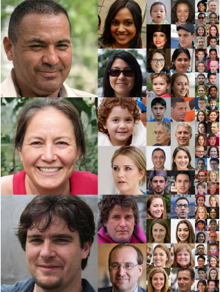
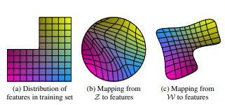
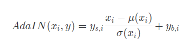
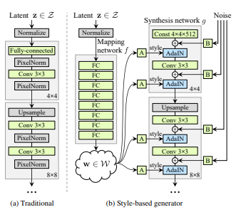
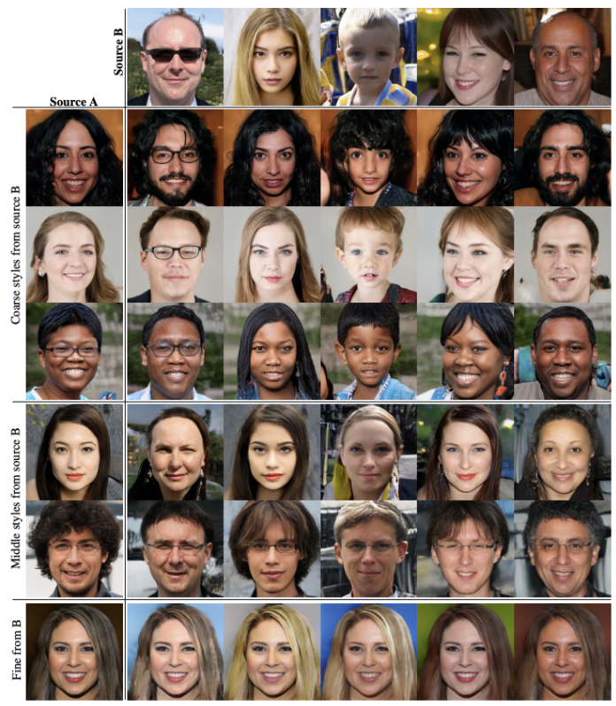
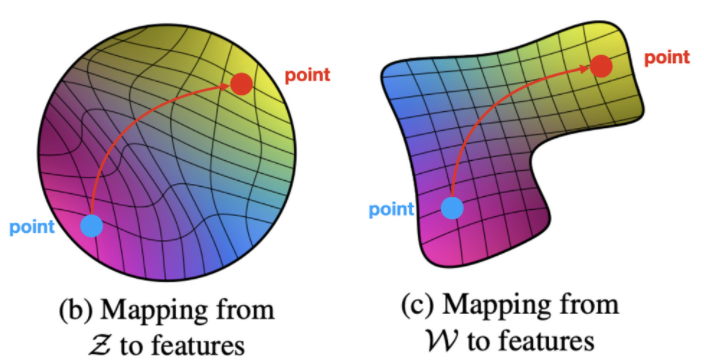
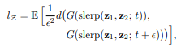
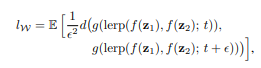

# StyleGAN  
A Style-Based Generator Architecture for Generative Adversarial Networks  

## 1. 개요
PGGAN 구조에서 Style Transfer 개념을 적용하여 Generative Adversarial Networks을 위한 alternative generative architecture을 제안한다.  
새로운 기능으로는 자동으로 학습되고 높은 수준의 속성(pose, identity 등)과 생성된 이미지(주근깨, 머리카락 등)의 Stochastic variation(확률적 변동)을 분리하고 직관적으로 scale별 제어를 가능하게 한다.  
새로운 Generator는 traditional distribution quality metrics 측면에서 SOTA을 향상시키고 더 나은 interpolation properties을 입증하며 latent factor of variation을 더 잘 disentangled 하게 한다.  
interpolation quality와 disentanglement을 정량화(quantify) 하기 위해 모든 generator 아키텍처에 사용할 수 있는 두가지 새로운 자동화된 방법을 제안한다.

## 2. 기존 연구 및 문제점
### 1. PGGAN  
PGGAN은 점진적으로 낮은 해상도부터 높은 해상도까지 차근차근 점진적으로 생성하는 대표적인 생성 모델로 StyleGAN의 base가 되는 모델로 latent vector z가 Normalize를 거쳐 모델에 바로 입력이 되는 형태로 학습이 진행된다. 하지만 이렇게 z가 Generator에 바로 입력이 들어가면 GAN은 latent space가 무조건 학습 데이터 셋의 확률 분포와 비슷한 형태로 만들어 지도록 학습을 하게되면서 entangle하게 만들어 지게 된다.  
GAN을 이용하여 이미지를 생성할 때 latent variable 기반의 모델은 random noise를 입력으로 사용하게 된다. 이 때 entangle하게 만들어지는 가장 큰 단점이 부각된다. 억지로 끼워맞추기 하는 형식으로 mapping이 이루어지다보니 wrapping이 발생하게 된다. wrapping이 발생하게 되면 예측할 수 없을 정도로 급진적으로 변하게 되는 특징이 존재한다.  

## 3. StyleGAN
### 1. Disentangle
  
이미지에 style을 적용하여 색다른 이미지를 생성하고 싶은데 Generator에 latent vector z가 바로 입력되기 때문에 entangle하게 되어서 불가능 하다는 단점이 있었다.  
이를 해결하기 위해 각각 다른 style을 여러 scale에 추가해서 학습시키는 방식을 도입했다.  
하지만 근본적인 문제인 latent vector z가 직접적으로 입력이 되는 문제는 해결되지 않았고 이를 해결하기위해 Mapping Network를 사용하여 mapping된 W를 각 scale에 브로드캐스트 하는 방식으로 해결하였다.  
이를 통해 매핑된 latent space의 W는 정확하지는 않지만 학습 데이터 셋의 확률 분포와 비슷한 모양으로 매핑이되었고 disentangle하게 된다.

### 2. AdaIN  
  
Neural Network에서 각 layer를 지나가며 scale, variance의 변화가 생기는 일이 빈번하게 발생하며 이는 점점 학습이 불안정 해지는 현상을 발생한다. 따라서 이를 방지하기 위해 Batch Normalization 방법같은 normalization 기법을 각 layer에 사용하므로써 해결한다.  
StyleGAN에서는 Mapping network를 거쳐서 나온 W가 latent vector의 style로 각 scale을 담당하는 layer에 입력으로 들어가게 된다. style에 영향을 주면서 동시에 normalization 해주는 방법으로 AdaIN을 사용하게 된다.  
수식을 해석하면 x라는 결과에서 평균을 빼고 표준편차로 나누는 모습이다. 이러한 결과에 y 
s,i 와 y b, i를 Affine Transformation을 거쳐서 shape을 맞추고 style을 입혀주게 된다. 여기서 y s,i는 linear cofficient를 의미한다.  
전체 과정을 정리하면 W가 AdaIN을 통해 Style을 입혀야 하는데 Shape이 안맞기 때문에 Affine Transform을 거쳐 맞춰준다. Style을 입히는 개념은 y s,i를 곱하고 y b,i를 더하는 과정을 의미한다. AdaIN에서 정규화를 할 때 한번에 하나씩만 W가 기여하게 되므로 하나의 style이 각각의 style에서만 영향을 끼칠 수 있도록 분리해주는 효과를 갖는다.

### 3. Generator Network  
  
StyleGAN의 Generator Network 구조는 기본적으로 PGGAN과 동일하게 점진적으로 낮은 해상도부터 높은 해상도 까지 차근차근 Feature Map을 생성하는 구조다.  기존 PGGAN과 다른점은 latent vector z를 바로 사용하지 않고 Mapping Network를 사용하여 W code를 생성하고 이를 각 scale별로 브로드 캐스트한다는 점이다.  
또한 Style의 편향 및 Style의 localization을 위해 mixing regularization를 사용 하는데 이 방식은 두 개의 임의의 latent code를 사용하는 방식이다. StyleGAN에서는 두 개의 latent code z를 이용하여 w1, w2가 style을 제어하도록 하고 하나는 AdaIN이전, 하나는 AdaIN연산에 입력된다.  
최종적으로는 1024*1024 이미지가 생성된다.

### 4. Discriminator Network  
Discriminator 구조는 Generator구조와는 반대로 높은해상도에서 점진적으로 낮은해상도로 변하며 판별을 한다.

## 4. Properties of the style-based generator  
### 1. Style Mixing  
StyleGAN에서StyleGAN에서 동일한 latent vector z가 Mapping network f를 통해서 나온 W 하나만 계속 네트워크를 학습하다보면 correlation이 발생하며 학습이 되는 문제가 발생하게 될 수 있다.  
예를들면 학습 데이터셋에서 극히 드물게 대머리인 사람은 항상 선글라스를 착용하고 있는 데이터가 있을 때 GAN은 학습 데이터의 분포와 비슷한 분포를 갖도록 학습하다보니 Generator은 선글라스 == 대머리 라는 correlation이 발생하여 무조건 대머리인 사람은 선글라스를 착용한 상태로 생성하는 overfitting이 일어날 가능성이 많아진다.  
style correlation이 발생하지 않고 학습을 진행하기 위해서는 synthesis network을 학습 시킬 때 하나의 Latent vector zz에서 나온 W을 이용해서 학습 하는것이 아니라 latent space에서 뽑은 z들을 mapping network f에 통과시켜서 w들을 만든다. 이후 그림과 같이 50:50 비율로 나눠서 각 layer에 적용해도 되고 다른 비율로 상황에 따라 적용하면 된다.  
StyleGAN 에서는 2개의 latent vector가 있을 때 서로 섞어서 이미지를 만들 수 있도록 한다. 여기서는 crossover point를 설정하여 이전은 w1으로 이후는 w2로 사용을 하게 된다. 이렇게 함으로써 인접한 layer간의 style 상관관계를 줄여가게 되는 것이다.

  
이런 style mixing 방법을 사용하면 다양한 style이 섞여서 synthesis network 학습이 됩니다. 따라서 Generator을 이용해서 이미지 생성을 해보면 style correlation이 거의 없으며 입력할 때 AdaIN을 통해 입력을 하게 되므로 regularization 효과도 볼 수 있게 됩니다. 그 결과 style correlate되는 현상을 방지해서 각 layer에 해당하는 style들이 잘 구분되면서 적용되는 것을 볼 수 있습니다.  

### 2. Perceptual Path Length  
  
latent space가 disentangle 하다는 것을 정량화 하기 두 가지 방법 중 하나.  
perceptual path length은 이미지들을 잘 구분하도록 학습된 pretrained model을 이용해서 입력 이미지가 들어오면 그 이미지가 어떤 이미지인지 처리하기 위해 본 논문에서는 VGG16 모델을 사용하고 있습니다.  
이미지가 어떤 이미지인지 잘 구분하는 pretrained model의 중간 레이어의 feature map은 마지막 레이어 보다 이미지에 대한 더 많은 정보들을 가지고 있으니 embedding된 중간 레이어의 feature map을 사용하여 perceptual path length을 구한다 . 이 역할은 사람이 여러 이미지들에서 어떤 특징들이 변화하였는지 잘 구분하는 과정과 동일하다고 이해하면 된다.  
pre-trained VGG16 network를 통해서 perceptual loss를 계산한다.
식은 다음과 같다.  
  
latent z에 대해서는 interpolation을 진행할 때는 spherical interpolation을 사용하는데, 이는 구면선형보간이라고 하며 구면을 따라 중간 위치에 잡을 수 있도록 하는 방법이다. (위의 식)  
  
또한 w vector끼리의 interpolation에 대해서 진행할 때는 단순하게 linear 방법으로 수행한다. (위의 식)
W space에서 interpolation을 수행했을 때가 훨씬 좋은 것을 확인할 수 있는데, 이는 아래의 표로 확인할 수 있다.  

### 3. linear separability  
간단히 말하면 이는 latent space에서 attribute가 얼마나 선형적으로 분류될 수 있는지를 판단하는 것이다.  
이를 위해 간단한 선형 분류기를 학습한 뒤 엔트로피를 계산해서 latent vector가 얼마나 linear한 subspace에 존재하는지를 확인하는 것이다. (보조선형 분류기를 통해 dataset을 제작한다.)  
latent space point를 분류할 수 있는 하나의 선형 분류기(SVM)을 학습한다.그 후 latent vector가 선형 분류기에서 얼마나 떨어져있는지 알 수 있고 conditional entropy 값을 구할 수 있다.  
여기서 entropy 값은 하나의 입력 벡터 X가 주어졌을 때 그때의 true class에 대한 entropy 값을 측정할 수 있다.  
다시 말해 하나의 이미지 data가 특정 클래스로 정확히 분류되기 위해 해당하는 feature가 얼마나 부족한지에 대한 정보를 알 수 있으며 이는 값이 낮을수록 이상적인 image임을 나타낸다.