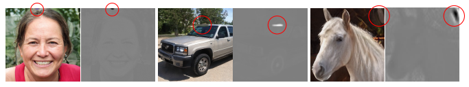
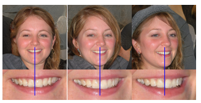
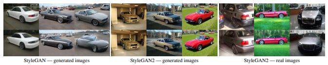
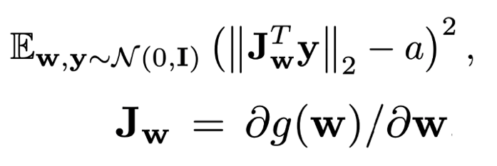
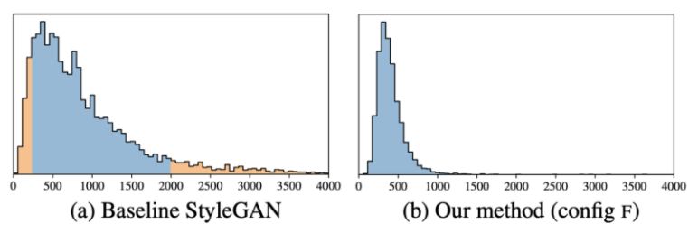
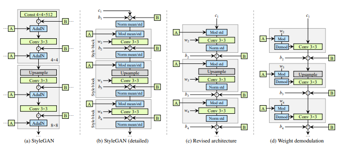
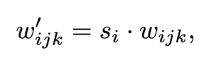
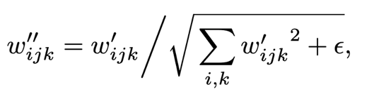
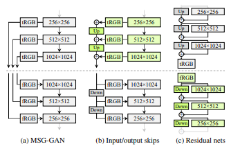
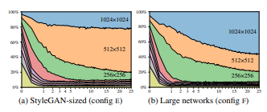

# StyleGAN2  
Analyzing and Improving the Image Quality of StyleGAN
  

## 1. 개요
StyleGAN은 데이터기반 이미지 생성과정에서 우수한 성능을 보인다. 이러한 StyleGAN의 몇가지 문제점을 분석하여 해결하고 변경하는 방법을 제안한다.  

## 2. StyleGAN 요약 및 문제점
### 1. StyleGAN
최근 이미지 생성 모델, 특히 GAN에 의해 생성된 이미지의 해상도와 품질이 빠르게 향상되고 있다. 그 중에서도 StyleGAN은 다양한 데이터셋에서 안정적으로 작동하는 것으로 나타났다.  
StyleGAN은 기존 Generator과는 많이 다른 구조다. input latent code z를 네트워크 시작부분에 바로 공급하지 않고 Mapping Network f 를 통과한 W를 브로드 캐스팅하여 전달한다. 이 과정에서 Style을 입히게 되는데 각 Scale별 Shape에 맞추게 AffineTransform을 이용하여 Shape을 설정하고 입힌다. 또한 확률적 변화를 위해 추가적인 무작위 Noise를 입력한다. 

### 2. Normalization Artifacts  
  
이러한 우수한 성능을 보이는 StyleGAN도 단점은 존재한다.  
각 Layer를 통과하며 Style, Normalization을 수행하는 과정에서 중간 Feature Map에 물방울 형태의 Artifacts가 발생하는 경우가 있다. 이러한 이상 징후는 약 64x64 해상도에서 나타나기 시작하여 모든 Feature Map에 나타나 고해상도에서는 점차 강해지게 된다.  
이러한 원인은 AdaIN에서 발생한다. AdaIN은 각 Feature Map의 평균과 분산을 별도로 정규화하는 작업에서 Feature 에서 발견된 정보가 파괴될 가능성이 있다.  
이러한 이유로 StyleGAN2에서는 정규화 단계를 제거하려고 한다.  
convolution의 가중치를 estimated statistics(추정 통계)을 사용해 정규화 함으로써 물방울 현상을 방지

### 3. Progressive Growing  
  
기존 StyleGAN에서 사용하는 점진적인 학습 방법은 고해상도 합성 이미지에 대해 안정화하는데 효과적이었다. 하지만 문제는 특정 위치 정보를 너무 강하게 가지고 있는 것이 문제다. 예를 들어 치아같은 경우는 움직임에 따라 자연스럽게 이동을 해야하는데 이동하지 않고 위치가 고정된 채로 왜곡되는 경우가 있다. 이러한 원인을 StyleGAN의 Progressive Growing 이라고 가정을 한다.  

### 4. Attribution of generated images  
  
Generate 과정에서 생성된 이미지의 탐지는 매우 중요한 작업이다. 이를 정확하게 해결하지 못하면 잘못된 형태가 특정 소스에 귀속되어 이미지가 안정적으로 생성되지 못한다. Latent Space에서 원하는 형태로 Image를 생성하기 위해서는 Latent Code W를 찾아야 한다. StyleGAN에서는 기술적으로 일치하는 latent code w를 찾는 것이 가능해야 하지만 W에서 이미지로 매핑하는 과정이 매우 복잡하여 안정적으로 성공하기가 어렵다.

## 3. StyleGAN2 Network  
### 1. PPL, 정규화  
latent space의 지각적 매끄러움을 나타내는 PPL과 이미지 품질 사이에 상관관계가 있을 수 있다는 것을 알아냈기 때문에 regularization term으로 통합했다. 수식은 아래와 같다.  
  
a는 상수 값이고 y는 정규 분포로부터 생성된 랜덤 값이다.  
이 정규화는 생성는 생성자가 가능한 latent variable의 미세 변동으로 인한 변화를 최소화 하도록 한다. 학습은 첫 번째 항의 평균을 움직여 상수a를 동적으로 바꾸면서 최적 값을 설정한다.  
추가로 PLR을 포함한 여러가지 정규화 진행시 계산적으로 overhead가 발생할 수 있으므로 미니배치 16번에 한 번씩 정규화를 진행한다.
  
결과를 측정하였을 때 기존 StyleGAN보다 PPL이 낮은 수치로 기록되어 더 좋은 성능을 보인다.  

### 2. Generator  
  
기존 StyleGAN Generator 구조에서 AdaIN을 완전히 분해하면 정규화와 변조라는 두 구성요소로 이루어진 것을 확인할 수 있다. 이러한 과정에서 Style Block을 다시 그릴 수 있다. 노이즈 삽입 부분은 스타일 블록에서 할 필요가 없기 때문에 외부로 이동하여 보다 예측 가능한 결과를 얻을 수 있다. 이 작업을 수행한 후에는 평균이 필요없고 오직 표준 편차만으로 정규화와 변조 과정을 진행할 수 있다.  
스타일 블록의 내부 작업을 단순화시켜 스타일 백터의 의한 첫 번째 linear transformation은 convolution 안에서 처리가 가능하다. 스타일 블럭에서 linear transformation의 스타일 백터 W의 계수 ys가 사용됐다. Convolution 가중치 wijk와 함께 s를 곱한 content 이미지를 처리하는 작업은 content 이미지 가중치 wijk와 s의 곱과 합성곱 연산하는 것과 같다. 아래의 수식은 간단하게 위의 설명을 표현한 것이다. (연산자 모드: d)  
  

아래의 수식은 표준 편차의 역수로 output을 곱한다.  
  
위의 수식으로, 스타일 블록의 작업 순서는 스타일에 의한 linear transformation -> convolution -> output normalization이 하나의 convolutoin process로 표현될 수 있다. 정규화 부분은 출력이 정규 분포라고 가정한 정규화 과정이다. 이 과정으로 물방울 문제를 야기하는 실제 분포를 사용하는 대신 이 같은 정규 분포를 사용해서 방지한다.  
이러한 과정을 통해 입력에 대한 편향, Noise 및 정규화가 적용되는 부분을 성능저하 없이 제거할 수 있다.  

### 3. Alternative Network Architecture
  
StyleGAN의 Progressive Growing으로 인한 문제를 해결하기 위해 대안되는 네트워크 구조를 제시한다.  
MSG-GAN Generator가 이미지 대신 mipmap을 출력하고 Skip Connection을 이용하여 Generator, Discriminator에서 일치하는 해상도를 연결하여 계산을 한다. 저해상도의 이미지에 대해 업샘플링을 하여 해당 정보를 합산하여 이러한 구조를 간략화 한다. 이 과정의 업샘플링에 사용되는 기법은 bilinear 보간법을 사용한다.  
최종적으로 이를 바탕으로 StyleGAN2에서는 Residual 방식을 사용하도록 수정한다. Residual 방식은 Discriminator 구조에서는 유용하다고 알려졌지만 Generator에서는 Residual Architecture가 좋지 않다는 연구가 있다. 때문에 Skip Generator, Residual Disrciminator 사용한다.  

### 4. Resolution usage  
  
이상적인 이미지 정보 전달 방식은 Low Resolution에서 다음으로 천천히 정보를 옮겨주는 모습이다. Generator의 구조를 변경한 후 이를 확인하기 위하여 실험을 진행하였다. 결과는 중간 resolution layer 비중이 비 정상적으로 높았다. 이를 해결하기 위해 기존 StyleGAN과 비교하여 최고 Resolution Layer에서 Feature Map 수를 두 배로 늘렸더니 좋은 성능을 보인다.  
StyleGAN도 Feature Map을 확장시키면 성능이 좋아지지만 StyleGAN2에 비하면 좋지 못한 성능을 보인다.

### 5. Projection of Image to latent space  
이미지를 Latent Space에 알맞게 투영하려면(생성하려면) 그에 맞는 latent code w를 찾아야 한다. 이전에는 latent code w를 찾는 대신에 각 Generator Layer에 대해 별도의 w를 선택하는 방향으로 개선시켰지만 이러한 방식은 의도치 않은 임의의 이미지를 투영할 수도 있다.  
이러한 이유로 latent space를 확장하지 않고 latent code w를 찾으려고 한다. 우선 latent code에 하향식 Noise를 추가한다. 이 후 Style의 확률적 Noise 입력도 최적화하여 Generator에 일관된 신호를 전달되지 않도록 정규화 한다. 정규화는 Noise Map의 자기 상관 계수를 적용하는 것을 기반으로 한다.