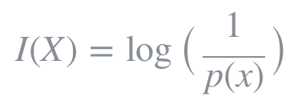
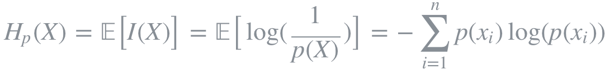
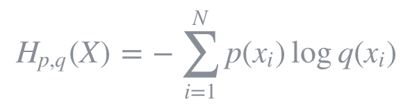
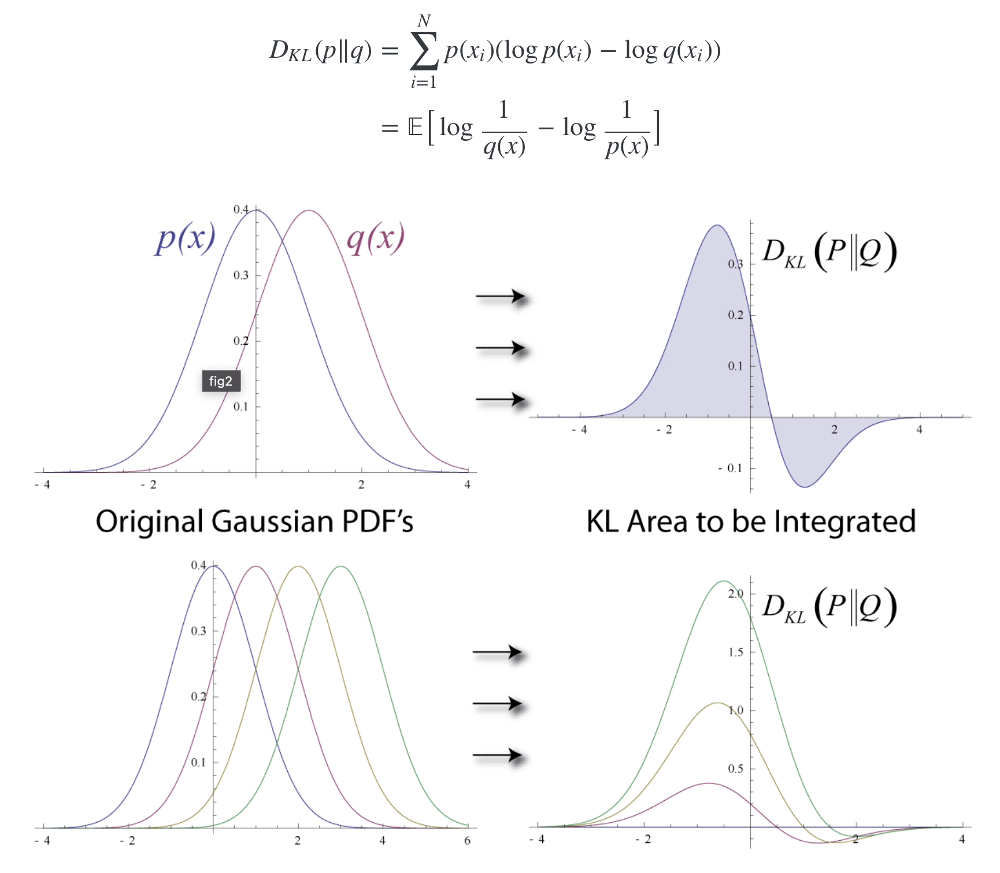
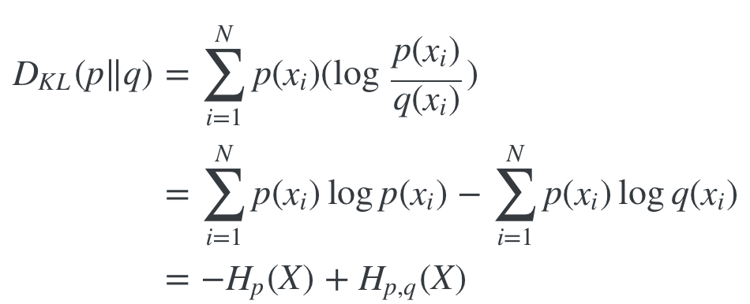
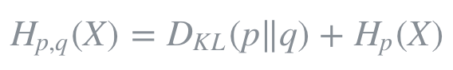
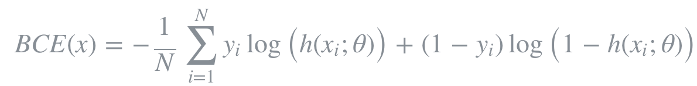

# BinaryCrossEntropy  
BinartCrossEntropy  

## 1. Entropy
### 1. 정보량과 엔트로피
엔트로피란 확률적으로 발생하는 사건에 대한 정보량의 평균을 의미한다. 정보량은 다음과 같이 정의되며 놀람의 정도를 나타낸다고 볼 수 있다.  
  

놀람의 정도는 예를 들어, 가까운 지인이 길을 걷다가 벼락에 맞았다고 해보자. 벼락에 맞을 확률은 약 1/28만으로 굉장히 낮은 확률이며, 이 사건이 주변에서 실제로 일어났다면 놀라지 않을 수 없을 것이다. 반면, 동전을 던져서 앞면이 나왔다고 가정해보자. 동전의 앞면이 나올 확률은 대략 1/2이고 빈번히 발생할 수 있는 사건이므로 그다지 대수롭지 않게 여겨질 것이다. 즉, 사건의 발생 확률이 낮을수록 놀람의 정도는 높아지고, 이러한 사건은 높은 정보량을 갖고있는 것으로 여겨진다.  

또한 log 함수를 취함으로써 놀람의 정도를 표현하는데 필요한 최소한의 자원을 나타낼 수 있게된다. 가령, 1/8로 발생하는 어떤 사건을 2진수로 표현한다면 밑이 2인 로그함수를 이용하여 (−log2(1/8)=3) 최소 3개의 비트가 필요함을 알 수 있다.  
  
즉, 엔트로피는 정보량에 대한 기댓값이며 동시에 사건을 표현하기 위해 요구되는 평균 자원이라고도 할 수 있다. 또한 엔트로피는 불확실성(uncertainty)과도 같은 개념이다. 예측이 어려울수록 정보의 양은 더 많아지고 엔트로피는 더 커진다.

### 2. Cross-Entropy   
  
Cross Entropy는 두 개의 확률분포 p와 q에 대해 하나의 사건 X가 갖는 정보량으로 정의된다. 즉, 서로 다른 두 확률분포에 대해 같은 사건이 가지는 정보량을 계산한 것이다. 이는 q에 대한 정보량을 p에 대해서 평균낸 것으로 볼 수 있다.  

Cross entropy는 기계학습에서 손실함수(loss function)을 정의하는데 사용되곤 한다. 이때, p는 true probability로써 true label에 대한 분포를, q는 현재 예측모델의 추정값에 대한 분포를 나타낸다.  

Binary cross entropy는 두 개의 class 중 하나를 예측하는 task에 대한 cross entropy의 special case이다.  

## 2. Kullback–Leibler (KL) Divergence  
### 1. 개요  
  
KL Divergence를 통해 두 확률분포 p와 q가 얼마나 다른지를 측정할 수 있다. KL Divergence는 정보량의 차이에 대한 기댓값이다. 만약 q가 p를 근사하는 확률분포라면 KL Divergence는 확률분포의 근사를 통해 얼마나 많은 정보를 잃게 되는지 시사한다. p와 q의 분포가 동일할 경우, 두 정보량의 차는 0이 되므로 이때 KL Divergence는 0을 반환한다. KL Divergence는 p와 q의 순서가 바뀌면 다른 값을 반환한다. 즉, 대칭적이지 않다.  

### 2. KL Divergence와 Cross-Entropy  
  
KL Divergence를 변형하면 cross entropy에 대한 식으로 정리된다. 이를 Hp,q(X)에 대해 정리하면 다음과 같다.  
  
즉, cross entropy를 최소화하는 것은 KL Divergence를 최소화하는 것과도 같다. 그럼으로써 p를 근사하는 q의 확률분포가 최대한 p와 같아질 수 있도록 예측모델의 파라미터를 조정하게된다.

## 3. BCE Loss
만약 이진 분류기를 훈련하려면, binary crossentropy 손실함수를 사용하면 된다. 이진 분류기라는 것은 True 또는 False, 양성 또는 음성 등 2개의 클래스를 분류할 수 있는 분류기를 의미한다. binary crossentropy는 다음과 같은 공식으로 쓸 수 있다.  
  
손실함수는 예측값과 실제값이 같으면 0이 되는 특성을 가지고 있어야 한다. 참고로 이진 분류기의 경우 예측값이 0과 1사이의 확률값으로 나옵니다. 1에 가까우면 하나의 클래스(예를 들어, True 클래스)일 확률이 큰 것이고, 0에 가까우면 다른 하나의 클래스(예를 들어, False 클래스)일 확률이 큰 것이다. 상황을 간단하게 하기 위해서 샘플이 하나만 있다고 가정하면, 예측값과 실제값이 같은 경우에는 기대했던 대로 손실함수값은 0이 된다. 반대로 예측값은 0, 실제값은 1인 상황에는 양의 무한대가 된다. 그런데 일반적으로 확률이 0이 나오지는 않기 때문에 꽤 큰 수가 나온다고 생각하면 된다. 이러한 특성을 갖고 있기 때문에 binary crossentropy가 이진 분류에 적절히 사용될 수 있는 손실함수이다.  

## 4. 코드
```python
import torch.nn as nn

criterion = nn.BCELoss()
...
loss = criterion(nn.Sigmoid(input), target) # 또는 nn.Softmax(input)
```