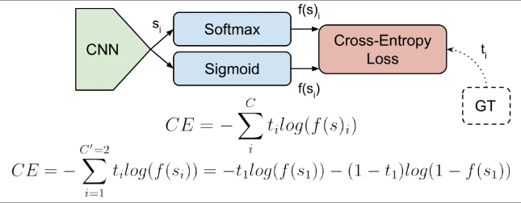
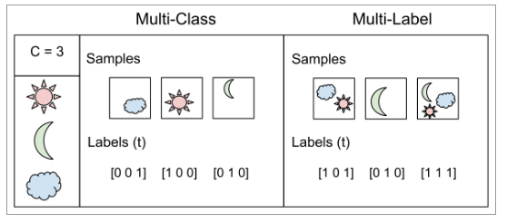
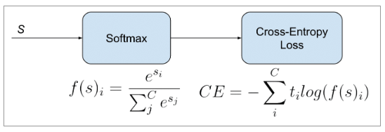

# CategoricalCrossEntropy  
CategoricalCrossEntropy  

  

## 1. Multi-Class, Multi-Label   
  
분류 문제는 크게 두 가지로 나눌 수 있다. 하나는 여러개의 클래스를 하나의 벡터로 표현하는 Multi Class 방식, 나머지 하나는 각각의 클래스의 유무를 이진분류로 설정하고 그 결과를 하나의 벡터에 담는 Multi-Label 방식이다.  

### 1. Multi-Class Classfication  
우선 Multi-Class 방식이다. 각 샘플(이미지)은 클래스 C 중 하나로 분류될 수 있다. 해는 [1 0 0], 달은 [0 1 0], 구름은 [0 0 1]으로 분류될 수 있다. CNN은 s(scores) 벡터를 출력하고, one hot 벡터인 타겟 ground truth) 벡터 t와 매칭이 되어 loss값을 계산할 것이다. 즉, Multi-Class Classification은 여러 샘플(이미지)에서 C개의 클래스 중 하나의 클래스로 분류하는 문제로 생각할 수 있다. 이 방식은 Loss 함수를 Categorical Cross Entropy Loss를 사용한다.  

### 2. Multi-Label Classficiation   
Multi-Label 방식은 오른쪽 그림과 같이 설명할 수 있다. 각 샘플은 여러 개의 클래스 객체(object)를 가질 수 있다. 타겟 벡터 t는 하나 이상의 positive클래스를 가질 수 있고 [1 0 1] 처럼 인코딩 될 수 있다 즉, Multi-label Classification은 여러 샘플(이미지)에서 각 샘플 마다 있는 클래스 들을 여러 클래스로 레이블하는 문제다. 이 방식은 Loss 함수를 BCE Loss (Binary Cross Entropy Loss)를 사용한다.  

## 2. CategoricalCrossEntropy  
  
Softmax activation 뒤에 Cross-Entropy loss를 붙인 형태로 주로 사용하기 때문에 Softmax loss 라고도 불린다. 분류문제에서 주로 사용하는 활성화함수와 로스다. 분류 문제에서는 MSE(mean square error) loss 보다 CE loss가 더 빨리 수렴한 다는 사실이 알려져있다. 따라서 multi class에서 하나의 클래스를 구분할 때 softmax와 CE loss의 조합을 많이 사용한다. 물론 이는 binary class에서도 적용이 가능하다. 클래스가 2개일 때 sigmoid와 softmax는 같은 식이 된다.

## 3. 코드  
```python
import torch
import torch.nn as nn

# nn.CrossEntropyLoss 함수는 nn.LogSoftmax 함수를 포함하고 있으므로 모델 하단에 Softmax를 추가할 필요가 없다.
loss = nn.CrossEntropyLoss()
input = torch.randn(3, 5, requires_grad=True)
target = torch.empty(3, dtype=torch.long).random_(5)
output = loss(input, target)
output.backward()
```  

## 4. 출처  
https://wordbe.tistory.com/entry/ML-Cross-entropyCategorical-Binary%EC%9D%98-%EC%9D%B4%ED%95%B4