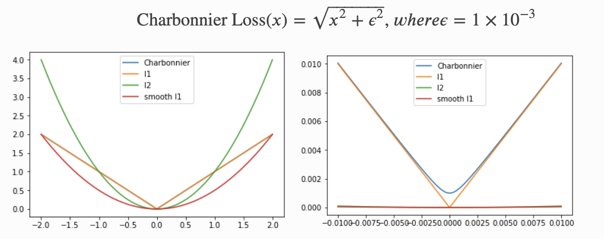
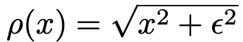

# CharbonnierLoss    
  

## 1. 설명  
LapSRN 네트워크에서 처음으로 사용된 Loss함수이며 기존에 사용하던 L2 Loss보다 SR과정에서 더 좋은 성능을 보인다. 데이터의 이상치를 잘 다루고 SR, HR 사이의 편차 값을 최소화 하는 것으로 주로 사용된다.  
  
수식에서 X값은 SR, HR 사이의 거리 차이이고 e값은 1e-3을 의미한다.  

## 2. 코드  
```python
import torch
import torch.nn as nn

class Charbonnier_loss(nn.Module):
    """ Charbonnierloss """
    def __init__(self):
        super(Charbonnier_loss, self).__init__()
        self.eps = 1e-6

    def forward(self, X, Y):
        diff = torch.add(X, -Y)
        error = torch.sqrt( diff * diff + self.eps )
        loss = torch.sum(error) 
        return loss

```