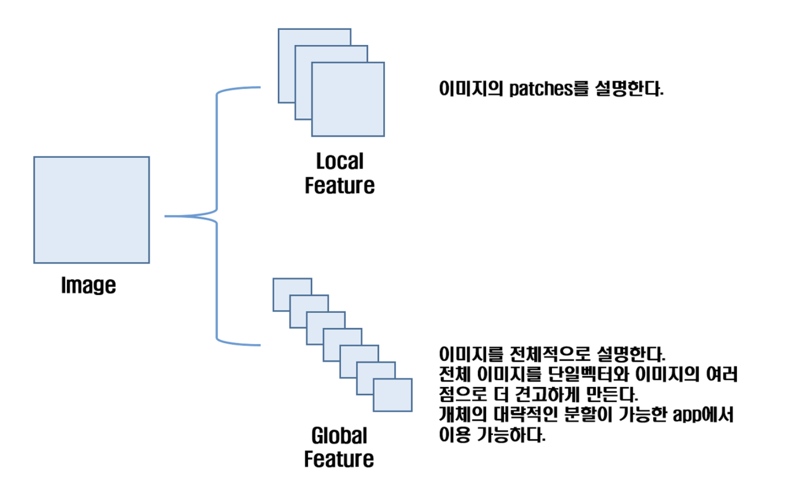

# Local&GlobalFeature  
Image Local Feauture AND Image Global Feature  

  
## 1. Local Feature  
객체인식, 식별에 사용 (Recognization, Identification) 즉 사람인지 물체인지 인식한다.
객체의 이미지 패치(patch: keypoints in the image)를 설명한다.
- texture in image patch
- shape matrics
- invariant moments
- Histogram oriented gradients  

지역적, 국소적 특징을 잘 파악할 수 있다.

## 2. Global Feature  
이미지 검색, 객체 감지 및 분류 (object detection, classification) 영상에서 어떤 물체가 존재하는지 찾는다.
- contour representation (윤곽표현)
- shape descriptors (모양 설명)
- texture features (질감)