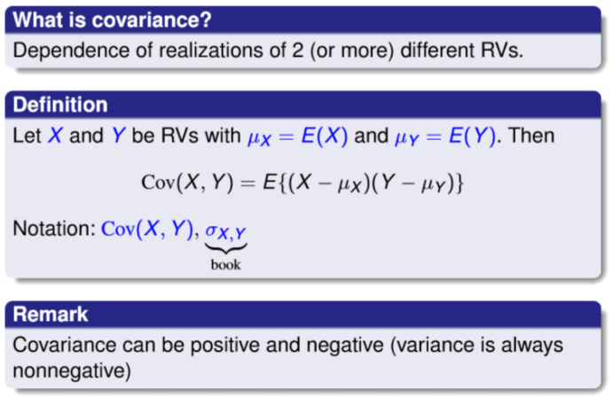
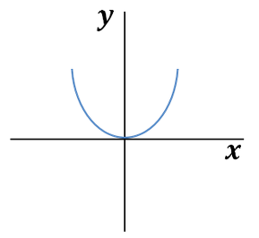
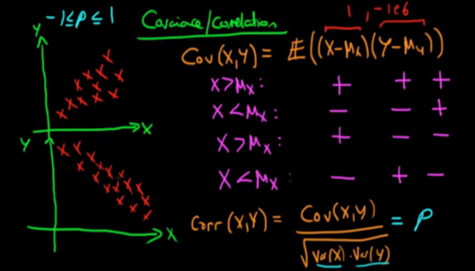

# Convariance 공분산    
  

## 1. 정의
Covariance는 한국말로는 공분산이라고 할 수 있고, 보통 Cov 라고 표현한다. 
공분산은 두 개 또는 그 이상의 랜덤 변수에 대한 의존성을 의미한다.

## 2. 의존성
### 1. 개요  
어떤 특정 샘플의 X라는 특징이 x의 평균 보다 크고, 그 샘플의 Y라는 특징이 y의 평균 보다 크다면, 각각의 편차는 둘 다 양수가 된다. 그 말은 X가 큰 값을 가질 때 Y도 큰 값을 가진다는 의존성을 보여준다.  
이러한 경향이 크게 나타난다면, 자연스럽게 반대 방향도 함께 일어난다. 반대 방향이라는 것은 X가 작은 값을 가질 때는 자연스럽게 Y의 작은 값이 된다. 이 때에도 마찬가지로 편차의 곱은 양수가 된다. 왜냐하면 "음수 x 음수 = 양수" 이기 때문이다. 이러한 상태에서 평균을 취하게 되면 큰 양수 값이 나오게 된다.  
즉, 정의에 의해서 X가 증가할 때, Y도 증가하려고 하고, X가 감소할 때, Y도 감소하려고 하는 모습을 보이기 때문에 X와 Y 사이의 의존성이 높다고 할 수 있다.  

### 2. 선형관계  
가장 의존성이 낮은 상황은 당연히 서로 독립인 상황이다. X가 어떻게 되든 상관 없이 Y는 어떤 값이든 가질 수 있다. 즉, X가 높은 값을 가졌을 때, Y는 높은 값일 수도 있고, 아닐 수도 있다. 그것이 완전히 랜덤이라면, 편차의 곱 항이 양수와 음수가 골고루 나올 것이고, 그걸 평균하면 0에 가까울 것이다.  
표기하기로는 Cov(X, Y)라고 주로 하지만, 시그마를 사용해서 index로 변수 두 개를 넣어서 하기도 한다. 분산은 한 변수에 대해서 Cov(X, X)를 한 거랑 마찬가지이고, 따라서, 제곱의 형태가 되기 때문에 분산은 항상 양수가 되어야 한다. 하지만 앞에서 설명했듯이 Cov는 양수도 음수도 될 수 있다. 이러한 상황을 선형 관계라고한다. XY를 곱한 것의 평균이 공분산이 될 수 있다.  
  
하지만, 공분산이 0이라고 해서 항상 독립이 되진 않는다. 이유는 공분산은 선형 관계에 대한 의존성을 말하고, 공분산이 0이 되면 두 변수의 선형 관계가 없다는 것을 의미하지, 모든 관계가 없다는 것을 의미하진 않기 때문이다. 독립이라는 조건은 두 변수의 모든 관계가 없다는 것을 의미하므로, 그냥 독립이라는 개념이 보다 상위 개념이 된다. 즉, y = x^2 이라는 관계가 있고, 그래프로 표현하면 위와 같다고 한다면, 여기서 y와 x는 서로 선형이 아니기 때문에 cov(x,y) = 0이 된다.  
하지만, 그렇다고 이 두 변수가 독립이라고는 할 수 없다. 이유는 x가 0에서부터 증가하면 y가 증가하고, x가 0에서부터 감소하면 y가 또 증가하는 이러한 관계를 가지기 때문이다.

### 3. 요약  
공분산은 서로 다른 변수들 사이에 얼마나 의존하는지를 수치적으로 표현하며, 그것의 직관적 의미는 어떤 변수(X)가 평균으로부터 증가 또는 감소라는 경향을 보일 때, 이러한 경향을 다른 변수(Y 또는 Z 등등)가 따라 하는 정도를 수치화 한 것이다. (공분산은 또한 두 변수의 선형 관계의 관련성을 측정한다라고도 할 수 있다.)  
  
이러한 현상을 잘 정리한 그림이 있어서 참조하였다. 여기에는 Correlation에 대한 설명도 함께 하는데 Corr(X,Y)는 -1부터 1까지의 값을 가지며, -1일 때는 가장 Negative 의존성이 높은 상태이며, +1이면 가장 Positive 의존성이 높은 상태이고 0일 때는 의존성이 없는 상태이다.

## 3. 참조  
https://blog.naver.com/sw4r/221025662499