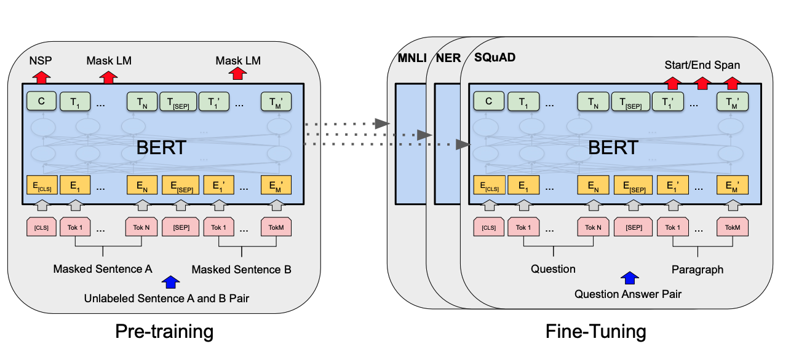
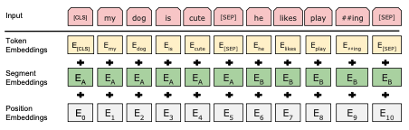

# BERT  
BERT: Pre-training of Deep Bidirectional Transformers for Language Understanding  

Bidirectional Encoder Representations from Transformers (BERT) 라고 불리는 새로운 언어 표현 모델을 소개한다. 최근의 언어 표현모델과 다르게 BERT는 모든 층의 내용의 왼쪽과 오른쪽 둘다 조절하면서  라벨이 안된문자를 이용한 pre-trained deep 양방향 표현으로 설계되었다. 그 결과 pre-trained BERT 모델은 단 하나의 추가적인 output layer만으로 미세조정을 할 수 있고, 질문과 답변이나 언어 추론 등 폭 넓은 분야에서 최신 모델을 개발할 수 있다. BERT 는 개념적으로 간단하고 경험적으로 강력하다. BERT 는 11개의 자연어 처리 과정에서 최신의 우수한 결과를 얻었다.  

## 1. Introduction  
언어 모델의 pre-training 과정은 많은 언어처리 작업에 효과적임을 보여왔다. 이러한 점은 자연어 추론이나 의역 같은 문장 단위의 작업도 포함이 되며 문장 사이의 관계를 전체적으로 분석하여 예측하는 것을 목표로 한다. 뿐만아니라 named entity recognition 그리고 질문과 답변 같은 토큰 단위의 fine-grained output 생산을 필요로하는 토큰 단위의 작업도 포함하여 효과적인 모습을 보였다.  

Pre-trained 언어 표현을 적용하기 위한 전략은 feature-based, fine-tuning 두 가지가 있다. ELMo 같은 Feature-based 접근법은 추가적인 특징으로 pre-trained representations 들을 포함하는 task-specific 구조를 사용한다. GPT 같은 fine-tuning 접근법은 최소한의 task-specific 파라미터를 사용하여 미리 학습된 모든 파라미터를 미세조정하면서 학습된다. 두 가지 접근법은 pre-training 과정에서 같은 objective function을 사용하고, 범용적인 언어 표현을 위하여 단방향 언어 모델을 사용한다.  

본 논문에서는 특히 fine-tuning 접근방법에서 pre-trained representations들의 성능이 제한되고 있는 현재 기술들에 대해 논의한다. 주된 제한점은 표준 언어 모델들이 단방향이고 이것이 pre-training 과정에서 사용되는 구조의 선택을 제한시킨다는 점이다. 예를 들어, OpenAI GPT의 저자는 Transformer의 self-attention 층에서 토큰들이 항상 오직 이전 토큰들에 대해서만 영향을 주는 left-to-right 구조를 사용했다. 그러한 제한들은 문장 수준의 작업에서 차선책이며, 문장을 양쪽 방향으로 통합하는것이 중요한 질문과 답변같은 토큰 단위의 접근법을 기반으로 하는 fine-tuning에 적용할 때 매우 위험해질 수 있다.  

본 논문에서는 BERT 를 이용하여 fine-tuning 기반의 접근법을 향상시킨다. BERT 는 이전에 언급된 단방향의 제약을 masked language model (MLM) pre-training objective 를 이용하여 완화시킨다. MLM 은 입력 값의 토큰들에 무작위로 마스크를 생성하고 objective는 오로지 내용에 근거하여 마스크된 단어의 원본 vocabulary id를 예측한다. Left-to-right 언어 모델과 다르게 MLM objective는 문장의 왼쪽과 오른쪽을 융화시킬 수 있고 deep bidirectional Transformer를 pre-train 할 수 있도록 한다. MLM외에도 next sentence prediction 을 사용한다.  

Bidirectional pre-training for language representations의 중요하다. 단방향 모델과 다르게 BERT는 masked language models를 사용하여 deep bidirectional representations를 사전 학습이 가능하도록 한다. 이것은 또한 독립적으로 left-to-right, right-to-left LMs를 학습하여 얕은 수준으로 합치는 것을 사용하는 것과 대조적이다.  

Pre-trained representations들이 많이 무거운 엔진 task-specific 구조들의 필요성을 줄여준다. BERT는 최초의 representations 모델 기반 fine-tuning 방식이고, 문장 단위와 토큰 단위의 거대한 범위에서 최신 수준의 좋은 성능을 보여준다. BERT는 11가지 NLP 작업에서 최신 기술을 진보 시켰다.  

## 2. Related Work  
blank  

## 3. BERT  
  
이 section 에서는 BERT와 자세한 실행과정을 설명한다. Pre-training, fine-tuning 두가지 단계가 있다. Pre-training 과정에서, BERT 모델은 처음으로 pre-trained 파라미터들로 초기화를 하고 모든 파라미터들은 downstream 작업을 통해 라벨링된 데이터를 이용하여 미세조정 된다. 각각의 downstream 작업은 같은 파라미터로 초기화된 분리된 fine-tuned 모델들이 있다. 위 그림과 같은 질문과 답변이 이 section 에서 예제로 사용된다.  

BERT의 차별적인 특징은 서로 다른분야에서 구조가 통합된다는 것이다. Pre-trained 구조와 마지막 downstream 구조의 차이점을 최소화한다.  

BERT는 다층 bidirectional Transformer encoder 구조이며 tensor2tensor 라이브러리로 release된다. Transformer의 사용으로 평범하고 실행이 거의 원본과 동일하기 때문에 backbone 모델의 철저한 분석은 생략할 것이다.  

이 작업에서 우리는 층의 개수를 L, 은닉 층의 크기를 H, self-attention heads를 A로 표기한다. 아래의 두 개의 모델을 이용하여 성능을 비교한다.  

- BERT base L=12, H=768, A=12 Total Parameters=110M  
- BERT base L=24, H=1024, A=16 Total Parameters=340M  

BERT base 모델은 비교를 위해 OpenAI GPT와 같은 크기를 가지도록 선택되었다. 그러나 모든 토큰이 오직 왼쪽 내용에만 영향을 줄 수 있는 GPT Transformer와 대조적으로 BERT Transformer는 bidirectional self-attention을 사용한다.  

BERT가 다양한 down-stream 작업을 다루기 위해서, 입력 해상도는 하나의 토큰 안의 단일 문장과 질문과 답변 같은 두 쌍의 문장 둘 다를 분명하게 표현한다. 이러한 작업을 통해 언어적 문장보다는  문장은 인접한 내용의 임의의 폭이 될 수 있다.  문장은 BERT의 입력 토큰들을 참고하고, 단일 문장 또는 두 문장이 합쳐진 것들이 될 수 있다.  

  
본 논문에서는 3만개의 토큰 사전과 함께 WordPiece embeddings를 사용한다. 모든 sequence의 첫번째로, 토큰은 항상 special classification token ([CLS]) 이다. 마지막 은닉층에 해당하는 토큰은 분류 작업을 위한 aggregate sequence representation 으로 사용된다. 두 번째로, learned embedding을 문장 A에 속하는지, B에 속하는지 표시하는 모든 토큰에 추가한다. input embedding을 E로, special [CLS] token 의 마지막 hidden vector를 C ∈ RH, 그리고 마지막 hidden vector의 입력 토큰을 Ti ∈RH 으로 표현한다. 주어진 토큰을 위해, 입력 해상도는 그에 상응하는 token, segment, 그리고 position embeddings를 합산함으로써 구성되어진다. 이 구조의 시작화는 위 그림과 같다.  

### 1. Pre-training BERT  
본 논문에서는 BERT를 사전학습 하기 위해 이전방식에서 사용된 left-to-right 또는 right-to-left 언어 모델을 사용하지 않는다. 대신에, 두 개의 unsupervised tasks를 사용한다. 이 과정은 첫 번째 그림의 왼쪽 부분에 묘사되어있다.  

<Test #1: Masked LM>  
직관적으로, 이 과정은 left-to-right 모델 또는 left-to-right, right-to-left를 합친 얕은 모델과 비교해서 깊은 양방향 모델을 엄격하게 더 강하게하는데 합리적이다. 불행하게도, 각각의 단어들이 자기 자신을 직접적으로 볼 소 있도록 하고 여러개의 층의 내용에서 대상 단어를 예측할 수 있는 bidirectional conditioning 방식에 비해, standard conditional 언어 모델들은 오직 left-to-right 또는 right-to-left 방식으로만 학습될 수 있다.  

Deep bidirectional representation을 학습하기 위해, 본 논문에서는 간단한 입력 토큰의 랜덤한 비율로 마스크를 씌우고, 마스크 처리된 토큰들을 예측한다. 이러한 과정을 masked LM (MLM)으로 부를 것이다. standard LM 에서는 mask tokens들과 상응하는 마지막 hidden vectors 들은 vocabulary를 통해 출력 softmax에 입력된다. 본 논문의 실험에서 각각의 문장의 모든 WordPiece tokens들의 15%만 랜덤으로 마스크를 했다. Denoting auto-encoders 방식과 대조적으로, 입력 전체를 복구하기 보다는 오직 마스크된 단어만 예측한다.  

이것이 bidirectional pre-trained model을 얻을 수 있게 할지라도, [MASK] token이 fine-tuning 과정에서 나타나지 않기 때문에 pre-training과 fine-tuning 사이에 불일치를 만들고 만다. 이것을 완화시키기 위해, 마스크된 단어를 실제 [MASK] token으로 항상 대체하지 않는다. 학습 데이터 생성기는 예측을 위해 랜덤하게 token positions의 15%를 선택한다. i 번째 토큰이 선택될 때, 해당 토큰을 80% 확률로 [MASK] token, 10% 확률로 랜덤한 토큰, 나머지 10% 확률로 그대로 i 번째 토큰으로 대체한다. 그 후 cross entropy loss를 통해 original token을 예측하는데 사용된다.  
 
<Task #2: Next Sentence Prediction (NSP)>  
Question Answering (QA)와 같은 downstream 작업들과 Natural Language inference (NLI) 들은 두 문장사이의 관계를 이해하는 것에 기반을 두고 있고, 언어 모델에 의해 간접적으로 포착된다. 문장의 관계를 이해하는 모델을 학습하기 위해서, 모든 단일언어 말뭉치로부터 생성될 수 있는 binarized next sentence 예측 작업을 위해 pre-train 한다. 구체적으로, 각각의 pre-training 예시를 위해 문장 A와 B를 선택했을 때 50%확률로 B가 실제로 A를 따라 다음 문장이 되고, 나머지 50% 확률로 NotNext로 라벨된 뭉치로 부터 랜덤한 문장이 된다. 첫 번째 그림과 같이 C는 next sentence prediction (NSP)를 위해 사용된다.  

NSP 작업은 representation learning objectives와 밀접하게 관련되어 있다. 그러나, 이전 작업에서, 오직 sentence embeddings들만이 downstream 작업으로 전송되며, 여기서 BERTsms end-task 모델 파라미터를 초기화 하기위해 모든 파라미터를 전송한다.  

<Pre-training Data>  
Pre-training 절차는 존재하는 언어 모델의 과정을 대부분 따른다. Pre-training corpus를 위해, BooksCorpus(800M words), 그리고 English Wikipedia (2,500M words)를 사용한다. Wikipedia에서 text 구절만 추출하고, 나머지 목록이나 테이블 그리고 헤더들은 무시한다. Billion Word Benchmark 같은 뒤섞인 sentence-level corpus를 사용하는 것 보다 document-level corpus를 사용하는 것은 긴 인접 묹장을 추출하기 위해 중요하다.  