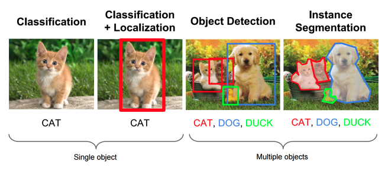
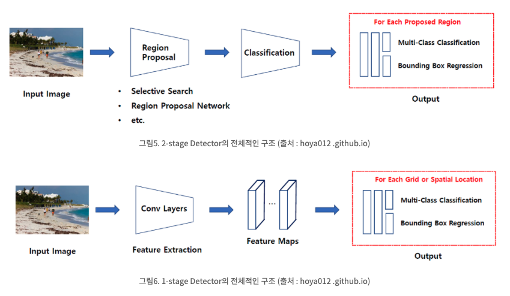

# ObjectDetection

  
Object Detection이란 여러 물체에 대해 어떤 물체인지 분류하는 Classification 문제와 그 물체가 어디 있는지 박스를 통해 위치 정보를 나타내는 Localization 문제를 둘 다 수행하는 분야다.  

Object Detection = Multi-Labeled Classification + Bounding Box Regression(Localization)

---  

  
Object Detection 문제는 크게 1-stage Detector, 2-stage Detector 2개로 나눌 수 있다.  

Object Detection문제는 앞에 말했듯이 물체의 위치를 찾는 Localization 문제와, 물체를 식별하는 Classification 문제를 합한 문제인데, 1-stage Detector는 이 두 문제를 동시에 행하는 방법이고 2-stage Detector는 이 두 문제를 순차적으로 행하는 방법이다.  

따라서 1-stage Detector가 비교적으로 빠르지만 정확도가 낮고 2-stage Detector가 비교적으로 느리지만 정확도가 높다.  

2-stage Detector은 CNN을 처음으로 적용시킨 (Fast R-CNN, Faster R-CNN ... )등의 R-CNN계열이 대표적이다.  
1-stage Detector에는 YOLO(You Look Only Once)계열과 SSD 계열 등이 포함이 된다.  