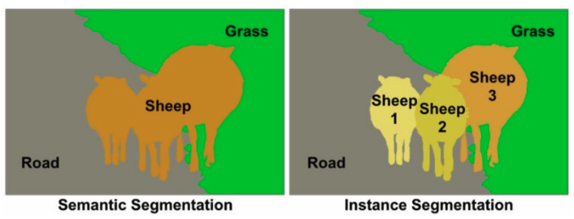
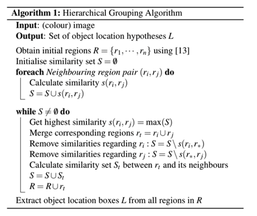
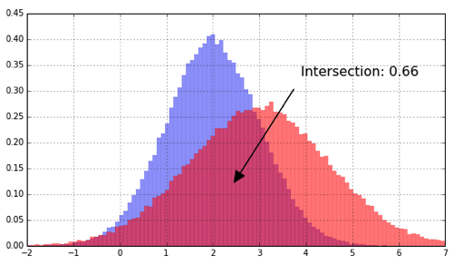
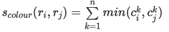
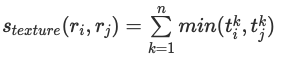
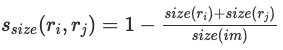
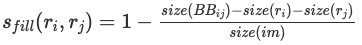

# RegionProposal  
RegionProposal  

## 1. RegionProposal   
  
물체가 있을 만한 영역을 빠르게 찾아내는 알고리즘이 region proposal이다.  
Image Crop, Wrap을 적용하여 2000개의 영역을 Proposal 한다. 이러한 영역을 RoI(Region of Interest)라고한다. 즉, region proposal은 object의 위치를 찾는 localization 문제이다.  

대표적으로 Selective search, Edge boxes 등이 있다.  

## 2. Selective Search  
원본 이미지로부터 최초 Segmentation을 수행하고 이를 통해 후보 Object를 추출하는 기법이다. 이를 통해 빠른 Detecion과 높은 Recall 예측 성능을 동시에 만족하는 Algorithm 기법이다. 이는 Color, Texture, Size, Shape에 따라 유사한 Region을 계층적 그룹핑 방법으로 계산하는 기법이다.  

### 1. 학습 방법  
R: 선택된 region 후보들 r1, r2, ...  
S: region들의 유사도 집합  

  

1. r1, r2, ... 들을 초기화  
2. 가장 유사성이 높은 ri, rj 선택  
3. 선택된 영역을 rt로 합침  
4. 유사성 집합 S에서 이미 합쳐진 영역 제거  
5. 합쳐진 rt와 나머지 region들의 새로운 유사성 집합 S를 계산  
6. 새로운 유사성 집합 S, 합쳐진 region을 원래 집합에 포함시킴  
7. 하나의 region이 될때까지 반복  

### 2. Region similarity  
[0, 1]사이로 정규화된 4가지 요소(Color, Texture, Size, Fill)들의 가중합으로 계산된다. A값 설정은 다양한 전략들이 존재한다.  

### 3. Color  
  
- 각 컬러의 채널을 25개 bin으로 설정  
- 각 region 마다 컬러 히스토그램 생성 C = c1, c2, ...  
- 차원수 n = 75 (RGB 3채널 * 25개의 bin)  
- L1 norm 정규화 [0, 1]  
- 인접한 regions의 교집합을 유사도로 측정  
- 유사성 척도의 min function은 두 히스토그램의 교집합을 나타냄  
  

### 4. Texture  
주변 Pixel값들의 변화량  
  
- 8방향 가우시안 미분을 사용  
- 10개의 bin으로 히스토그램 도출  
- L1 norm 정규화 [0, 1]  
- 80차원(8방향 * 10차원의 bin)의 벡터로 인접한 region들의 유사성을 평가  
- RGB(3차원)의 경우 8 * 10 * 3 = 240차원  

### 5. Size  
Region들의 크기  
  
- 크기가 작을 수록 유사도가 높다.  
- im은 원 이미지를 나타낸다.  

### 6. Fill  
candidate Bounding Box 크기와의 차이  
  
- candidate Bounding Box와 Region들의 크기 차이가 적을수록 유사도가 높다.  
- im은 원 이미지를 나타낸다.