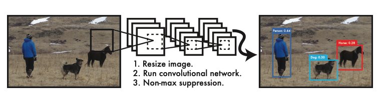
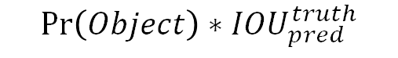
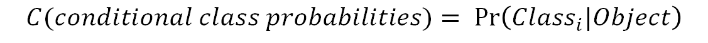
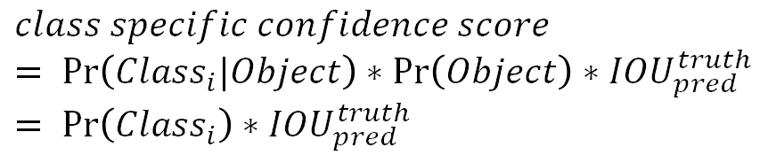
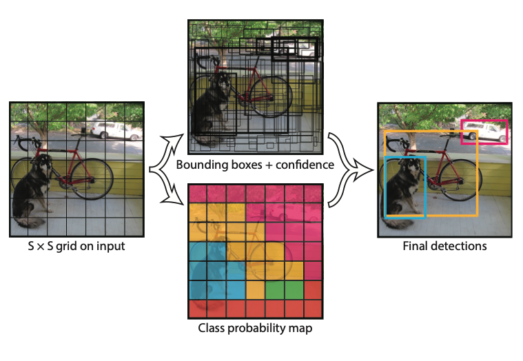
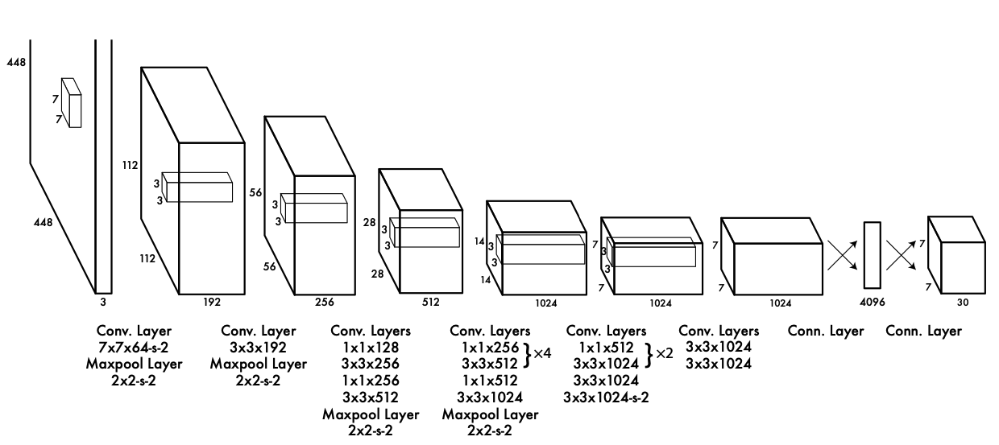
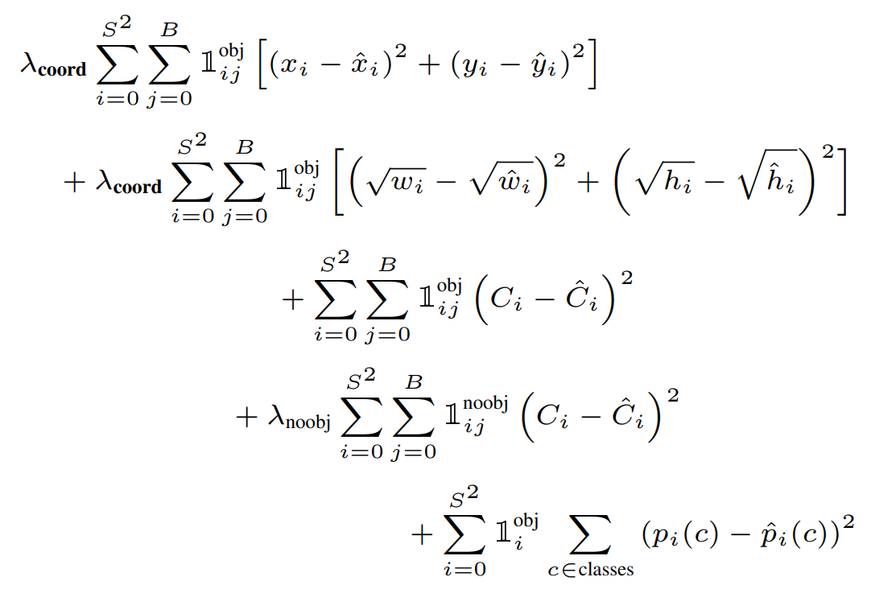

# Yolo  
You Only Look Oncd: Unified, Real-Time Object Detection  

## 1. Introduction  
### 1. Yolo  
기존의 Detection 모델은 DPM, R-CNN 등이 있다. Deformable parts models(DPM)은 이미지 전체를 거쳐 Sliding window 방식으로 객체 검출을 하는 모델이다. R-CNN은 이미지 안에서 bounding box를 생성하기 위해 region proposal 방법을 사용하여 classification + detection 2개의 과정을 수행한다. 이러한 복잡함 때문에 R-CNN은 느리고 독립적으로 학습해야 하므로 최적화하기에도 힘들다.  
본 논문은 ObjectDetection, 이미지의 픽셀로부터 bounding box의 coordinates, 클래스 probabilities,을 구하기 까지의 일련의 절차를 하나의  회귀(regression)문제로 재정의 했다.  
이미지를 한 번만 보면 객체를 검출할 수 있다고 하여 이름이 Yolo(You only look once) 정의된다.  

### 2. 장점  
  
Yolo는 기존의 복잡한 프로세스를 하나의 회귀 문제로 바꾸었기 때문에 굉장히 빠르며 복잡한 파이프라인이 필요 없다. 또한 다른 모델보다 2배 이상의 mAP(mean average precision)을 갖는다.  

Yolo는 Sliding Window, Region Proposal 방식과 달리 예측을 할 때 이미지 전체를 본다. 그리하여 클래스의 모양에 대한 정보뿐만 아니라 주변 정보까지 학습하여 처리한다. 기존 모델은 아무 물체가 없는 배경에 반점이나 노이즈가 있으면 그것을 물체로 인식한다. 이를 background error라고 한다. Yolo는 이미지 전체를 처리하기 때문에 background error가 발생할 확률이 훨씬 적다.  

Yolo는 물체의 일반적인 부분을 학습한다. 일반적인 부분을 학습하기 때문에 자연 이미지를 학습하여 그림 이미지로 테스트할 때, Yolo의 성능은 DPM이나 R-CNN보다 월등히 뛰어나다. 따라서 Yolo는 학습 단계에서 보지 못한 새로운 이미지에 대해 Robust하다. 즉, 검출 정확도가 높다.  

### 3. 요약  
- Yolo는 단일 신경망 구조이기 때문에 구성이 단순하며, 빠르다.  
- Yolo는 주변 정보까지 학습하며 이미지 전체를 처리하기 때문에 Background Error가 적다.  
- Yolo는 학습 단계에서 보지 못한 새로운 이미지에 대해서도 검출 정확도가 높다.  
- 단, Yolo는 SOTA 객체 검출 모델에 비해 정확도(mAP)가 다소 떨어진다.  

## 2. Yolo Network  
### 1. Unified Detection  
YOLO는 객체 검출의 개별 요소를 단일 신경망(single neural network)으로 통합한 모델이다. YOLO는 각각의 bounding box를 예측하기 위해 이미지 전체의 특징을 활용한다. 이러한 YOLO의 디자인 덕분에 높은 정확성을 유지하면서 end-to-end 학습과 실시간 객체 검출이 가능하다. 

YOLO는 입력 이미지(input images)를 S x S 그리드(S x S grid)로 나눈다. 만약 어떤 객체의 중심이 특정 그리드 셀(grid cell) 안에 위치한다면, 그 그리드 셀이 해당 객체를 검출해야 한다.

각각의 그리드 셀(grid cell)은 B개의 bounding box와 그 bounding box에 대한 confidence score를 예측한다. confidence score는 bounding box가 객체를 포함한다는 것을 얼마나 믿을만한지, 그리고 예측한 bounding box가 얼마나 정확한지를 나타낸다. confidence score는 다음과 같이 정의한다.  

  

위 수식에서 IOU는 intersection over union의 약자로 객체의 실제 bounding box와 예측 bounding box의 합집합 면적 대비 교집합 면적의 비율을 뜻한다.  
즉, IOU = (실제 bounding box와 예측 bounding box의 교집합) / (실제 bounding box와 예측 bounding box의 합집합)  

만약 그리드 셀에 아무 객체가 없다면 Pr(Obejct)=0 성립된다. 그러므로 confidence score도 0이다. 그리드 셀에 어떤 객체가 확실히 있다고 예측했을 때, 즉 Pr(Object)=1일 때가 가장 이상적이다. 따라서 confidence score가 IOU와 같다면 가장 이상적인 score다.

각각의 bounding box는 x, y, w, h, confidence 총 5개의 예측치로 구성되어 있다. (x, y) 좌표 쌍은 bouning box 중심의 그리드 셀(grid cell) 내 상대 위치를 뜻한다. 절대 위치가 아니라 그리드 셀 내의 상대 위치이므로 [0, 1] 사이의 값을 갖는다. 만일 bounding box의 중심인 (x, y)가 정확히 그리드 셀 중앙에 위치한다면 (x, y)=(0.5, 0.5)이다. (w, h) 쌍은 bounding box의 상대 너비와 상대 높이를 뜻한다. 이때 (w, h)는 이미지 전체의 너비와 높이를 1이라고 했을 때 bounding box의 너비와 높이가 몇인지를 상대적인 값으로 나타낸다. 그러므로 (w, h)도 역시 [0, 1] 사이의 값을 갖는다. 마지막으로 confidence는 앞서 다룬 confience score와 동일하다.  

그리고 각각의 그리드 셀은 conditional class probabilities(C)를 예측한다. conditional class probabilities는 다음과 같이 계산할 수 있다.  

  

이는 그리드 셀 안에 객체가 있다는 조건 하에 그 객체가 어떤 클래스(class)인지에 대한 조건부 확률이다. 그리드 셀에 몇 개의 bounding box가 있는지와는 무관하게 하나의 그리드 셀에는 오직 하나의 클래스(class)에 대한 확률 값만을 구한다. 하나의 그리드 셀은 B개의 bounding box를 예측한다고 했다. B의 개수와는 무관하게 하나의 그리드 셀에서는 클래스 하나만 예측하는 것이다.

테스트 단계에서는 conditional class probability(C)와 개별 boudning box의 confidence score를 곱해주는데, 이를 각 bounding box에 대한 class-specific confidence score라고 부른다. class-specific confidence score는 다음과 같이 계산할 수 있다. 위에서 구한 conditional class probability와 confidence score를 곱한 값이다.  

  

이 score는 bounding box에 특정 클래스(class) 객체가 나타날 확률(=Pr(Class_i))과 예측된 bounding box가 그 클래스(class) 객체에 얼마나 잘 들어맞는지(fits the object)(=IOU_pred^truth)를 나타낸다.  

  

본 논문에서는 파스칼 VOC라는 이미지 인식 국제대회 데이터 셋을 이용해 실험을 진행했다. S=7, B=2로 세팅했고 파스칼 VOC는 총 20개의 라벨링 된 클래스가 있으므로 C=20이다. S=7 이면 인풋 이미지는 7 x 7 그리드로 나뉜다. B=2이라는 것은 하나의 그리드 셀에서 2개의 bounding box를 예측하겠다는 뜻이다. 이렇게 했을 때 S x S x (B*5 + C) 텐서를 생성한다. 따라서 최종 예측 텐서의 dimension은 (7 x 7 x 30)이다.  

### 2. Network Architecture  
  

YOLO 모델은 하나의 CNN(Convolutional Neural Network) 구조로 디자인되었다. 이 CNN의 앞단은 컨볼루션 계층(convolutional layer)이고, 이어서 전결합 계층(fully-connected layer)으로 구성되어 있다. 컨볼루션 계층(convolutional layer)은 이미지로부터 특징을 추출하고, 전결합 계층(fully connected layer)은 클래스 확률과 bounding box의 좌표(coordinates)를 예측한다.  

YOLO의 신경망 구조는 이미지 분류(image classification)에 사용되는 GoogLeNet을 참조하였다. YOLO는 총 24개의 컨볼루션 계층(convolutional layers)과 2개의 전결합 계층(fully connected layers)으로 구성되어 있다. GoogLeNet의 인셉션 구조 대신 YOLO는 1 x 1 축소 계층(reduction layer)과 3 x 3 컨볼루션 계층의 결합을 사용했다. 1 x 1 축소 계층(reduction layer)과 3 x 3 컨볼루션 계층의 결합이 인셉션 구조를 대신한다. 좀 더 빠른 객체 인식 속도를 위해 YOLO보다 더 적은 컨볼루션 계층(24개 대신 9개)과 필터를 사용하는 Fast YOLO라는 것도 있다. 크기만 다를 뿐이고 훈련 및 테스트 시 사용하는 나머지 파라미터는 YOLO와 모두 동일하다.  

### 3. Backbone Network Architecture  
ImageNet은 분류(classification)를 위한 데이터 셋입니다. 따라서 사전 훈련된 분류 모델을 객체 검출(object detection) 모델로 바꾸어야 한다. 연구진은 사전 훈련된 20개의 컨볼루션 계층 뒤에 4개의 컨볼루션 계층 및 2개의 전결합 계층을 추가하여  성능을 향상시켰다. 4개의 컨볼루션 계층 및 2개의 전결합 계층을 추가할 때, 이 계층의 가중치(weights)는 임의로 초기화했다. 또한, 객체 검출을 위해서는 이미지 정보의 해상도가 높아야 한다. 따라서 입력 이미지의 해상도를 224 x 224에서 448 x 448로 증가시켰다.

이 신경망의 최종 아웃풋(예측값)은 클래스 확률(class probabilities)과 bounding box 위치정보(coordinates)다. bounding box의 위치정보에는 bounding box의 너비(width)와 높이(height)와 bounding box의 중심 좌표(x, y)가 있다. 너비, 높이, 중심 좌표값(w, h, x, y)을 모두 0~1 사이의 값으로 정규화(normalize)했다. 

YOLO 신경망의 마지막 계층에는 선형 활성화 함수(linear activation function)를 적용했고, 나머지 모든 계층에는 leaky ReLU를 적용했다. ReLU는 0 이하의 값은 모두 0인데 비해, leaky ReLU는 0 이하의 값도 작은 음수 값을 갖는다.  

## 3. Training Strategy  
### 1. Process  
우선 1,000개의 클래스를 갖는 ImageNet 데이터 셋으로 YOLO의 컨볼루션 계층을 사전훈련(pretrain)시킨다. 사전훈련을 위해서 24개의 컨볼루션 계층 중 첫 20개의 컨볼루션 계층만 사용했고, 이어서 전결합 계층을 연결했다. 이 모델을 약 1주간 훈련시켰다. 이렇게 사전 훈련된 모델은 ImageNet 2012 검증 데이터 셋에서 88%의 정확도를 기록했다. 이 모든 과정은 Darknet 프레임워크를 사용했습니다. 

Darknet 프레임워크는 YOLO를 개발한 Joseph Redmon이 독자적으로 개발한 신경망 프레임워크다. 신경망들을 학습하거나 실행할 수 있는 프레임워크로 YOLO도 Darknet에서 학습된 모델 중 하나다. 

### 2. Loss  
YOLO의 loss는 SSE(sum-squared error)를 기반으로 한다. SSE를 사용한 이유는 SSE가 최적화하기 쉽기 때문이다. 하지만 SSE를 최적화하는 것이 YOLO의 최종 목적인 mAP(평균 정확도)를 높이는 것과 완벽하게 일치하지는 않는다.  
YOLO의 loss에는 bounding box의 위치를 얼마나 잘 예측했는지에 대한 loss인 localization loss와 클래스를 얼마나 잘 예측했는지에 대한 loss인 classification loss가 있다. localization loss와 classification loss의 가중치를 동일하게 두고 학습시키는 것은 좋은 방법이 아니다. 하지만 SSE를 최적화하는 방식은 이 두 loss의 가중치를 동일하게 취급한다.  

또 다른 문제가 있는데, 이미지 내 대부분의 그리드 셀에는 객체가 없다. 배경 영역이 전경 영역보다 더 크기 때문이다. 그리드 셀에 객체가 없다면 confidence score=0이다. 따라서 대부분의 그리드 셀의 confidence socre=0이 되도록 학습할 수밖에 없다. 이는 모델의 불균형을 초래한다.  
이를 개선하기 위해 객체가 존재하는 bounding box 좌표(coordinate)에 대한 loss의 가중치를 증가시키고, 객체가 존재하지 않는 bounding box의 confidence loss에 대한 가중치는 감소시켰다. 이는 localization loss와 classification loss 중 localization loss의 가중치를 증가시키고, 객체가 없는 그리드 셀의 confidence loss보다 객체가 존재하는 그리드 셀의 confidence loss의 가중치를 증가시킨다는 뜻이다. 이로써 위 두 문제가 해결된다. 이를 위해 두 개의 파라미터를 사용했는데, λ_coord와 λ_noobj다. λ_coord=5, λ_noobj=0.5로 가중치를 줬다.  

SSE는 또 다른 문제를 가지고 있다. SSE는 큰 bounding box와 작은 boudning box에 대해 모두 동일한 가중치로 loss를 계산한다. 하지만 작은 bounding box가 큰 bounding box보다 작은 위치 변화에 더 민감하다. 큰 객체를 둘러싸는 bounding box는 조금 움직여도 여전히 큰 객체를 잘 감싸지만, 작은 객체를 둘러싸는 bounding box는 조금만 움직여도 작은 객체를 벗어나게 된다. 이를 개선하기 위해 bounding box의 너비(widht)와 높이(hegith)에 square root를 취해주었다. 너비와 높이에 square root를 취해주면 너비와 높이가 커짐에 따라 그 증가율이 감소해 loss에 대한 가중치를 감소시키는 효과가 있기 때문이다.  

YOLO는 하나의 그리드 셀 당 여러 개의 bounding box를 예측한다. 학습단계에서 객체 하나당 하나의 bounding box와 매칭을 시켜야한다. 따라서 여러 개의 bounding box 중 하나만 선택해야 한다. 이를 위해 예측된 여러 bounding box 중 실제 객체를 감싸는 ground-truth boudning box와의 IOU가 가장 큰 것을 선택한다. ground-truth boudning box와의 IOU가 가장 크다는 것은 객체를 가장 잘 감싼다는 뜻과 같다. 이렇게 학습된 bounding box predictor는 특정 크기(size), 종횡비(aspect ratios), 객체의 클래스(classes of object)를 잘 예측한다.  
학습 단계에서 사용하는 loss function은 다음과 같습니다.  

  

여기서 1_i^obj는 그리드 셀 i 안에 객체가 존재하는지 여부를 의미한다. 이 값은 객체 존재하면 1, 존재하지 않으면 0이다. 1_ij^obj는 그리드 셀 i의 j번째 bounding box predictor가 사용되는지 여부를 의미한다. 위 loss function의 5개 식은 차례대로 아래와 같은 의미를 갖는다.  

1. Object가 존재하는 그리드 셀 i의 bounding box predictor j에 대해, x와 y의 loss를 계산.  
2. Object가 존재하는 그리드 셀 i의 bounding box predictor j에 대해, w와 h의 loss를 계산. 큰 box에 대해서는 작은 분산(small deviation)을 반영하기 위해 제곱근을 취한 후, sum-squared error를 구한다. (같은 error라도 큰 box의 경우 상대적으로 IOU에 영향을 적게 준다.)  
3. Object가 존재하는 그리드 셀 i의 bounding box predictor j에 대해, confidence score의 loss를 계산. (Ci = 1)  
4. Object가 존재하지 않는 그리드 셀 i의 bounding box predictor j에 대해, confidence score의 loss를 계산. (Ci = 0)  
5. Object가 존재하는 그리드 셀 i에 대해, conditional class probability의 loss를 계산. (p_i(c)=1 if class c is correct, otherwise: p_i(c)=0)  

λ_coord: coordinates(x, y, w, h)에 대한 loss와 다른 loss들과의 균형을 위한 balancing parameter.  
λ_noobj: 객체가 있는 box와 없는 box 간에 균형을 위한 balancing parameter. (일반적으로 image내에는 객체가 있는 그리드 셀보다는 없는 셀이 훨씬 많으므로)  

## 4. Limitations of Yolo  
YOLO는 하나의 그리드 셀마다 두 개의 bounding box를 예측한다. 그리고 하나의 그리드 셀마다 오직 하나의 객체만 검출할 수 있다. 이는 공간적 제약(spatial constraints)을 야기한다. 공간적 제약이란 '하나의 그리드 셀은 오직 하나의 객체만 검출하므로 하나의 그리드 셀에 두 개 이상의 객체가 붙어있다면 이를 잘 검출하지 못하는 문제'를 뜻한다. 예를 들어, 새 떼와 같이 작은 물체가 몰려 있는 경우 공간적 제약 때문에 객체 검출이 제한적이다. 하나의 그리드 셀은 오직 하나의 객체만 검출하는데 여러 객체가 몰려있으면 검출하지 못하는 객체도 존재하는 것이다.  

그리고 YOLO 모델은 데이터로부터 bounding box를 예측하는 것을 학습하기 때문에 학습 단계에서 학습하지 못했던 새로운 종횡비(aspect ratio, 가로 세로 비율)를 마주하면 고전할 수밖에 없다.  

마지막으로 YOLO 모델은 큰 bounding box와 작은 bounding box의 loss에 대해 동일한 가중치를 둔다는 단점이 있다. 크기가 큰 bounding box는 위치가 약간 달라져도 비교적 성능에 별 영향을 주지 않는데, 크기가 작은 bounding box는 위치가 조금만 달라져도 성능에 큰 영향을 줄 수 있다. 큰 bounding box에 비해 작은 bounding box가 위치 변화에 따른 IOU 변화가 더 심하기 때문이다. 이를 부정확한 localization 문제라고 부른다.  