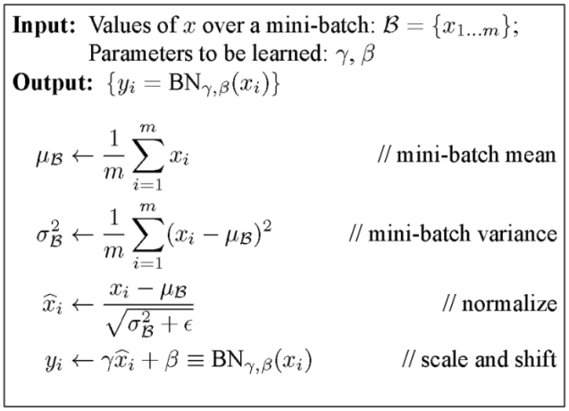
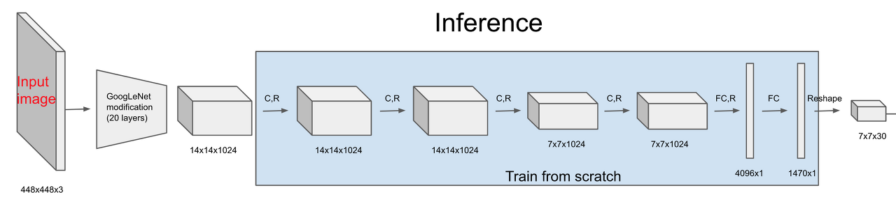
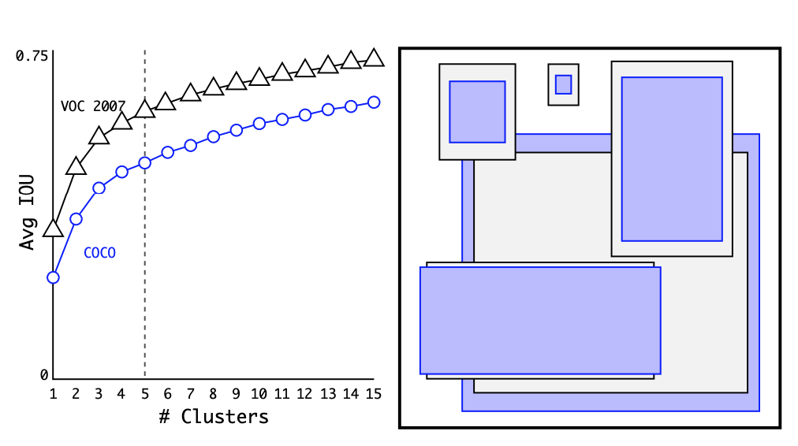
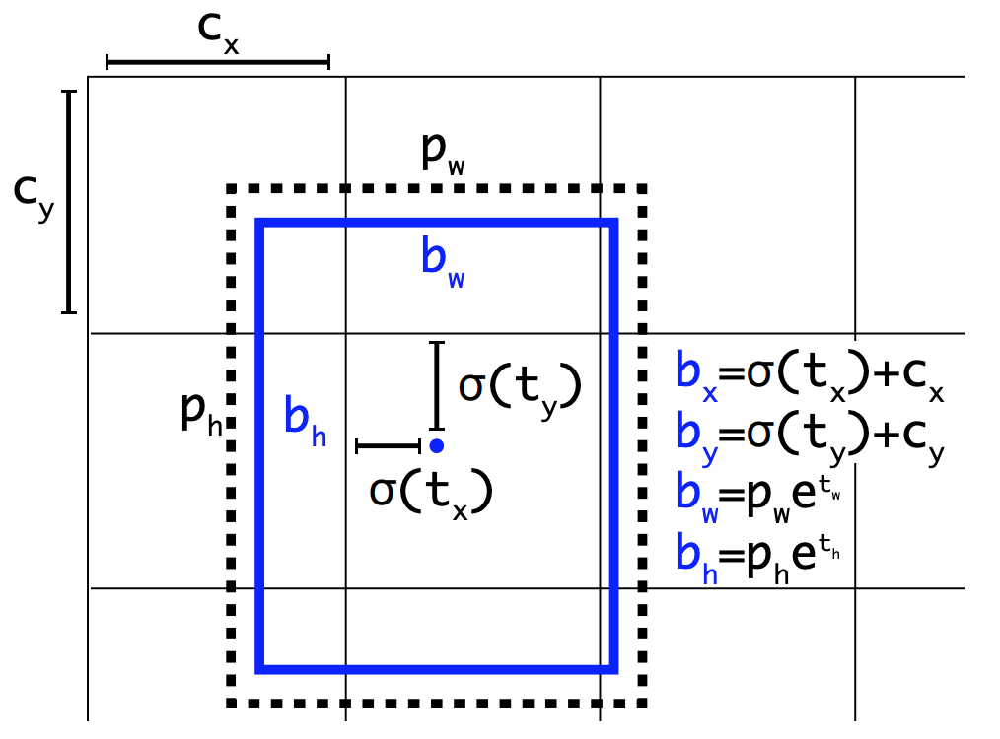
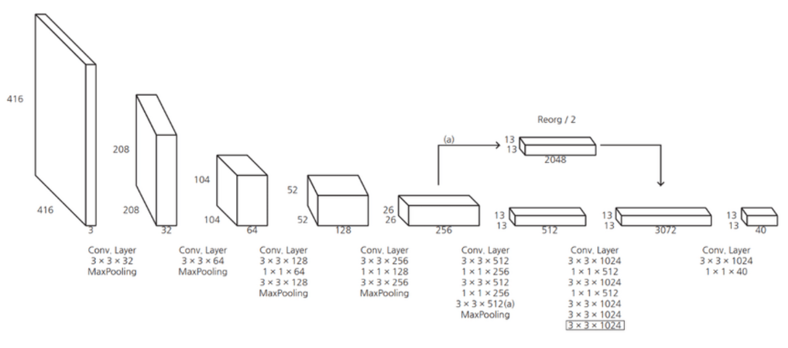
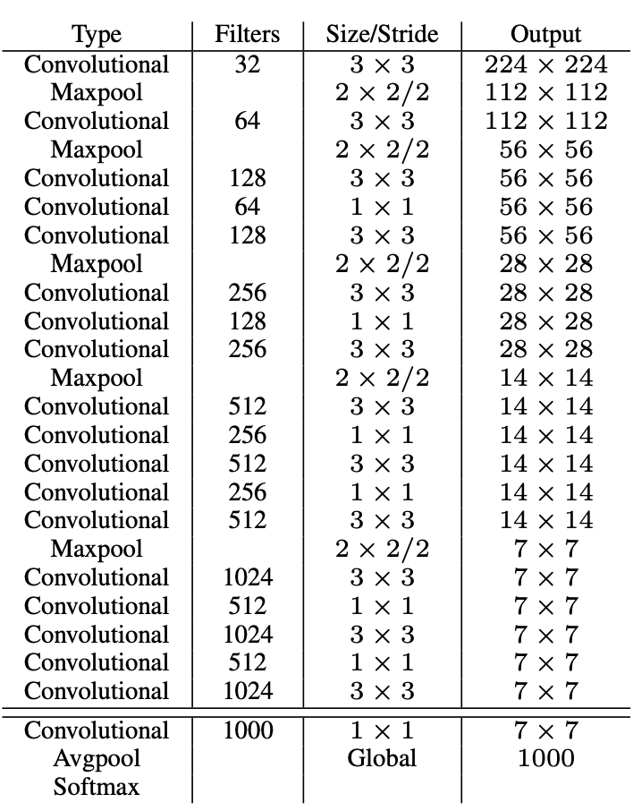
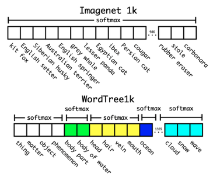
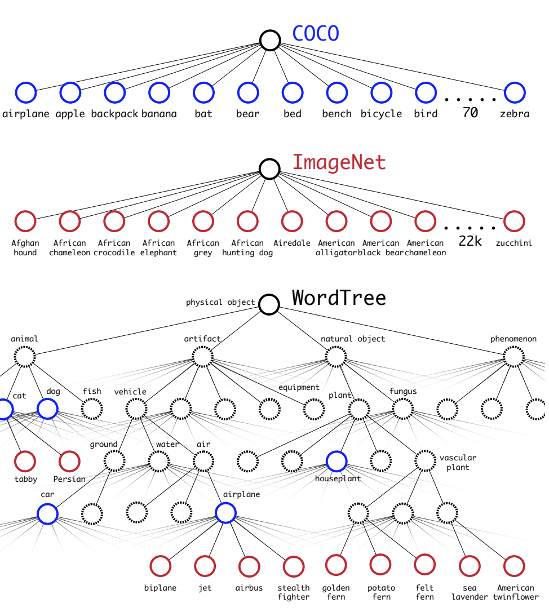

# Yolo2  
YOLO9000: Better, Faster, Stronger  

## 1. Better  
### 1. Batch Normalization  
Batch Normalization은 mini batch를 사용하여 학습할 때 학습이 빠르게 수렴하도록 해주고, 정규화 효과도 있다.  

  

mini batch 단위로 feature map의 각 채널의 평균과 표준편차를 구한다. feature map의 각 채널별로 평균과 표준 편차를 이용해 정규화하면 평균이 0이 되며, 값의 범위는 대부분 [-1, 1]사이가 된다. 0으로 나누어지는 일을 방지하기 위해 epsilon을 사용한다. 정규화된 feature map에 다시한번 채널별로 감마를  곱해주고 베타를 더해준다. 그러므로 Batch Normalization 파라미터 감마와 베타는 채널 수 만큼 존재한다.  
Yolo2에서는 기존 모델의 Dropout Layer를 제거하고 Batch Normalization을 추가한다. 이에 따른 오버피팅은 발생하지 않았고 mAP 2% 향상되었다.  

### 2. High Resolution  
기존 yolo 모델은 224x224 크기의 해상도로 학습된 VGG 모델을 가져온 다음, 448x448 크기의 이미지에 대해서 Object Detection을 수행하게끔 구성되어 있어 해상도가 맞지 않았다. 이를 Object Detection 학습 전에 Image Classification 모델을 큰 해상도 이미지에 대해서 fine-tuning 함으로써 해결하였으며, 약 4% mAP가 증가했다.  

### 3. Convolution With Anchor Boxes  
  
Fully Connected Layer를 떼어내고 Fully Convolutional Network 형태로 prediction을 계산한다. 또한 Anchor Box의 개념을 도입한다. 위 기존 yolo 구조를 보면 FC Layer를 두번 거쳐서 최종적으로 7x7x30 크기의 피쳐맵을 얻어낸다. 7x7은 입력 이미지를 그리드 단위로 나눈 것이고 각 그리드 별 30차원 벡터는 5차원 벡터로 표기된 박스 두개와 20개의 클래스에 대한 스코어 값을 합친 것입니다. 여기서 중요한 점은 5차원 박스를 예측할 때 (중심점 x,y 좌표, 박스 너비 높이 w, h, 물체일 확률 p) 이렇게 다섯가지 정보를 합친 벡터를 사용했다는 것이다. 이는 사전에 박스는 어떠한 형태일 것이다라는 사전 정보 없이 그냥 박스를 prediction 하는 것이다. 때문에 예측하는 박스의 크기나 위치가 중구난방이 될 우려가 있다. 이를 방지하기 위해 yolo v2에서는 Anchor Box의 개념을 도입한다.  
Anchor Box를 사용하면서 성능은 69.5 mAP 에서 69.2 mAP 로 조금 떨어졌으나 재현율(recall)은 81%에서 88%로 크게 상승했다.  

### 4. Dimension Cluster  
  
Anchor Box의 핵심은 사전에 크기와 비율이 모두 결정되어 있는 박스를 전제하고, 학습을 통해서 이 박스의 위치나 크기를 세부 조정하는 것을 말한다. 아예 처음부터 중심점의 좌표와 너비, 높이를 결정하는 방식보다 훨씬 안정적으로 학습이 가능하다. Anchor Box는 적당히 직관적인 크기의 박스로 결정하고, 비율을 1:2, 1:1, 2:1로 설정하는 것이 일반적이었는데, yolo v2는 여기에 learning algorithm을 적용한다. 바로 coco 데이터 셋의 바운딩 박스에 K-means clustering을 적용하였다. 그 결과 Anchor Box를 5개로 설정하는 것이 precision과 recall 측면에서 좋은 결과를 낸다고 결론지었다.  

### 5. Direct Location Prediction  
  
이렇게 결정한 Anchor Box에 따라서 하나의 셀에서 5차원 벡터로 이루어진 바운딩 박스를 예측한다. (tx, ty, tw, th, to)를 학습을 통해서 예측하게 되며, 이를 아래와 같은 방식을 적용하여 바운딩 박스를 구한다. 기존의 yolo가 그리드의 중심점을 예측했다면, yolov2에서는 left top 꼭지점으로부터 얼만큼 이동하는 지를 예측한다. 이것이 bx=σ(tx) + cx의 의미다. 다음으로 너비와 높이는 사전에 정의된 박스의 크기를 얼만큼 비율로 조절할 지를 지수승을 통해 예측하며, bw=pwe^tw에 잘 나타나 있다. 이러한 Anchor Box의 적용을 통해서 mAP가 5% 정도 상승했다.  

### 6. Fine-Grained Features  
  
기존의 yolo에서는 CNN을 통과한 마지막 레이어의 feature map만 사용하여 작은 물체에 대한 정보가 사라진다는 제한점이 있었다. yolo v2에서는 상위 레이어의 feature map을 하위 feature map에 합쳐주는 passthrough layer를 도입하였다. 위 그림에서 볼 수 있듯이 높은 해상도를 가진 26x26x256 피쳐맵을 13x13x2048 크기로 rescale하여 낮은 해상도의 feature map과 합쳐 13x13x3072 크기의 feature map을 만들어 낸다.  

### 7. Multi-Scale Training  
작은 물체들을 잘 잡아내기 위해서 yolov2는 여러 스케일의 이미지를 학습할 수 있도록 하였다. Fully Connected Layer를 떼어냈기 때문에 입력 이미지의 해상도에서 비교적 자유로울 수 있게 되었다. yolo v2는 이를 활용하여 학습 시에 {320, 352, ..., 608} 와 같이 32 픽셀 간격으로 매 10 배치시마다 입력 이미지의 해상도를 바꿔주며 학습을 진행한다.  

## 2. Faster  
  
기존의 yolo가 pretrained VGG 혹은 Googlenet을 사용하였는데 이 BackBone Network가 너무 크고 복잡하다. 이를 해결하기 위해 새로운 CNN Architecture인 Darknet을 제시한다.    

전체 구조는 VGG와 크게 다르지 않지만 MaxPooling을 줄이고 컨볼루션 연산을 늘렸다. 또한 마지막 단에 Fully Connected Layer를 제거하고 Convolution 연산으로 대체하여 파라미터의 수를 줄였다. 이러한 경량 CNN Architecture를 사용하여 속도 측면에서도 개선을 이루었다.  

## 3. Stronger  
### 1. Hierarchical Classification  
  
방대한 크기의 class에 대해서 classification을 수행할 경우 계층적으로 분류 작업을 수행해야한다. ImageNet 데이터를 보면 개과 안에 웰시코기, 요크 셔테리어와 같은 라벨들이 속한다. 이 점에 착안하여 Softmax 연산을 수행할 때 전체 클래스에 대해서 한번에 수행하지 말고, 각 대분류 별로 Softmax를 수행한다.  

  
coco와 imagenet 데이터 셋의 라벨을 트리 구조를 활용하여 섞는다.  

### 2. Joint classification and detection  
앞서 wordtree를 이용하여 총 9418개의 클래스를 가진 데이터 셋을 만들어 냈다 그러나 이 중 9000개의 클래스는 ImageNet Classification 데이터 셋에 속하였고, 이들은 Classification 라벨만 붙어있는 상태다. 학습 과정에서 COCO 데이터 셋이 더 많이 샘플링 되도록 하여 실제 모델이 학습하는 이미지의 비율을 4:1로 맞춰주었다. 그리고 Classification 라벨만 붙어있는 이미지의 경우에는 Classification Loss만 역전파를 수행하도록 하였다. 이를 통해서 Classification과 Object Detection 테스크가 섞여있는 데이터 셋을 학습시킬 수 있게 되었다. 학습시킨 yolo 9000을 ImageNet Detection Challenge 데이터 셋을 활용하여 성능 평가를 진행하였고, 19.7 mAP를 얻었다. 특히 detection 라벨이 붙은 데이터를 하나도 학습하지 못한 156개의 클래스에 대해서는 16.0 mAP라는 정확도를 달성했다. 수치만 놓고 보면 실망스러울 수 있지만, 모델이 무려 9000개의 클래스를 구분하도록 학습을 진행헀다는 것을 생각해보면 놀라운 결과다.  