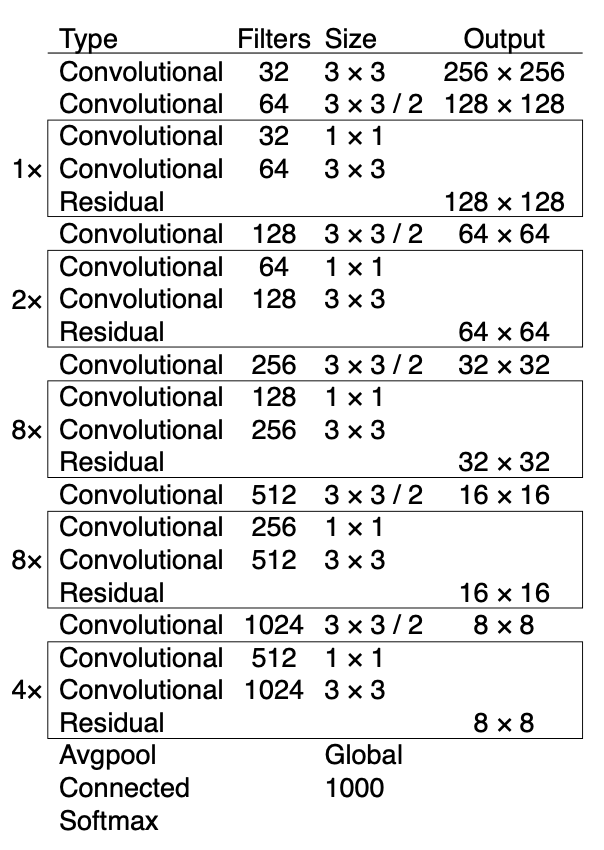

# Yolo3  
YOLO: Real-Time Object Detection  

## 1. BackBone Network  
  
yolo v3에서는 BackBone Network를 Darknet-53으로 변경했다. 이전 yolo v2에서는 VGG 모델이 지나치게 복잡하다는 점에 착안하여 훨씬 적은 파라미터를 사용하면서도 성능이 좋은 Darknet-19 Architecture를 사용했다. Darknet-53에서는 Darknet-19에 ResNet에서 제안된 skip connection 개념을 적용했다. 먼저 3x3 컨볼루션과 1x1 컨볼루션으로 이루어진 블럭을 연속해서 쌓아간다. 그리고 MaxPooling 대신에 컨볼루션의 stride를 2로 취해주어 피쳐맵의 해상도를 줄여나간다. 또한 skip connection을 활용해서 residual 값을 전달하고 마지막 레이어에서 Average Pooling과 Fully Connected Layer를 통과한 뒤, Softmax를 거쳐 분류 결과를 출력한다.  

Architecture만 살펴보아서는 기존의 ResNet과 큰 차이점이 없어 보이지만 실험 결과 ResNet-101과 ResNet-152 과 정확도는 큰 차이가 안나지만 FPS가 훨씬 높았다.  

## 2. Other Change  
FPN 처럼 다양한 크기의 해상도의 피쳐맵을 사용하여 바운딩 박스를 예측한다.  
Class 예측 시에 Softmax를 사용하지 않고 개별 클래스 별로 sigmoid를 활용한 binary classification을 적용한다  

## 3. Experiment  
- Anchor Box x,y의 offset을 너비나 높이의 비율로 예측하는 기법을 사용하면 모델 학습이 불안정해 진다.  
- Bounding Box의 x, y를 예측하는데 Non-Linear Activation Function을 사용하지말고 Linear Activation Function을 사용했더니 효과가 없었다.  
- 예측한 Bounding Box가 True라고 판단할 IoU 기준 값을 0.3부터 0.7사이로 설정하였을 때, 큰 효과는 없었다.  