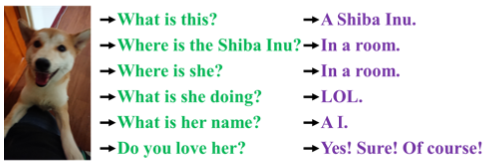

# YoloR  
YOLO R: You Only Learn One Representation: Unified Network for Multiple Tasks  

## 1. Abstract  
사람들은 시각, 청각, 촉각, 그리고 과거의 경험을 통해 세상을 이해한다. 인간의 경험은 정상적인 학습(explicit knowledge)을 통해, 또는 잠재의식적으로(implicit knowledge) 학습할 수 있다. 정상적인 학습을 통해 또는 무의식적으로 학습한 이러한 경험들은 암호화되어 뇌에 저장될 것이다. 이런 풍부한 경험을 거대한 데이터베이스로 활용함으로써, 인류는 사전에 보지 못했던 데이터도 효과적으로 처리할 수 있다. 본 논문에서는 인간의 뇌가 잠재의식 학습뿐만 아니라 정상 학습에서도 지식을 배울 수 있는 것처럼 explicit knowledge과 implicit knowledge을 함께 encoding하는 통합 네트워크를 제안한다. 통합 네트워크는 다양한 작업을 동시에 처리하기 위해 통일된 표현을 생성할 수 있다. 우리는 convolution neural network에서 kernel space alignment, prediction refinement 및 multi-task learning을 수행할 수 있다. 결과는 explicit knowledge이 신경망에 도입되면 모든 작업의 성능에 도움이 된다는 것을 보여준다. 제안된 통합 네트워크에서 학습된 implicit representation을 추가로 분석하며, 다양한 작업의 물리적 의미를 파악하는 데 큰 기능을 보여준다.  

## 2. Introduction  
  
위 그림과 같이 인간은 동일한 데이터를 다양한 각도에서 분석할 수 있습니다. 그러나 학습된 CNN(Convolutional Neural Network) 모델은 일반적으로 단일 목표만 달성할 수 있다. 일반적으로, 학습된 CNN에서 추출할 수 있는 특징은 보통 다른 유형의 문제에 잘 적응하지 못한다. 위와 같은 문제의 주요 원인은 뉴런에서 특징을 추출할 뿐 CNN에 풍부한 explicit knowledge은 활용되지 않기 때문이다. 실제 인간의 뇌가 작동 중일 때 앞서 언급한 explicit knowledge은 뇌가 다양한 작업을 수행할 수 있도록 효과적으로 도울 수 있다.