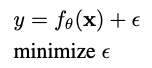

# YoloR  
YOLO R: You Only Learn One Representation: Unified Network for Multiple Tasks  

## 1. Abstract  
사람들은 시각, 청각, 촉각, 그리고 과거의 경험을 통해 세상을 이해한다. 인간의 경험은 정상적인 학습(explicit knowledge)을 통해, 또는 잠재의식적으로(implicit knowledge) 학습할 수 있다. 정상적인 학습을 통해 또는 무의식적으로 학습한 이러한 경험들은 암호화되어 뇌에 저장될 것이다. 이런 풍부한 경험을 거대한 데이터베이스로 활용함으로써, 인류는 사전에 보지 못했던 데이터도 효과적으로 처리할 수 있다. 본 논문에서는 인간의 뇌가 잠재의식 학습뿐만 아니라 정상 학습에서도 지식을 배울 수 있는 것처럼 explicit knowledge과 implicit knowledge을 함께 encoding하는 통합 네트워크를 제안한다. 통합 네트워크는 다양한 작업을 동시에 처리하기 위해 통일된 표현을 생성할 수 있다. 우리는 convolution neural network에서 kernel space alignment, prediction refinement 및 multi-task learning을 수행할 수 있다. 결과는 explicit knowledge이 신경망에 도입되면 모든 작업의 성능에 도움이 된다는 것을 보여준다. 제안된 통합 네트워크에서 학습된 implicit representation을 추가로 분석하며, 다양한 작업의 물리적 의미를 파악하는 데 큰 기능을 보여준다.  

## 2. Introduction  
  
위 그림과 같이 인간은 동일한 데이터를 다양한 각도에서 분석할 수 있습니다. 그러나 학습된 CNN(Convolutional Neural Network) 모델은 일반적으로 단일 목표만 달성할 수 있다. 일반적으로, 학습된 CNN에서 추출할 수 있는 특징은 보통 다른 유형의 문제에 잘 적응하지 못한다. 위와 같은 문제의 주요 원인은 뉴런에서 특징을 추출할 뿐 CNN에 풍부한 implicit knowledge은 활용되지 않기 때문이다. 실제 인간의 뇌가 작동 중일 때 앞서 언급한 implicit knowledge은 뇌가 다양한 작업을 수행할 수 있도록 효과적으로 도울 수 있다.  

implicit knowledge은 잠재의식 상태에서 배운 지식을 말한다. 그러나 implicit 학습이 어떻게 작동하고 implicit knowledge을 얻는 방법에 대한 체계적인 정의는 없다. 신경망의 일반적인 정의에서 얕은 계층에서 얻은 특징을 종종 explicit knowledge이라고 하며, 깊은 계층에서 얻은 특징을 implicit knowledge이라고 한다. 본 논문에서 관찰에 직접적으로 해당하는 지식을 implicit knowledge이라고 부른다. 모델에 내재되어 있고 관찰과 무관한 지식에 대해서는 implicit knowledge이라고 한다.  

본 논문에서는 explicit knowledge과 implicit knowledge을 통합하고 학습된 모델이 일반적인 표현을 포함할 수 있도록 통합 네트워크를 제안하며, 이 일반적인 표현은 다양한 작업에 적합한 하위 표현을 가능하게 한다. 그림 2.(c)는 제안된 통합 네트워크 아키텍처를 보여준다.  

## 3. Related Work  
### 1. Explicit deep learning  
명시적 딥 러닝은 다음과 같은 방법으로 수행될 수 있다. 그 중 Transformer가 한 가지 방법이며, 주로 쿼리, 키 또는 값을 사용하여 self-attention을 얻는다. Non-local network 는 attention을 추출할 수 있는 또 다른 방법이며, 주로 시간과 공간에서 pair-wise attention을 추출한다. 일반적으로 사용되는 또 다른 명시적 딥러닝 방법은 입력 데이터로 적절한 커널을 자동으로 선택하는 것이다.  

### 2. Implicit deep learning  
암묵적 딥 러닝 범주에 속하는 방법은 주로 implicit neural representations와 deep equilibrium models이다. 전자는 주로 다른 작업을 수행하기 위해 이산 입력의 매개 변수화된 연속 mapping representation을 얻는 것이고, 후자는 implicit 학습을 residual 형태의 신경망으로 변환하고 그에 대한 equilibrium point 계산을 수행하는 것이다.  

### 3. Knowledge Modeling  
knowledge modeling 범주에 속하는 방법의 경우, sparse representation과 메모리 네트워크가 주로 포함된다. 전자는 exemplar, predefined over complete, learned dictionary을 사용하여 모델링을 수행하는 반면, 후자는 다양한 형태의 embedding 결합하여 메모리를 형성하고 메모리를 동적으로 추가하거나 변경할 수 있다.  

## 4. How implicit knowledge works?  
본 연구의 주요 목적은 implicit knowledge 효과적으로 학습할 수 있는 통일된 네트워크를 실시하는 것이므로 먼저 implicit knowledge을 학습하고 이를 후속 연구에서 빠르게 inference하는 방법에 초점을 맞출 것이다. implicit representation zi는 관찰과 무관하기 때문에, 상수 텐서 Z = {z1,z2,......zk}의 집합으로 생각할 수 있다. 이 섹션에서는 상수 텐서로서의 암묵적 지식을 다양한 작업에 어떻게 적용할 수 있는지 소개한다.  

### 1. Maifold space reduction  
good representation은 그것이 속한 manifold space에서 적절한 projection을 찾을 수 있어야 하고 성공하기 위한 후속적인 객관적 과제를 촉진할 수 있어야 한다. 예를 들어, 그림 3에서와 같이, 대상 범주가 projection space에서 hyper-plane으로 성공적으로 분류될 수 있다면, 그것이 가장 좋은 결과일 것이다. 위의 예에서, 우리는 projection vector와 implicit representation의 내적을 취하여 manifold space의 차원을 줄이고 다양한 작업을 효과적으로 달성하는 목표를 달성할 수 있다.  

### 2. Kernel space alignment  
multi-task, multi-head neural network에서 kernel space misalignment은 빈번한 문제다. 이 문제를 해결하기 위해, 본 논문에서는 kernel space를 그림 4(b)와 같이 신경망의 각 output kernel space를 정렬하도록 translated, rotated 및 scaled할 수 있도록 출력 기능과 implicit representation의 덧셈을 수행할 수 있다. 위의 작동 모드는 large object와 small object의 feature alignment를 수행하는 FPN, large model, small model을 통합하기 위한 knowledge distillation 같은 다양한 분야에서 널리 사용될 수 있다.  

### 3. More functions  
implicit knowledge는 더 많은 기능으로 확장될 수 있다. 그림 5와 같이 덧셈을 도입하면 중심 좌표의 오프셋을 예측할 수 있는 신경망을 만들 수 있다. 앵커 기반 object detector에 매우 자주 필요한 앵커의 하이퍼 파라미터 세트를 자동으로 검색하기 위해 multiplication을 도입할 수도 있다. 또한, dot multiplication과 concat은 각각 multi-task feature selection을 수행하고 후속 계산을 위한 사전 조건을 설정하는 데 사용될 수 있다.  

## 5. Implicit knowledge in our unified networks  
본 문단에서는 기존 네트워크의 objective function과 제안된 unified networks를 비교하고, multi-purpose network 학습에 implicit knowledge을 도입하는 것이 왜 중요한지 설명할 것이다. 동시에, 본 연구에서 제안된 방법에 대한 detail도 자세히 설명할 것이다.  

### 1. Formulation of implicit knowledge - conventional network  
기존 네트워크 학습의 objective function에 대해서는 다음과 같이 표현할 수 있다.  
  
여기서 x는 observation, θ는 신경망의 매개변수 집합, fθ는 신경망의 작동을, ε는 오차항, y는 주어진 작업의 대상이다.  
conventional neural network의 학습 과정에서는 보통 fθ(x)를 가능한 한 대상에 가깝게 만들기 위해 ε를 최소화한다. 그림 6(a)에 설명된 바와 같이 fθ에 의해 얻어진 값이 동일한 타겟을 가지면 obsercation이 다르더라도 single point로 매핑된다. 즉, 현재 task에 대하여 discriminative가 얻어지고, 다른 task에 취약하다.  
여러 task에서 역할을 수행할 수 있는 representation을 얻고 싶다면, 그림 6(b)와 같이 manifold space에서 동시에 각 task의 solution을 찾을 수 있도록 ε를 relax해야 한다. 그러나 위의 요구사항들은 사소한 수학적 방법을 사용하는 것이 불가능하다. 문제를 해결하기 위해서는 그림 6.(c)와 같이 error term을 modeling하여 서로 다른 task에 대한 solution을 찾아야 한다.  

### 2. Formulation of implicit knowledge - unified network  
제안된 unified network를 학습시키기 위해 explicit, implicit knowledge를 함께 사용하여 error term을 modeling 한다. 그리고나서 이를 multi-purpose network training process로 guide하기 위해 사용한다.  

두 error term은 관측값 x와 latent code z로부터의 explicit error와 implicit error다. g는 explicit, implicit knowledge 로부터의 정보를 선택하거나 결합하는 역할을 하는 task specific 연산이다. 위 식을 아래와 같이 작성할 수 있다.  

별표는 f와 g 두개를 결합할 수 있는 연산을 나타낸다. addition, multiplication, concatenation이 될 수 있다.

만약 multiple task를 다루기 위해 error term을 확장하면 다음의 식을 얻는다.  

### 3. Modeling implicit knowledge  
3가지 과정을 거쳐서 implicit representation을 계산한다. z를 벡터로 표현하고 이 z벡터를 neural network를 사용해 implicit representation Z 을 계산한다. 이 Z와 계수 c로 최종 implicit representation을 형성한다.  

### 4. Training  
학습 초반에는 어떤 prior implicit knowledge를 갖고 있지 않아 explicit representation f(x)에 어떤 영향을 미치지 않는다. 초기 z는 N(0,
σ)에서 추출한다. 시그마는 0에 가까운 매우 작은 값이다. explicit와 implicit를 결합하는 별표 연산은 multiplication다. 이 z는 오차 역전파법으로 학습된다.  

### 5. Inference  
implicit knowledge은 observation x와 무관하기 때문에, implicit model gφ가 얼마나 복잡하든, 추론 단계가 실행되기 전에 상수 텐서 집합으로 축소될 수 있다. 즉, implicit information의 형성은 알고리즘의 계산 유연성에 거의 영향을 미치지 않는다. 또한 위의 연산자가 곱셈일 때, 후속 계층이 컨볼루션 계층이면, 우리는 아래 (9)를 사용하여 통합한다. 추가 연산자를 만났을 때, 그리고 이전 계층이 컨볼루션 계층이고 활성화 함수가 없다면, 적분하기 위해 아래의 한 번 사용(10)을 나타낸다.