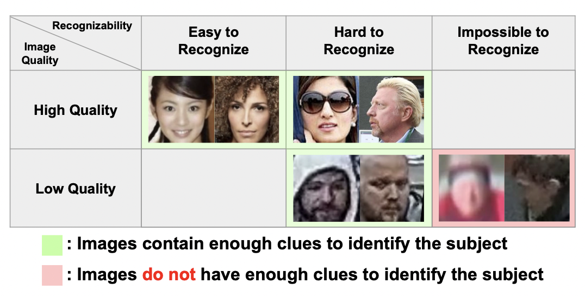

# AdaFace  
AdaFace: Quality Adaptive Margin for Face Recognition  

## 1. Abstract   
열화되거나 얼굴이 가려진 데이터를 이용하여 인식 기술을 학습하는 것은 어려운 과제다. embedding 공간에서 margin을 기반으로 하는 loss 함수가 차별성을 가지며 발전해 왔고, 잘못 분류된 예시를 강화하기 위한 adaptive loss 방식이 좋은 효과를 보인다는 것이 연구결과로 나왔었다. 본 논문에서는 이미지 품질이라는 adaptiveness의 다른 측면을 소개한다. 이미지 품질에 따라 조절되는 misclassified 샘플들을 강화하는 전략으로, 이미지 품질에 따라 어려움, 쉬움등의 인식 난이도를 설정하거나 품질이 다른 샘플사이의 차이점을 학습하기 위한 새로운 loss function을 제안한다.  

## 2. Introduction  
  
안면인식에서 얼굴의 포즈, 표정이 다양하거나 조명이나 명암, 특히 나이 차이나 메이크업으로 인한 극적인 시각변화에도 사람이나 모델은 여전히 잘 인지할 수 있다. 하지만 품질이 안좋은 이미지는 얼굴의 특징을 잡는데 어렵기 때문에 인식이 매우 어렵다. 이전에는 좋은 품질의 얼굴 이미지에서 높은 성능을 보이는 모델이 많이 발표되었다. 하지만 시간이 지나면서 보안 분야 같이 낮은 품질의 이미지를 활용하는 분야에서 안면인식으로 인하여 품질이 낮은 얼굴 이미지를 학습한 모델의 중요성이 커지고 있다.  

품질이 낮은 데이터 학습의 가장 큰 문제점은 인식이 안된다는 점이다. 정확하게 얼굴인지 정의가 되지 않은 상태로 학습을 진행하면 모델이 loss 값을 낮추기 위해 학습하는 과정에 해가되며 테스트 과정에서도 품질이 낮은 이미지에 대해서 좋지 않은 결과를 나타낼 것이다.  

본 연구에서는 이미지 품질에 따라 샘플의 중요성을 구분할 것이다. 품질에 따른 중요성 분료가 필수적인 이유는 정의되지 않은 이미지로부터 추출된 하나의 요소는 랜덤한 결과를 산출할 수 밖에 없기 때문에 이러한 것들은 항상 Hard 샘플들사이에 위치해 있다.