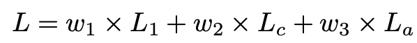

# ClassSR  
Exploring Sparsity in Image Super-Resolution for Efficient Inference  

## 1. 개요  
기존 SISR방식은 전체 이미지를 같은 공간에서 동일하게 연산을 수행한다. 이러한 방식은 시간이 지나면서 성능이 좋아지지만, 그에 비례하여 메모리, 계산 복잡도도 2차적으로 증가한다. 그러나 주목할 점은 모든 이미지 영역이 요구하는 계산 복잡도와 메모리 용량은 다르다는 것이다. 예를 들어 배경색만 있는 영역은 적은 계산을 요구할 것이고, 반대로 복잡한 문양이 있는 영역은 많은 메모리와 계산양을 요구할 것이다. 이러한 특성을 이용하여 이미지 영역을 구분하고 메모리, 속도를 개선한 ClassSR을 제안한다.  
핵심 개념은 이미지 영역별로 서로 다른 네트워크를 적용시킨다는 점이다. DIV2K, DIV8K이미지를 비교했을 때 각각 30%, 60%가 평균적으로 부드러운 영역을 차지한다. 즉 고해상도 이미지일 수록 가속 비율이 커진다. 또한 ClassSR은 서브 네트워크 개념이어서 사용되는 SR모델을 교체할 수 있다.  

## 2. Network Architecture  
### 1. Data Distribution  
전체적인 네트워크 구조를 설명하기 전에 ClassSR의 핵심인 데이터 분류를 간단한 실험을 통해 확인하고 가려고 한다. 테스트에는 DIV2K이미지를 32*32 사이즈로 잘라서 사용하였고 모델은 MSRResNet을 사용하였다. 결과는 위 그림과 같다. 그림을 보면 서브 이미지를 3개로 분류할 수 있는데 이는 단순히 부드럽고 복잡한 것으로 분류할 수 있지만 HR과의 PSNR수치하고도 연관이 있다. PSNR수치가 클수록 연산이 간단했고, 낮을수록 연산이 복잡한 관계를 보인다. 그래서 이러한 자료를 기반으로 같은 네트워크에서 파라미터, 레이어 수만 줄인 모델을 준비하고 배치할 것이다. original 모델은 가장 복잡한 서브 이미지 연산을 수행하고, 모델이 가벼워 질 수록 간단한 이미지를 연산하도록 설계한다.  

### 2. Overview of ClassSR  
ClassSR의 전체적인 흐름은 우선 입력받은 이미지 X를 서브이미지로 자른다. 서브이미지를 class 모듈을 이용하여 사전에 정의해 놓은 클래스 개수로 분류한다. softmax함수를 이용하여 각 클래스에 해당하는 확률을 구하고, 가장 큰 확률 값의 클래스와 매칭시킨다. 매칭된 클래스에 해당하는 모델을 이용하여 서브이미지를 연산한다. 최종적으로 서브이미지를 모두 합쳐서 최종이미지를 생성한다.  

### 3. Class-Module  
클래스모듈은 복잡한 모델을 사용하지 않고 가볍게, 간단하게 구성한다. 우선 Conv연산은 이미지의 특징을 추출하는 역할을 수행한다. Average pooling layer, fully-connected layer는 class vector를 예측하는 역할을 수행한다.  

### 4. SR-Module  
SR 모듈은 새롭게 구축하지 않고 기존모델을 활용한다. 기존에 사용되던 모델을 가장 복잡한 이미지를 처리하도록 설정하고, 모델을 점점 경량화하면서 중간, 간단한 이미지를 처리하도록 한다.  

### 5. Classification Method  
학습 과정에서 서브이미지를 기준 클래스에 따라 정확히 분류하는 것은 어려운일이다. 그래서 테스트 과정과는 다르게 학습을 진행할 때, class 모듈이 기울기 전파를 더 쉽게 할 수 있도록 서브이미지의 확률을 결과에 곱하여 분류를 진행한다. 또한 기존에는 L1 Loss만을 사용했는데, 이는 이미지 분류를 수행하기에 한계가 있다. 따라서 Class Loss를 사용하여 서브이미지와 클래스 사이의 개연성을 높이고 학습을 더 잘 진행되게 한다.  

### 6. Loss Function  
  
ClassSR의 Loss는 3개로 구성되어있다. 우선 기본적인 SR, HR비교 Loss인 L1 Loss를 사용한다. 그리고 Class Loss, Average Loss 2개를 추가로 사용하여 학습한다. 위 그림은 최종 Loss의 수식이다.  

Class Loss는 서브이미지와 클래스 사이의 개연성을 높이는 역할을 한다. 예를들어, 하나의 서브이미지의 class 분류 결과가 [0.34, 0.33, 0.33]인 경우보다 [0.9, 0.05, 0.05]일 경우가 확률이 큰 것이 눈에띄어서 더 좋은 결과를 보인다. 이처럼 개연성을 높이면서 분류를 더 쉽게할 수 있도록 가중치 파라미터를 변경하도록 한다. 수식은 각 확률의 차이의 절대 값을 합하여 계산한다. 이 결과로 나오는 최대확률은 1에 근접한 수치를 가진다.  

Average Loss는 확률의 몰림현상을 방지한다. 위에서 언급한 2개의 Loss만 사용해서 학습을 할 경우, 가장 복잡한 모델로 이미지가 편향되는 현상이 생긴다. 이를 방지하기 위해 Average Loss를 사용하여 각각의 모델에 동등한 기회를 제공하도록 학습한다.  

## 3. 학습 전략
### 1. 과정
우선 SR모델을 미리 학습을 시켜둔다. 각각의 모델을 학습시킬 때, MSRResNet을 통과한 이미지와 PSNR 수치를 통해 Rank를 구분한 서브이미지를 이용한다. 즉, 데이터 분류와 일치하도록 모델을 설정하여 각각 학습시킨다.  
두 번째로 Class Module을 학습시키는데, 이 때 SR모델의 파라미터는 고정시킨다. 이 때 Loss는 3개의 Loss를 전부 사용한다.  
최종적으로 모든 파라미터를 Fine Tuning시킨다. 두 개의 모델을 같이 학습시키면서 Class Module의 정확도는 향상하고, SR 모델은 새로운 데이터 분류에 맞게 정확도를 향상시킨다.  

### 2. 설정
학습 데이터 셋은 DIV2K를 사용하여 0.6~0.9 사이로 이미지를 Resize하여 사용한다. LR 서브이미지는 HR과 비교하여 4배 차이가 나게 다운 스케일을 하고 서브이미지의 사이지는 32*32로 설정한다.  
첫 번째, SR 모델을 학습시킬 때는 배치사이즈를 16으로 설정하고 L1 Loss의 Optimizer를 Adam으로 설정한다. 이때 Learning Rate는 1e-3에서 1e-7까지 감소하며 총 500000 iteration 학습을 실시한다.  
두 번째, Class Module을 학습시킬 때는 전체 Loss를 구할 때 각각의 Loss의 weight값을 2000, 1, 6 으로 설정한다. 배치사이즈는 96으로 설정하고 나머지 설정은 첫 번째 학습과정과 동일하다. 학습은 200000 iteration 진행한다.  
마지막 학습과정에서 두 개의 모델을 같이 학습시키고 설정은 바꾸지 않는다.  

## 4. 결과  
학습을 진행하면서 PSNR이 증가함에 따라 flops가 감소하는 것을 볼 수 있다.