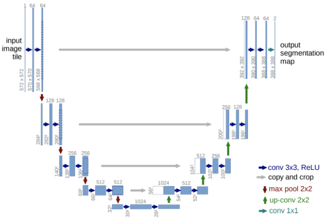

# DASR  
  
Unsupervised Degradation Representation Learning for Blind Super-Resolution  

## 1. 개요  
이전까지 연구된 고정된 Degradation 기반 SR 학습 방식은 좋은 성능을 보이지만 실생활에서 발생하는 랜덤한 degrade에 관해서 대처를 잘 하지 못하고 성능이 떨어지는 모습을 보인다. 또한 이를 해결하기 위해 반복적으로 degrade를 없애는 방식으로 성능이 좋아졌지만 너무 많은 시간이 소모된다는 단점이 있다. 본 논문은 이를 해결하기 위해 명확한 degrade 표현을 사용하는 대신 추상적인 degrade 표현을 사용하여 degradation representations를 학습하고 이를 유연하게 활용할 수 있는 Degradation-Aware SR(DASR)을 소개한다.

## 2. 이전까지의 연구
### 1. Single Image Super-Resolution  
Super-Resolution 기술은 최초의 네트워크인 SRCNN을 시작으로 지금까지 많은 발전이 있었다. 최근에는 second-order channel attention을 활용하는 네트워크로 우수한 성능을 입증했지만 단일 degradation(바이큐빅 다운샘플링)이라는 제한적인 성능을 보인다.  
이러한 degradation 문제를 해결하기위해 다양한 degradation 기법을 적용시키는 SRMD, UDVD 등의 네트워크가 등장하였다.  
이 후 zero-shot 이라는 방식을 활용한 ZSSR, meta-learning 방식을 활용한 MZSR 방식이 등장하였지만 사용된 degradation method에 대한 의존성이 너무 커서 잘못된 정보를 가져올 경우 성능이 많이 떨어지는 모습을 보였다.  
이러한 문제를 해결하기 위해 degrade 정보를 점진적으로 반복하여 학습하는 IKC가 제안되었고 실제로 성능이 좋았다. 하지만 반복적인 추론을 진행하다보니 시간 소모적인 부분에서 많은 손해가 발생한다.  

### 2. Contrasive Learning  
기존에는 고정된 이미지를 이용하여 학습을 진행했다. 하지만 GAN 기반 네트워크 에서는 상반된, 대조적인 데이터를 이용하여 학습하는 것이 더 효과적임이 입증되었다. 이는 representation space를 최대화 하기 때문이다.  

## 3. DASR Methodology  
### 1. Problem Formulation  
LR 이미지를 생성하기 위한 Degradation 수식을 위 그림과 같이 정의하였다. I-HR은 HR이미지를 의미하며 k는 블러 커널을 의미한다. s는 다운 스케일 배율을 의미하며 n은 가우시안 노이즈를 의미한다.  
DASR에서는 우선 노이즈가 없는 상태로 Isotropic Gaussian kernels을 이용하여 학습을 진행한 후, Anisotropic Gaussian kernels과 노이즈를 함께 사용하여 general model을 학습한다. 