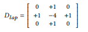

# ECBSR  
Edge-oriented Convolution Block for Real-time Super Resolution on Mobile Devices  

## 1. Introduction   
기존의 Single Image Super Resolution(SISR) 관련 연구들은 성능개선을 주 된 목표로 한다. 이러한 연구 과정에서 네트워크 구조는 복잡해지고 GPU 메모리 사용량이 점점 증가해졌다. 이러한 모델은 Inference Time에 크게 영향을 주었고 이를 해결하기 위한 연구도 같이 진행되어 왔다. Inference Time을 개선하기 위한 연구는 크게 두 가지가 있다. 첫 번째는 네트워크의 파라미터를 줄이는 것이다. 대표적인 방식으로 Weight Parameter를 Layer간에 공유를 하여 직접적으로 사용되는 Parameter 수를 줄이는 방식이 있다. 두 번째는 Flops를 줄이는 방법이다. 하지만 위와 같은 2가지 방식은 GPU Server에서 측정을 할 때는 효과가 있지만 Edge Device에서는 효과가 거의 없었다. 이를 해결하기 위해 아래의 기술을 제안한다.  

1. 학습에서 다양한 Feature Information을 얻고 Inference과정에서 속도 최적화를 위해 Re-Parameterizable Building Block 기술을 사용하여 Edge에 최적화된 Edge-oriented Convolution Block(ECB) 설계  
2. ECB는 3가지 유형의 Convolution 연산을 포함하여 학습하고 Inference 과정에서는 기존 Convolution 연산을 수행  
3. ECB를 이용하여 Edge Device 특화 SR 네트워크인 ECBSR 네트워크 설계
  

## 2. Network Architecture  
### 1. Base Model   
  
Edge Device에 적합한 네트워크를 개발하기 위하여 그 기반이 되는 모델 구조를 찾을 필요가 있다. 기존 SISR 네트워크에서 성능 향상을 위해 사용되는 Dense Connection 등의 기술은 확실히 Feature Information을 많이 가질 수 있지만 메모리 사용량, 속도 등에 부정적인 영향을 준다. 따라서 그림과 같이 성능을 유지를 하면서 간단한 구조를 가진 모델을 기반으로 한다. 하지만 이 모델을 그대로 Edge Device에 적용하면 그렇게 좋은 성능을 확인할 수 없다. 지원하지 않는 연산을 CPU로 연산을 하게 되면서 높은 메모리 사용량을 차지하는 등 다양한 문제가 있기 때문이다. 이를 해결하기 위해 Base Model을 기반으로 Convolution Block을 Edge Device에 최적화된 연산으로 바꾼다.   

### 2. Edge-oriented convolution block  
  
기본적으로 ECB의 구조는 위 그림과 같으며, 학습과 추론할 때 사용되는 파라미터는 가변적으로 변하게 된다.  

  
우선 ECB의 첫 번째 구성요소로 Normal 3x3 convolution 연산을 수행한다. 기존의 연산과 다른 점은 마지막 부분에서 Normalization 부분을 제거한다는 점이다. 이유는 이런 BN layer가 SR 결과에 좋지 않은 영향을 주기 때문이다.  

  
두 번째 구성요소는 Expanding-and-Squeezing Convolution 연산을 수행한다. Wider Features들이 SR 수행과정에서 좋은 영향을 주기 때문에 본 연산을 수행을 한다. 연산 순서는 우선 DxCx1x1 Convolution 연산을 통해 Feature Information의 채널을 C에서 D로 확장한다. 이 후, CxDx3x3 Convolution 연산을 통해 채널을 D에서 C로 다시 압축한다.  

  
  
세 번째 구성요소는 Sobel Filter를 사용한 Sequential Convolution 연산이다. Edge Device에서의 연산에서 이미지의 Edge Information을 보다 정확하게 하기 위하여 Sobel Filter를 사용한다. 기존에 대부분이 사용하던 Sharpen Filter는 학습할 때 자동적으로 적용하기 쉽지 않기 때문에 그 대체제로 Sobel Filter를 사용했다. 최종적으로는 수직, 수평 정보를 각각 Scale 필터, Bias 값을 각각 곱해준 뒤 Depth-wise Convolution 연산을 수행한 후 수직, 수평 Information을 하나로 합친다. 아래 두 행렬은 각각 수평, 수직 Sobel Filter를 표현한 것이다.  

  
  
네 번째 구성요소는 앞서 말한 Sobel Filter를 사용한 Feature 추출 단계에서 first-order 관련 정보에만 관여를 했는데, second-order 관련 정보도 추출하기 위해 Laplacian Filter를 사용하여 Sequential Convolution 연산을 수행한다. 연산 순서는 우선 CxCx1x1 Convolution 연산을 수행한 후 Depth-wise Convolution 연산 후에 Laplacian Filter를 적용하여 최종 Feature를 추출한다.  

  
위 4가지 구성요소를 통해 최종적으로는 하나의 Feature Information을 얻는다.  