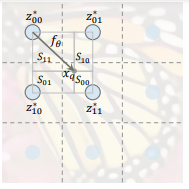

# LIIF  
Learning Continous Image Representation with Local Implicit Image Function  

## 1. 개요  
  
기존까지 연구되어온 SISR(Single Image Super Resolution)은 우수한 성능을 보이고 있다. 하지만 해상도다 특정 수치로 제한된다는 단점이 있다. 그리고 학습을 진행하는 과정에서 데이터셋의 크기를 특정 사이즈로 강제로 Resize하는 과정은 이미지에 큰 손실을 줄 수 있다. GAN을 이용한 방식은 Latent Code를 탐색하여 이미지에 적용하는 방식으로 진행되었는데, 이러한 방식은 디지털 이미지에는 성공적인 모습을 보이지만 실제 이미지에는 큰 효과가 없다.  
위 단점을 보안하기 위해 LIIF 모델 함수를 사용한다. LIIF의 메인 아이디어는 기존 SR이 Up-Sampling 하는 곳에 초점을 둔 것에 반해, 픽셀 사이의 값을 구하는 것에 초점을 둔다. 간단히 말하면 기존 Interpolate 기법에 파라미터를 적용하여 학습하는 것이다. 또한 LIIF에서는 이미지를 특정 Latent Space로 표현하여 학습한다. 학습하는 과정에서는 다른 해상도의 이미지로 학습이 가능하게 변경하였다.  

## 2. Local Implicit Image Function  
### 1. Local Implicit Image Function  
LIIF에서 각각의 연속적인 이미지는 2D Feature Map으로 표현한다. decoding 함수는 모든 이미지에 공유되어 적용되고 이 과정은 MLP(Multi-Layer-Perceptron)으로 정의된다.  
  
최종적으로 LIIF의 과정을 위와 같이 표현할 수 있다. f세타는 파라미터를 의미한다. 결과로 나오는 s는 예측되는 RGB값을 의미한다. z는 H*W의 Vector을 의미하고 x는 2H, 2W의 2차원 좌표 Domain을 의미한다. 사용되는 Latent Vector z는 지정된 좌표, RGB값을 예측하는데 사용된다.  

### 2. Feature Unfolding  
이미지의 Information을 각각의 Latent Code에 더 풍부하게 담기위하여 unfolding 기법을 적용시킨다. x좌표 차원과 y좌표 차원을 확장시킨뒤 Concat연산을 이용하여 합쳐서 최종적으로 펼쳐진 Feature Map을 얻는다.  
  
이러한 Feature Map을 얻는 과정을 위 수식처럼 표현할 수 있다. 해당 결과를 이 후 과정에 모두 적용시켜서 진행한다.  

### 3. Local Ensemble  
  
하나의 좌표 값을 이용하여 이미지를 예측할 경우 큰 문제점이 있다. 예를 들어, 측정 대상이 되는 x값이 갑자기 불규칙하게 이동하게 되면 다른 latent code로 부터 다시 값을 예측해야한다. 이러한 행동응 비연속이기 때문에 성능이 크게 저하되는 문제가 있다. 이를 해결하기 위해 Ensemble 기법을 적용한다.  
  
하나의 좌표를 기준으로 그 좌표 주변의 4개의 값을 이용하여 최종적인 값을 지정하는 방식이다. 각각 독립적인 좌표로 존재하며, Latent Code를 활용해서 표현된다. 이 때 각각의 좌표를 기준이 되는 Quary Point 좌표사이의 거리를 이용하여 그에 비례하여 합친다.  

### 4. Cell Decoding  
  
LIIF를 사용하기위해 하나의 x좌표에서 RGB 값을 예측하는 순서로 진행되었다. 하지만 이러한 방식은 해상도가 바뀔 때 마다 그 정보를 반영하지 못하기 때문에 문제가 있다. 이를 해결하기 위하여 Cell Decoding 기법을 사용한다.  
기존처럼 중간좌표만 사용하는 것이 아니라 w,h 값을 이용하여 하나의 Cell을 사용하여 연산을 진행한다. 각 Cell은 RGB값으로 표현된다. 이러한 방식을 사용하면 주어진 해상도에 따라 알맞게 값을 예측할 수 있다.  

## 3. Learning Continuous Image Representation  
  
LIIF를 학습하기 위해 Encoding 과정을 통해 알맞은 2D Feature Map을 추출한다. 전체 과정에서 사용되는 f값은 해상도와 상관없이 모든 이미지가 공유하게 된다.  
학습을 할 때 LIIF(Decoder) 뿐만 아니라 Encoder부분도 같이 학습한다.  

## 4. Training Setting  
학습 데이터 셋은 DIV2K 800장을 사용한다. 학습을 진행할 때는 Up-Scale 수치를 1~4 사이의 랜덤한 값으로 설정하고 테스트를 할 때는 최대 30배 까지 확대하여 성능을 측정한다. patch_size는 LR기준 48*48 Size를 사용하고 L1 Loss를 사용하여 학습을 진행한다. Optimizer는 Adam, learning rate는 1e-4로 설정하고 200 epoch마다 learning rate 수치를 0.5만큼 감소시킨다. batch size는 16으로 설정하고 학습에 사용되는 Encoder 대신에 EDSR등의 Encoder를 사용해도 되는데, Feature Map의 크기는 같아야 한다.  

## 5. Results  
  
왼쪽 바이큐빅과 비교하여 오른쪽 LIIF 연산 결과가 우수한 성능을 보임을 알 수 있다.