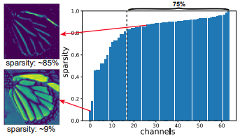

# SMSR  
Exploring Sparsity in Image Super-Resolution for Efficient Inference  

## 1. 개요  
  
대부분의 CNN 기반 SR네트워크는 같은 이미지 공간에 대하여 동일한 연산을 수행하게 된다. 이러한 방식의 문제는 연산이 많이 필요한 부분, 불필요한 부분을 구분하지 않기 때문에 불필요한 연산을 하게되어 추론시간을 늘리게 된다.  
특히 이 문제는 Edge Device 환경에서 성능이 많이 제한되어 추론속도가 많이 느려지는 현상을 유발한다. 이 문제를 해결하기 위해 모델경량화, Pruning 기법 등이 많이 사용되었지만 공통적으로 이미지 공간의 중요도와 상관없이 연산을 동일하게 진행한다는 것이다. 이미지 공간에서 중요한 위치를 구별하기위해 Spatial Mask 활용여 SMSR 네트워크를 구축한다.  

## 2. 연구 근거
### 1. 이미지 고주파 영역의 중요도  
  
같은 이미지 공간에서 중요한 부분, 중요하지 않은 부분이 있다는 것을 증명하기 위해 Luminance channel을 이용한다. 그림은 각각 HR, Bicubic, SR 이미지를 비교한 결과이다. 결과를 통해 이미지의 고주파 영역이 차지하는 중요도가 높은것으로 보인다. 하지만 이러한 결과에도 대부분의 SR 네트워크는 모든 영역을 동일하게 연산하기 때문에 비효율적인 연산 Cost가 요구된다.  

### 2. Sparsity에 따른 이미지 정보의 차이  
  
특정 Hidden Layer를 통과한 Feature Map을 채널 별 Sparsity 그래프를 이용하여 비교를 하면, Sparsity 가 80%이상인 luminance channel 에서는 고주파 영역만이 남게된다. 이를 통해 모든 공간을 동일하게 연산하는 것은 비효율적임을 증명할 수 있다.  

## 3. Sparse Mask Generation  
### 1. Spatial Mask and Channel Mask  
  
Spatial Mask의 목표는 Feature Maps 공간에서 중요한 것을 구별하는 것이다. 0은 중요하지 않고, 1은 중요하다로 이진분류 하기위하여 Gumbel softmax을 이용하여 one-hot 구분 방식과 비슷하게 학습한다. 우선 Input Feature 데이터는 모래시계모양의 블록을 통과하고 최종적으로 Gumbel softmax를 통과한다.  
  
위 수식은 Gumbel softmax의 수식이다. x,y는 각각 수직, 수평지수를 의미하며 T값이 무한대로 수렴하면 샘플 값은 정형화되고 0으로 수렴하면 one-hot형태로 변하기 때문에 이진분류가 가능하다.  
Channel Mask는 불필요한 채널이 무엇인지를 학습한다. 0은 불필요한 채널, 1은 보존해야하는 채널로 이진분류를 하게된다. 마찬가지로 Gumbel softmax를 사용하는데 수식이 살짝 다르다.  
  
추가로 곱해지는 S값은 Gaussian distribution N(0,1) 범위에서 랜덤한 값으로 사용한다.  

### 2. Sparsity Regularization  
   
출력되는 Feature를 더 Sparse하게 만들기 위해서 Spatial, Channel Mask를 기반으로 위 수식과 같은 특정 텐서를 이용하여 Loss를 사용한다.  
Sparsity Regularization Loss는 위 수식과 같이 표현된다.  

### 3. Training Phase and Infernece Phase  
학습을 하는 단계에서 T 값을 점진적으로 감소시켜 one-hot 형식과 유사하게 학습한다.  
추론을 하는 단계에서는 학습에 사용하던 Gumbel sofrmax Layer를 대체하여 argmax Layer를 사용한다.  

## 4. Sparse Mask Convolution  
### 1. Training Phase  
  
모든 기울기의 역전파를 진행하기 위해서 Sparse Convolution을 명확하게 수행하지 않았다. 대신 두 마스크와 함께 기존 Dense연산 결과를 곱하여 연산을 수행한다. 위 그림과 같이 channels with Dense, Sparse feature maps 두개로 Feature을 나누고 계산한다. 그 후 서로 다른 조합으로 곱셈연산을 수행하고 최종적으로는 합쳐져서 하나의 Output Feature Map을 생성한다.  

### 2. Inference Phase  
  
추론을 시작하기에 앞서 우선 사용되는 커널을 4등분 하는데 그 중하나는 기존 Dense Conv연산이다. 나머지 3부분은 Sparse Conv를 통해 중요한 부분만 통과시키는 커널이다. 최종적으로 4가지 Feature들은 합쳐지고 Concatenation연산을 수행하여 하나의 Output Feature Map을 생성한다.  

## 5. Training Information  
데이터 셋은 DIV2K 800장을 사용하여 학습, 100장을 사용하여 평가를 진행했다. 배치사이즈는 16, LR Patch 사이즈는 96으로 진행했다. SMSR의 하이퍼파라미터 수치는 C, L, K 각각 64, 4, 5로 설정한다. Optimizer는 Adam, Learning Rate는 2e-4로 설정하며 Loss는 L1 Loss와 Sparsity Regularization Loss 2개를 사용한다.  

## 6. Conclusion  
  
표와 같이 기존 모델과 비교해서 PSNR수치를 감소시키지 않고 Flops를 줄이는데 성공하였다.  
  
다른 경량화 모델과 비교를 해봤을 때, SMSR이 우수한 성능을 나타냄을 알 수 있다.