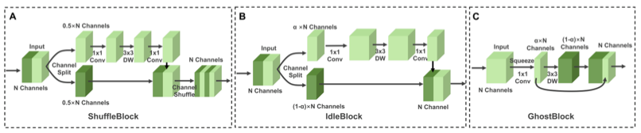
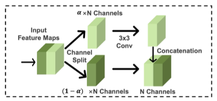

# SplitSR  
An End-to-End Approach to Super-Resolution on Mobile Devices    

## 1. 개요  
현재 존재하는 SR은 딥러닝 모델 기반 많은 메모리를 요구한다. 때문에 모바일이나 클라우드 환경에서 실행가능한 시간을 충족시키지 못한다.  

대부분의 스마트폰의 확대 과정은 digital zoom 방식을 사용하는데, 이유는 optical zoom lens가 없기 때문이다. Digital Zoom 방식의 성능향상을 위해 SR 기술을 사용하는데, Server 기반 모델은 데이터 전송시간 지연으로부터 많은 제약을 받는다. 이에 반해 On Device SR은 데이터 전송의 제약이 없기 때문에 전송시간 지연문제가 발생하지 않는다. 의학 분야에서는 On Device SR이 많이 사용되고 있다.  

최근에 발표되는 SR 모델은 좋은 품질수준을 유지하기 위해 Layer 개수를 증가시키고 있다, 이러한 이유로 파라미터 개수가 백만개 단위로 계산되기 때문에 솔루션 대상 기기에 직접적으로 적용하는 것이 불가능하다. 모델의 파라미터 개수와 컴퓨터 성능의 제한을 극복하기 위해 On Device SR 모델인 SplitSR을 제안한다.  

본 모델의 핵심 내용은 Standard Convolution, Lightweight Residual Blocks들로 구성된 혼합 모델이라는 점이다. 또한 RCAN에서 사용하는 Attention 기법과 Hyperparameters 수치 조절을 통해 높은 정확도와 빠른 추론 속도를 만족시킬 것이다.  

## 2. 관련 연구  
  
### 1. Super Resolution  
역사적으로 많은 연구자들은 무수한 SR Task를 탐구해왔다. 하지만 CNN의 등장으로 이미지 Feature 추출에 관한 접근법으로 연구방향이 바뀌었고 SRCNN을 시작으로 많은 딥러닝 기반 SR 모델이 등장하였다. 깊은 Layer의 문제점을 극복하기 위해 Residual 방식을 도입한 EDSR, Attention module을 도입한 RCAN, SAN등이 대표적인 모델이다. 이러한 모델을 모바일 환경에서 사용하기 위해서는 모델의 복잡성과 크기를 줄여야 한다. 기존에 설계된 모델을 단순화하는 방식은 속도는 빨라지지만 정확도도 같이 낮아진다.  

### 2. On Device SR  
이전 솔루션들은 하드웨어에 맞춘 추론동작을 가속화하는 방식을 사용해왔다. MobiSR은 CPU, GPU, DSP를 통합한 환경에서 사용 가능한 모델이다. 이전 모델과 비교하면 MobiSR은 상당한 속도 향상을 이루었지만, 멀티 프로세싱 문제로 사용할 수 있는 기기가 한정되는 문제가 있다.  

### 3. Lightweight Residual Blocks  
Standard Convolution Layers는 컴퓨터 비전에서 사용되는 근본적인 연산블록이다. 많은 Convolution 블록이 딥러닝 모델에 사용될 때, Residual 블록을 사용하여 점진적인 학습이 가능하다. 여기서 주목할 점은 많은 네트워크들이 On Device 시스템에서, 특히 Channel Dimension의 Feature Map은 너무 크고, 계산적이라는 것이다. 입출력 채널을 N으로 가정한다면 계산복잡도는 O(N^2)이다. 본 논문에서는 높은 정확도를 최대한 유지하면서 Convolution 계산 복잡성을 줄이는 것을 목표로 한다.  

#### 1. ShuffleBlock  
Depthwise separable convolution을 이용하여 Residual Block을 Stack하면 정확도와 속도 모두 균형있게 강화시킬 수 있다. Depthwise separable convolution 블록은 우선 3x3 depthwise convolution을 통해 features를 확장시킨다. 그 후, pointwise convolution layer를 통해 입력 채널과의 linear combinations 연산을 통해 새로운 features를 생성한다. 해당 연산을 발전시킨 것이 ShuffleBlock이다. ShuffleBlock은 channel-splitting 기술을 사용하여 입력 채널을 분리한다. 분리된 features들 중 한 개만 계산에 사용되고 나머지는 1x1 pointwise, 3x3 depthwise 연산을 통과한다. 그 후, 나눠진 두 feature들을 통합하기위해 concat 연산을 수행한다.  

#### 2. Inverted Residual Block  
Inverted Residual Blocks은 더 많은 spatial information을 처리할 수 있도록 설계되었다. 이를 위해 첫 부분에 pointwise layer를 추가해서 low-dimensional 정보를 high-dimensional 표현으로 확장시킨다. 그 후, Depthwise 연산을 수행한 후에 또다른 pointwise 연산을 수행한다. 이 연산을 통해 high-dimensional representation을 original low-dimensional space에 투영시킨다. 이 블록은 MobileNetv2에 처음으로 사용되었고 이를 ShuffleBlock과 결합한 IdleBlock도 등장하였다.  

#### 3. GhostBlock  
CNN 연산과정에서 중복되는 feature map이 존재하고, 이러한 불필요한 존재들은 최적화하는데 도움이 될수도 있다. 중복된 feature map을 생성하는 GhostBlock 내부의 일반적인 conv layer는 본질적인 feature maps을 추출한다. Linear Operations는 중복된 feature maps들을 생성하고 그것들은 본질적인 feature map위에 쌓이게 된다. Pointwise, Depthwise 순서로 연산이 진행된다.  

## 3. Network Architecture  
### 1. SplitSRBlock  
  
RCAN에서 사용된 Channel-wise attention 기법은 informative features들을 사용하기 때문에 정확도 향상에 큰 도움이 되고, 이를 통해 최종 HR 결과를 생성할 때 모든 채널이 필요하지 않다는 것을 증명했다. Channel-splitting 기술은 역전파 과정을 통해 중심이 되는 채널에 더 복잡한 weight를 제공하는 등 channel-attention과 비슷하게 작동한다. 따라서 high-quality를 유지하면서 계산과정의 복잡성을 줄이는 lightweight residual block을 제안한다. SplitSRBlock은 Depthwise convolution block, Inverted Residual Block, Ghost Block등을 참고하여 설계하였다. 총 3개의 단계로 구성되어 있다. 우선 N개의 채널을 가진 텐서를 파라미터 알파를 통해 두개의 가지로 나눈다. 그리고 하나의 가지는 Depthwise 또는 Pointwise 연산을 수행하고, 나머지 하나는 그대로 통과시킨다. 최종적으로 두 개의 feature maps을 concat연산을 통해 통합한다. 결과적으로 생성된 feature map의 채널은 입력 채널과 동일하다. 파라미터 알파의 크기를 감소시키면 고정된 전체 파라미터 수 안에서 여러 블록을 추가할 수 있다. 이러한 구조는 입력채널과 역전파 subset을 사용하여 이미지의 충분한 정보를 학습할 수 있기 때문에, 계산적으로 효율적이고 높은 정확도를 이룰 수 있다.  

Lightweight residual block에서 channel-splitting은 image classification과 차별적으로 설계되었다. SR은 세밀한 spatial information을 필요로한다. 작은 수의 채널을 가진 상태로 Con 연산을 수행하면 얻을 수 있는 spatial information에 큰 영향을 준다. 이러한 문제를 막기위해 channel-splitting 이루 convolution 연산을 수행하여 spatial transformation을 얻을 수 있는 SplitSRBlock을 사용한다.  Convolution 연산은 spatial information을 receptive field를 이용하여 보존하고, channel-splitting 이후에 이러한 연산을 위한 계산 요구량이 상당히 줄어든다.  또한 SplitSRBlock은 기존 Residual Block와 방향을 반대로 concat 연산을 수행하여 모든 single channel이 계산에 관련되도록 한다.  

### 2. SplitSR
대부분의 SR 모델은 input layer, feature extraction stage, upsampled stage, output layer 4단계로 구성되어 있다. 과거에는 SR모델의 모든 블록을 lightweight residual 블록으로 바꾸려고 시도했다.  하지만 이러한 시도는 오히려 정확도에 좋지 않은 영향을 줄 수 있다. 
SplitSR은 RCAN모델을 기반으로 정확도와 속도 사이에서 균형을 이룰 수 있는 hybrid 구조로 설계한다. Standard convolutional layer, lightweight residual blocks들을 활용하여 RCAN을 수정한다. Channel-splitting과 함께 사용되는 Lightweight residual blocks들은 feature extraction, upsampled 단계에서만 수행한다. 이러한 점들일 염두에 두고 4개의 hyper parameter를 설정한다.
- Channel-split ratio 각각의 블록에서 계산을 위해 사용되는 채널의 개수
- Hybrid Index lightweight residual block으로 대체되는 standard convolution 블록의 개수
- Hybrid Mode standard convolution block, lightweight residual block 순서 설정
- Replacement Location standard convolution blocks이 대체되는 stage  

## 4. Training Strategy  
96x96 크기로 HR 이미지를 자르고 DIV2K 데이터 셋을 사용한다. Random horizontal flipping, random rotation 연산으로 data augmentation 수행한다. L1 loss를 사용하고 learning rate는 1e-4로 설정한다. Optimizer는 Adam을 사용하고 파라미터 값은 각각 0.9, 0.000, 1e-7로 설정한다.