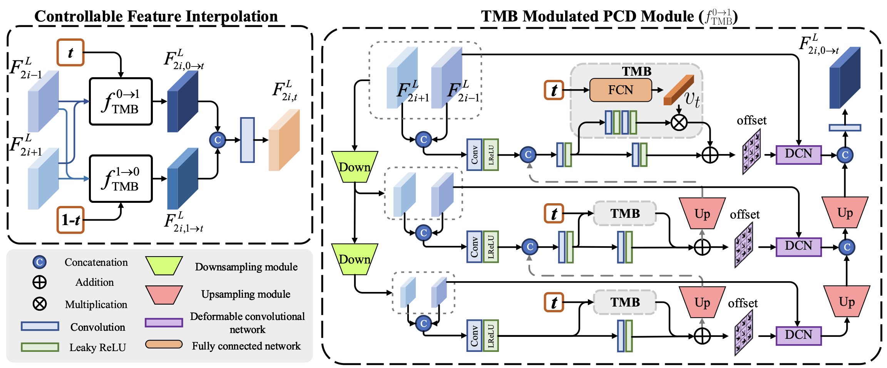
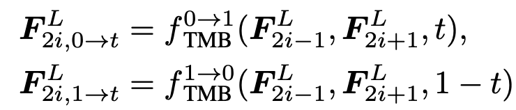

# TMNet  
Temporal Modulation Network for Controllable Space-Time Video Super-Resolution  
  

## 1. 개요  
최근 디스플레이 기술은 최대 240fps, 8K 해상도를 지원할 정도로 높은 성능을 보이고 있다. 하지만 이를 통해 재생되는 영상들은 대부분 2K 해상도에 30fps가 주를 이룬다. 이를 해결하고자 많은 Video super-resolution 기술들이 연구되고 있다.  
기존 STVSR(Space-time video super-resolution)은 저 해상도 영상에서 spatial, temporal resolutions을 증가시키는 것을 목표로 하고 있다. 하지만 기존 모델들의 한계는 미리 지정된 프레임에 대해서만 추론을 진행한다는 점이다. 또 프레임 사이의 모션 등의 작은 단서를 무시하고 학습한다는 문제점이 있다.  
위 문제를 해결하기 위해 여러 기술들이 연구되어왔고 대표적으로 VFI, VSR이 사용되고 있다. 하지만 이 두 모델은 spatial resolution, frame rates를 증가시키지만 spatial, temporal dimensions 사이의 상관관계를 무시한다는 문제점이 있다. 이러한 문제로 고 해상도 영상과 같은 풍부한 움직임 정보를 담는데 한계가 있다.  
Flow 기반 네트워크는 위 문제를 해결되기 위해 연구되었지만 추가적인 데이터가 필요하고 계산 복잡도가 매우 크게 증가하는 단점이 있다. 또한 고정된 Flow를 가지는 영상에서는 효과적이지만 하이라이트 영상과 같이 장면이 전환되는 경우에는 사용하기가 힘들고 성능이 급격하게 제한된다.  
위 문제들을 해결하기 위해 TMNet을 제안한다. TMNet은 앞, 뒤 프레임을 통해 중간 프레임을 생성하며 참조되는 프레임을 통해 spatial, temporal features들을 추출하고 적절하게 혼합하여 반영하여 최종적으로는 High resolution의 프레임들을 얻게 된다.  

## 2. 네트워크 구조  
### 1. 전체 구조   
  
TMNet은 전체 3단계로 구성된다.  
- Controllable Feature 보간  
- Temporal Feature 통합  
- High resolution 복원  
위 3가지 과정을 거쳐 최종적으로 High resolution frame을 얻게된다.  

### 2. Controllable feature interpolation  
  
우선 첫번째로 각각의 프레임에서 그에 상응하는 Feature map을 추출한다. 해당 구간의 목표는 추출한 프레임사이의 프레임을 보간하는 것이다. 이를 위해 전, 후 Frame사이의 motion 정보를 얻어야한다.  
기존 다른모델은 Pyramid Cascading and Deformable(PCD)모듈을 주로 사용했다. 해당 모듈을 통해 Motion 정보를 얻을 수 있다. 문제는 PCD모듈은 지정된 프레임에 대해서만 정보를 추출하고 이는 추론과정에서도 그대로 진행된다.  
이를 해결하기위해 PCD모듈에 TMB블록 추가로 사용한다. TMB블록은 전, 후 Frame을 이용하여 중간의 새로운 Frame을 생성하며 프레임 사이의 보간이 가능하다. 또한 TMB모듈을 조절하기 위한 0~1 사이의 하이퍼파라미터 t값을 이용하여 각각 전, 후 프레임과 함께 사용된다. 전, 후 프레임에 사용되는 TMB블록은 구조는 동일하지만 내부 weight 값은 다르게 적용되어 각각에 최적화된다.  
  
TMB를 통해 수정된 PCD 모듈은 총 3번의 Down scale을 거치며 프레임을 보간한다. 각각의 Scale에 따라 서로 다르게 TMB를 사용하기 위해 하이퍼파라미터 t를 3개의 Conv layer(FCN)를 통과시켜 1x1x64 크기의 벡터를 생성한다. TMB 블록 내부에서는 2개의 conv layer를 통과한 Feature map과 생성된 Vector를 Channel-dimension에 따라 곱셉연산을 수행하고 생성된 결과를 이용하여 Offset을 생성한다.  
이 과정을 통해 High frame-rate, Low relosution video를 얻게되었고 다음 과정을 통해 temporal dimension을 따라 Feature maps들을 통합할 것이다.  

### 3. Temporal Feature Fusion  
추후 작성 예정