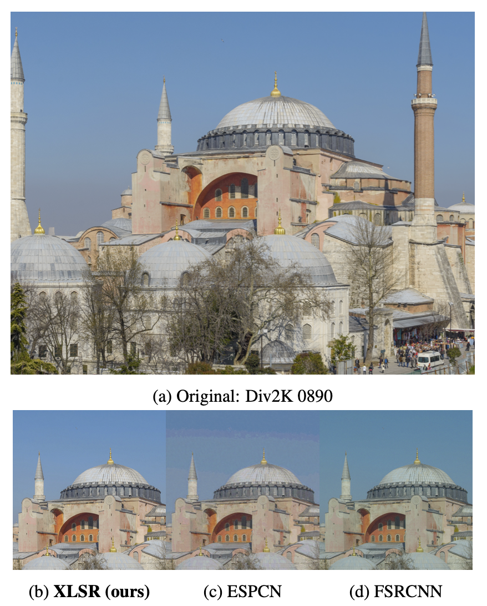
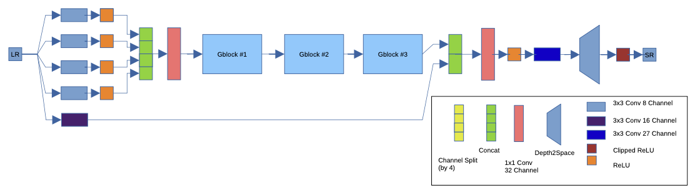
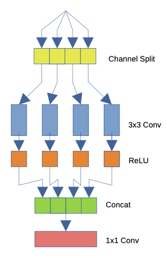
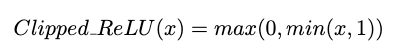
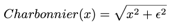

# XLSR  
Extremely Lightweight Quantization Robust Real-Time Single-Image Super Resolution for Mobile Devices  

## 1. 개요  
  
SR은 컴퓨터 비전분야에서 오래전부터 연구되어왔고 최근에는 SRCNN을 시작으로 딥러닝 기술을 이용하여 성능이 비약적으로 상승했다. 현재까지 GAN을 비롯한 여러가지 학습기법을 이용한 모델이 나오고있지만, 여전히 int8 및 모바일기기에서의 성능은 많이 제한되는 상황이다.  
이를 해결하기위해 자체적인 양자화 및 Cliped ReLU 방식등을 사용한 XLSR 모델을 제안한다.  

## 2. 관련 연구  
모바일 장치에 딥러닝 모델을 성공적으로 배포하면 더 넓은 응용 영역이 열리고 학술적 기여와 함께 사용성이 증가한다.  

### 1. Network  
딥러닝 구축에 초점을 맞춘 하드웨어는 이후 Qualcomm과 Arm의 노력으로 시작되었으며, 여러 공급업체의 전문 AI 실리콘으로 지속되었다. 그리고 모바일 구축에 초점을 맞춘 많은 연구자들은 모바일 친화적 모델에 대한 다양한 아이디어를 생각해낸다.
대표적으로 MobileNetV1은 depthwise separable convolutions을 사용하며 SqueezeNet보다 더 나은 성능을 달성한다. ShuffleNet은 group convolutions and channel shuffling operator를 활용하여 더 가벼우면서 성능을 더욱 향상시킨다. ShuffleNet과 유사하게 DeepRoots는 channel shuffling 대신 1x1 convolution의 사용을 제안한다. 얼굴 확인을 위해 MobileFaceNets는 depthwise separable convolutions과 bottleneck layers를 사용하여 애플리케이션별 경량 네트워크를 구축한다. 이미지 초고해상도의 경우, IMDN은 channel splitting을 사용하여 더 가벼운 네트워크를 구축한다.  

### 2. Quantize, Pruning  
연구자들은 네트워크 자체에 초점을 맞추는 것 외에도, 양자화에도 초점을 맞추고 있다. 왜냐하면 대부분의 경우 양자화는 옵션이 아니라 하드웨어 성능상 필수이기 때문이다. Knowledge Distillation등을 사용하며, 더 나아가 양자화를 결합하는 방법도 제안되었다.. 경량 모델을 구축하는 동안 pretrained된 복합적인 모델을 사용하는 또 다른 방법론은 channel sparsification and pruning이다.
이 방법론을 사용해 필터에서 불필요한 채널을 제거함으로써 복잡한 모델을 얇게 만들 수 있다.  

### 3. Summary  
앞에서 언급한 방법의 대부분은 SISR이 아닌 다른 영역에 대해 설계되었지만 실시간 성능 SISR 모델을 구축하는 동안 여전히 매우 유용할 수 있다. 모바일 장치의 성능 딥러닝 방법을 실행/설계하는 방법론은 다음과 같이 요약할 수 있다.  

- Hand-Designed Architectures
- Efficient Building Block Design
- Network Pruning / Sparsification
- Network Quantization
- Network Architecture Search (NAS) • Knowledge Distillation  

본 논문에서는 Mobile AI 2021 Real-Time 단일 이미지 초해상도 챌린지에 제출하는 동안 첫 번째와 두 번째 방법론을 따랐다. 이 접근법의 이유와 동기는 고려해야 할 플랫폼(Synaptics Dolphin NPU)의 다양한 하드웨어 한계가 있었기 때문이다. 또한, 과제는 모델의 전체 int8 양자화를 필요로 했다. 전체 uint8 양자화 요구 사항은 당면한 모델이 적절하게 설계/훈련/양자화되지 않은 경우 SISR 문제가 양자화 작업에 의해 심각하게 영향을 받기 때문에 문제를 더욱 복잡하게 만든다.

## 3. Network Architecture  
  
본 문단에서는 제안된 네트워크의 세부 사항과 설계 아이디어에 대한 동기를 설명하면서 이를 문헌 및 하드웨어 한계와 연결한다. 이전에 언급했듯이, 본 논문에서는 Backbone 모델없이 제안된 아카이브를 설계했고, SISR 문제를 위해 효율적인 구성 요소를 채택했다.  

### 1. Building Block Selection  
  
Group Convolutions은 AlexNet에서 처음 사용되지만 GPU 하드웨어 제한으로 인해 이러한 방법론이 불가피하다. 잘 사용하면 Group Convolutions이 정확도를 높이는 동시에 계산 비용을 줄일 수 있다. 이러한 특성 때문에 모바일 중심 네트워크에서 자주 사용된다. Skip Connection과 함께 ResNet에서, 계단식 Channel shuffling이 있는 ShuffleNet에서, 계단식 1x1 Convolution이 있는 DeepRoots에서 사용된다.  

SISR 문제와 하드웨어 제한의 관점에서, reshape 및 transpose 작업이 최적화되지 않았기 때문에 channel shuffling을 사용하는 것은 불가능하다. Skip Connection과 residual 구조는 모델 수렴을 돕고 더 깊은 아키텍처를 허용하며 많은 최신 네트워크에 사용된다. 하지만 동시 다발적인 Skip connection들은 느리고 요소간 덧셈은 최적화 되지않았다. 따라서 ResNet block은 하드웨어어에 최적화 되지 않는다.  

반면에 channel shuffling 연산자가 1x1 convolution으로 완화되거나 Resnet 블록에서의 Skip Connection등의 특성을 이용하여 설계를 진행한다. Group convolution 대신 Depthwise convolution도 빌딩 블록의 후보가 될 수 있다. 그러나 depthwise convolution은 특별한 예방 조치 없이 사용할 경우 큰 정량화 오류를 일으킬 수 있으며, 이는 또한 실험에서 경험적으로 관찰한 결과다. 제안된 모델을 설계하는 동안 우리가 고려한 중요한 측면은 elementise wise operation이 배치 하드웨어에서 최적화되지 않았다는 것이다. 따라서 모든 addition, scaling 연산을 피하고 필요할 때 concatenation operation을 사용했으며 입력 데이터 scaling링 및 normalization를 사용하지 않았다.  

### 2. Quantization Friendly Architecture 
딥러닝 모델을 모바일 장치에 배포하는 과정에서 8비트 양자화는 매우 중요하다. 그러나, Float32, Float16 모델에 int8 양자화 체계를 적용하는것은 일반적으로 성능저하가 발생한다. 이 문제를 극복하기 위해 모델을 수정하고 양자화에 친숙하게 만들어야 한다.  

이러한 모델의 수정은 양자화에 친숙하면서 동시에 속도가 빨라야한다. 모델 양자화를 친화적으로 만들려면 먼저 양자화가 정확도에 부정적인 영향을 미치는 이유에 초점을 맞춰야 한다. Linear Output Activation Function을 사용하는 것은 SR 모델에서 매우 일반적이며 모델 최적화에 도움이 된다. 이 함수를 통해 모델이 수렴할 때 출력이 0-255 (또는 0-1.0) 사이로 제한될 것이다. 그러나 양자화되면 Float 16/32 모델에 비해 정확도가 약 5-7dB 떨어질 수 있다.  

학습 초기 단계에서 출력이 0-1.0 사이로 수렴하지 않고, intermediate activation 연산 결과, 무한에 수렴하거나 특이점(값)을 포함할 수 있다. 나중에 학습을 계속하면 학습 데이터가 모델 출력에서 간접적으로 경계성을 강제한다. 그러나 모델의 intermediate activation function은 작용하지 않으며, 모델은 보통 훈련의 초기 단계에서 이러한 지점을 방문하기 때문에 intermediate activation function가 무한히 유지되는 지점 근처로 수렴할 수 있다. 이렇게 무한으로 수렴하는 intermediate activation function은 특이치(몇 개의 매우 큰 숫자)를 생성합니다. intermediate activation function의 이상치는 int8 양자화 시 일부 중요한 정보 전달로 이어지며 상대적으로 낮은 진폭 값이 영점 처리된다. 따라서 마지막 레이어에 도달하는 효과적인 신호 에너지가 떨어지며, 이는 어두운 색상과 급격한 PSNR 저하를 초래한다.

  
이러한 문제를 해결하기위하여 intermediate activation function이 학습 시작부터 이러한 Outlier를 출력하지 않도록 강제하는 경우 모델이 보다 양자화 친화적이다. 이를 위하여 모델이 마지막 레이어에서 Clipped ReLU로 학습을 진행한다. 이러한 방식으로 학습된 모델은 Float 모델에 대해 ~0.2-0.5dB의 손실만을 초래한다. 이는 Clip ReLU 없이 설계된 모델을 학습하고 결과 모델을 양자화하고 Div2K 검증 정확도를 기록한 표 2에서 더 잘 나타난다. 또한 Clipped ReLU는 모델에 추가되는 계산 부담은 최소가 된다.  

또한, Single Clipped ReLU를 배치하는 것이 제안된 네트워크의 중간 활성화를 정규화하는 데 충분했지만, 모델이 더 깊어지면 정규화 효과가 사라질 수 있으며, 이 문제를 극복하기 위해 Clipped ReLU를 사용하여 ReLU 중 일부를 변경할 것을 제안한다. 본 논문에서 이 아이디어에 대해 실험하지 않았지만 몇 개의 ReLU만 Clipped ReLU로 변경하면 intermediate activation을 정규화하기에 충분하다. 또한 Clipped ReLU의 값이 1일 필요는 없으며 실험을 통해 최적화된 값을 찾아야 한다.  

출력 레이어에서 Clipped ReLU를 사용할 때의 한 가지 단점은 모델이 아무런 파생 방향 없이 많은 평평한 영역을 만들기 때문에 최적화하기가 더 어렵다는 것이다. 이러한 이유로 더 나은 모델로 수렴하기 위해서는 학습 세부사항에 설명된 몇 가지 학습방식을 사용할 필요가 있다.  

## 4. Training Strategy  
### 1. Dataset  
제공된 Div2K Dataset을 사용했으며 추가 데이터는 사용하지 않는다. 데이터 세트는 800개의 HR Train 이미지와 100개의 Val 이미지, 100개의 Test 이미지로 구성된다. 공정한 계산을 위해 기존 작업과 함께 표준 벤치마크 데이터 세트(세트5, Set14, BSD100, Maga109, Urban100)에서 부동 소수점 모델을 사용하고 출력의 Y 채널을 사용했다.  

### 2. Training  
학습을 위해 800개의 Train 이미지를 두 세트로 분할했으며, 검증을 위해 마지막 8개의 이미지를 제외하고 Train 이미지의 792개를 학습에 사용했다. 랜덤 32x32 LR 이미지를 자르고 Data Augmentation을 위해 동일한 확률의 기하학적 변환(8개 transformations - original, rotations, flip)을 사용했다. 또한 조명 변화에 더 견고함을 주기 위해 1, 0.7 및 0.5로 이미지의 강도를 무작위로 조정했다.  

  
Loss Function은 Outlier를 보다 효과적으로 제어하기 위하여 Charbonnier Loss를 사용했고, 이 함수는 Clipping ReLU와 더 잘 작동한다. Clipped ReLU의 원활한 수렴을 위해 다음과 같은 트릭이 사용되었습니다.

Learning Rate를 처음에 5e-5로 설정해두고, 50 epoch 안에 25e-4까지 빠르게 증가시킨고 5000 epoch 까지 LR 값을 1e-4까지 서서히 낮은 값으로 감소하는 삼각 순환 Learning Rate Scheduling 전략을 사용한다.  

배치 사이즈는 16으로 설정하고 Optimizer는 Adam을 사용한다. Adam의 설정 값은 beta1=0.9, beta2=0.999 및 1e-8이다.  

0.1 분산 배율을 갖는 He-Normal로 Conv2D 커널을 0에 가깝게 초기화한다.