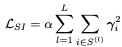

# ASSL  
Aligned Structural Sparsity Learning  

## 1. Abstract  
Lightweight SR 모델의 대부분은 구조를 설계하는대 중점을 두고 중복된 파라미터를 제거하는데 관심이없다. KD 기법은 학습과정에서 상당한 메모리와 계산 자원을 요구한다. 이를 위해 Pruning 구조를 사용해야하는데 Residual 구조로 인하여 많은 어려움이 있다. 이를 해결하기 위한 Aligned Structured Sparsity Learning (ASSL)을 제안한다.  

## 2. Inctoduction  
Deep Neural CNN은 SRCNN을 시작으로 EDSR, RCAN등 여러가지 모델이 발표되었다. 그러나 이 모델들은 무거운 모델 크기로 인하여 사용대상이 되는 device에서 직접적으로 사용하지 못하는 결점이 있다. 즉, 별도의 NPU가 없다면 실제 동작이 힘들다는 것이다. CARN, IMDN등 다양한 Lightweight Model을 통해 해결하려 했지만 학습과정에서의 필요로하는 많은 컴퓨팅자원, Sparsity, 중복된 Convolution Layer를 무시하고 있다. 더 효과적이고, 적은 자원으로 사용이 가능한 Lightweight SR Model이 필요한 시점이다.  

Convolution 커널의 중복성과 모델의 복잡성을 줄이기 위해 Neural Network Pruning 기법을 사용한다. 대부분의 연구자들은 모델 가속을 위해 weight-element pruning 기법보다 filter pruning 기법을 선호하지만 Residual이라는 구조적인 문제가 있다. 이 문제를 해결하기 위해 ASSL을 제안한다.  

ASSL은 filter pruning기반 효과적인 regularization기법이다. 본 논문에서는 각각의 convolution layer 후에 normalization layer를 추가한다. 그리고 weight normalization의 파라미터 개수를 조절하기 위해 sparsity-inducing L2 regularization을 사용한다. Residual SR 모델의 pruning과정에서 중요한 문제는, 서로 다른 layer에서 sparsity structure가 정렬된다는 것이다. pruned filter를 서로 다른 later에 동일하게 적용하기 위하여 새로운 sparsity structure alignment regularization term을 제안한다.  

## 3. Proposed Method  
### 1. Regularizing Scales in Weight Normalization  
Filter pruning 기법의 목표는 필수적으로 중요한 특징에 근거하여 convolution layer의 필터를 제거하는 것이다. 한 가지 방법은 각각의 필터의 통과점을 조절하기 위해 Gate Variable G를 사용하는 것이다. G는 연결된 필터가 후속 레이어에 기여하지 않음을 의미하므로 제거할 수 있다. G변수를 정규화해서 다른 필터와 비교해서 덜 중요한 필터를 찾을 수 있다.  
Classification 분야에서는 이러한 원리로 BatchNormalization을 사용했다. 하지만 SR에서는 BN이 그다지 좋지 않은 성능을 보여준다. 때문에, SR네트워크에 적용하기 위한 솔루션은 현재까지 존재하지 않는다. 이를 위해 Weight Normalization(WN)을 사용한다. WN은 norm learning으로부터 필터의 학습 방향을 분리하는 것을 목표로 한다. 특히 WN안에서 각 필터는 단위 길이로 정규화되고, 추가 학습 가능한 Scale Parameter는 필터크기를 학습하는 데 사용한다.  

  

위 수식에서 W는 4D convolution kernel을 의미하고, r은 WN이 한 번에 학습 가능한 척도를 의미한다. WN을 이용해서 r과 유사한 BN의 scale parameters를 얻는다. 이를 통해 sparsity를 줄이는 regularization을 강화시킬 수 있다.  

### 2. Pruning Scheme and Criterion  
이전에는 BN scales를 global하게 분류했다. 하지만 SR 모델에서는 작동시키기 어렵다. 이유중 하나는 Classification 모델과 SR 모델의 구조와 많이 다르다는 것이다. SR 모델은 일반적으로 분류모델보다 더 많은 Residual Block를 가지고 있다.  

Global sorting scheme는 필터의 숫자가 동일하게 유지된 상태로 추가된 두 Layer를 보장할 수 없다. 이것을 위해 global에서 local pruning scheme로 전환할 것이다. 각각의 layer를 위한 사전 정의된 r을 지정할 것이다. Layer 내부의 filter는 이런 방식이 적용된 layer 사이에서만 비교될 것이다.  

이전 regularization-based pruning 기법은 일반적으로 sparsity-inducing penalty term을 loss에 추가하였다. 이런 구조의 장점은 네트워크가 사람의 영향 없이, 중요하지 않은 필터를 스스로 고르는 것을 학습할 수 있다. 그리고 penalty 강도와 sparsity 사이에 확립된 관계는 아직 없다. 실제로 이러한 일은 흔하기 때문에, sparsity를 얻는 것과 네트워크의 성능을 마비시키지 않는 것 사이에서 좋은 균형을 유지하기위해 penalty 강도를 잘 조절해야 한다.  

반면에, 분류모델에서 이전에 사용된 pruning 기법 중 하나인 L1-norm 방법이 상당히 효과가 있는것을 볼 수 있다. L1-norm은 네트워크에서 가중치를 제거할 때 발생하는 Loss 변화를 특성화한다는 점에서 잘 작동하지 않는 것으로 알려져 있다. 하지만 사용자가 제어하는 것이 매우 간단하다. 때문에 이런 문제점은 깊은 네트워크의 plasticity로 인해 해결될 수 있다.  

모든 상황을 고려해 pruning 방식으로 L1-norm을 사용하기로 했다. 구체적으로, 특정 layer에서 L1-norm으로 필터를 정렬하고 최소 값을 중요하지 않은 필터로 설정하고 S로 표시한다. 그 후, sparsity-inducing-regularzation을 중요하지 않은 필터와 상응하는 weight normalizations scales에 적용한다. 중요한 필터는 네트워크에 남아있기 때문에 어떠한 제약도 학습할 때 필요하지 않다.  

### 3. Regularization Form  
L1/L0 regularization 방식은 sparsity를 위해 대부분 사용한다. 하지만 penalty 강도를 조절하는게 매우 어렵기 때문에, L2 regularization을 weight normalization 수식의 scale parameter를 조절하는데 사용한다.  

  

알파는 scalar loss weight, S는 l번째 layer의 중요하지 않은 필터를 표현한다.

L2 regularization은 학습 과정에서 알파값을 점진적으로 증가시킨다. 때문에 중요하지않은 필터는 무시할 수 있는 양으로 압축될 수 있다. 종료 조건으로 델타의 상승 한계는 regularization 계수 알파에 의해 도입된다. 알파가 중요하지않은 필터 델타에 도달했을 때, pruning 과정은 종료되고 finetuning 과정이 진행된다.  

위 방식은 다른 layer에 같은 필터개수로 pruning 과정을 진행할 수 있는것을 확인했다. 하지만 pruned locations들이 같다는 보장을 할 수 없다. 이것은 sparsity구조의 residual network를 pruning 과정에서 문제가 발생한다.  