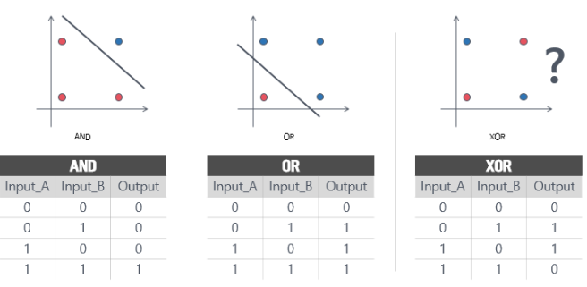
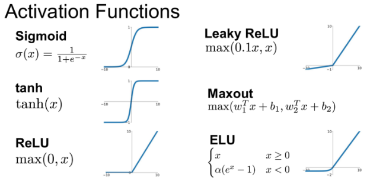

# ActivationFunction  
활성화 함수  

## 1. Linear Layer의 한계  
  
딥러닝에서 가장 먼저 맞이한 한계점은 XOR연산이다. 간단한 단층 퍼셉트론으로는 AND, OR을 구현할 수 있지만 XOR을 구현할 수 없기 때문이다.  
이러한 문제를 해결하기위해 Hidden Layer(은닉 층)을 사용하여 다층 퍼셉트론을 사용하였고 XOR연산을 구현할 수 있었다. 하지만 Hidden Layer를 계속 깊게 쌓아서 결과를 비 선형적으로 바꿀 수는 없다.  
결론적으로 Linear Layer를 계속 쌓다고 결과는 Linear Layer에서 벗어나지 못한다.  

## 2. 활성화 함수  
  
이에 대한 해결책이 바로 활성화 함수(activation function)이다. 활성화 함수는 입력된 데이터의 가중 합을 출력 신호로 변환하는 함수이다. 활성화 함수를 사용하면 입력값에 대한 출력값이 linear하게 나오지 않으므로 Linear한 결과를 Non-Linear하게 만들 수 있다. 따라서 MLP(Multiple layer perceptron)는 단지 linear layer를 여러개 쌓는 개념이 아닌 활성화 함수를 이용한 non-linear 시스템을 여러 layer로 쌓는 개념이다.  
결론은 활성화 함수를 사용하면 입력값에 대한 출력값을 비선형으로 만들 수 있다.