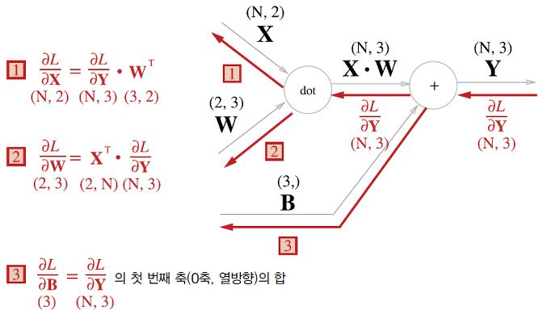
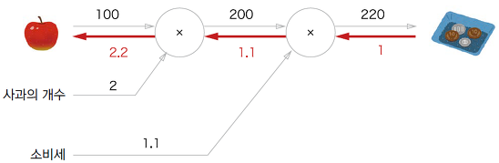
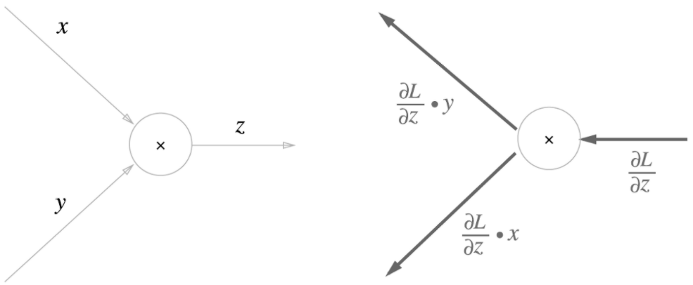
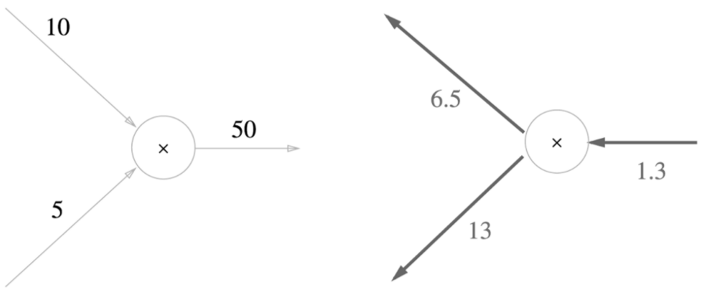

# BackPropagation  
오차역전파법  

## 1. 개요
  
신경망의 가중치 매개변수의 기울기는 수치 미분을 사용해 구했다. 수치 미분은 단순하고 구현하기도 쉽지만 계산 시간이 오래 걸린다는게 단점이다. 또한 Linear한 문제를 해결하려고 Activation Function을 이용하여 신경망을 구성하는데, 파라미터의 개수가 점점 많아지면서 각각의 가중치, 편향 값을 학습시키기 매우 어려워졌다. 이러한 문제를 해결하기 위한 가중치의 매개변수를 효율적으로 계산하는 방법이 오차역전파법이다.  

## 2. 계산 그래프  
  
하나의 문제풀이 과정을 계산 그래프로 표현한 것이다. 계산 그래프의 특징은 국소적 계산을 전파함으로써 최종 결과를 얻는다는 점에 있다.  
국소적이란 자신과 직접 관계된 작은 범위를 말한다. 즉 계산 그래프는 전체에서 어떤 일이 일어나는지 상관없이 자신과 관계된 정보만으로 계산을 수행하고 출력하는 특징이 있다.  
이러한 국소적 미분을 전달하는 원리는 연쇄법칙에 따른 것인고, 합성함수는 여러 함수로 구성된 함수를 말한다. 즉 연쇄법칙은 합성 함수의 미분에 대한 성질이라고 할 수 있다.  

## 3. 역전파
딥러닝에서 사용되는 역전파의 기본적인 전파 방법은 국소적 미분을 곱한 후 노드에 전달하는 것이다. 역전파는 그래프의 반대방향으로 계산을 진행하는 것이다.  
  
  
덧셈노드의 역전파에서는 입력신호를 그대로 전달하고 곱셈노드의 역전파에서는 입력 신호를 서로 바꿔서 하류로 흘린다. 