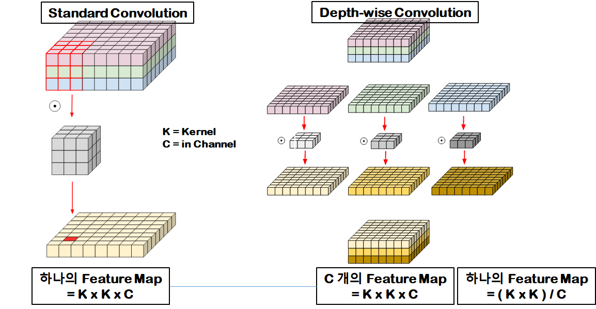
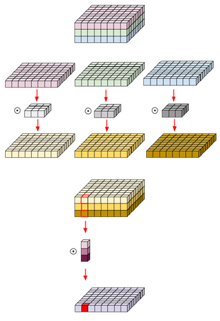

# DepthWise-Separable-Conv  
DepthWise-Separable-Convolution  

## 1. DepthWise Convolution  
### 1. 개요  
  
기존 CNN은 Feature Map을 생성하는데 Kernel Size * Kernel Size * Input Channel(입력 이미지 개수)의 Parameter를 사용한다.  
반면에 DepthWise Convolution 방식은 각 채널마다 Feature Map을 계산하여 합하게 되는데 이러한 과정을 통해 Input Channel이 줄어드므로 연산량이 감소되는 이점이 있다.  
또한 각 필터에 대한 연산 결과가 독립적일 필요가 있을 경우에 큰 장점이 된다.  

### 2. Pytorch Code  
```{.python}
class depthwise_conv2d(nn.Module):
    def __init__(self, input_channel):
        super(depthwise_conv2d, self).__init__()
        self.depthwise = nn.Conv2d(input_channel, input_channel, kernel_size=3, padding=1, groups=input_channel)

    def forward(self, x):
        out = self.depthwise(x)
        return out
```  

## 2. Pointwise Convolution(1x1 convolution)  
### 1. 개요  
Separable Convolution을 다른말로 Pointwise Convolution이라고 부른다. 중요한 특징은 1x1 convolution 이다. 1x1 convolution은 두 가지 특징을 가지고 있다.  
- 공간적인 특성을 가지고 있지 않다(채널 등을 고려하지 않고 하나의 픽셀만 바라봄)  
- 연산량이 가장 적게 필요하기 때문에, Feature Map 개수를 조절할 때 유용하게 사용된다.(연산량 = cmhw, 파라미터 개수 = cm)  
- 출력 이미지 크기는 입력 크기와 동일하다.  

### 2. Pytorch Code  
```{.python}
class pointwise_conv2d(nn.Module):
    def __init__(self, input_channel, output_channel):
        super(pointwise_conv2d, self).__init__()
        self.pointwise = nn.Conv2d(input_channel, output_channel, kernel_size=1)

    def forward(self, x):
        out = self.pointwise(x)
        return out
```  

### 3. Depthwise Separable Convolution  
### 1. 개요  
  
Convolution 연산의 병목현상을 줄이기 위한 관점은 연산량이 많은 곳에서는 Feature Map을 적게 생성하고, 연산량이 적은 곳에서는 Feature Map을 많이 생성해서 파라미터 개수를 효율적으로 줄이는 것이 목표다. 이러한 이유로 Depthwise Convolution, Pointwise Convolution 두 연산을 합쳐서 사용한다.  
즉, DepthWise Convolution에서 Feature Map을 최대한 적게 생성하고, Pointwise Convolution에서 Feature Map을 최대한 많이 생성하기 위해 두 구조를 합한다. 이러한 방식을 통해 기존 Convolution연산과 비교해서 동일한 Output Channel의 Feature Map을 생성하고 연산량을 줄일 수 있게 된다.

### 2. Pytorch Code  
```{.python}
class depthwise_separable_conv2d(nn.Module):
    def __init__(self, input_channel, output_channel):
        super(pointwise_conv2d, self).__init__()
        self.depthwise = nn.Conv2d(input_channel, input_channel, kernel_size=3, padding=1, groups=input_channel)
        self.pointwise = nn.Conv2d(input_channel, output_channel, kernel_size=1)

    def forward(self, x):
        out = self.depthwise(x)
        out = self.pointwise(out)
        return out
```  