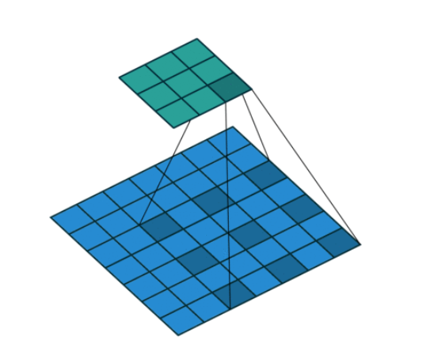
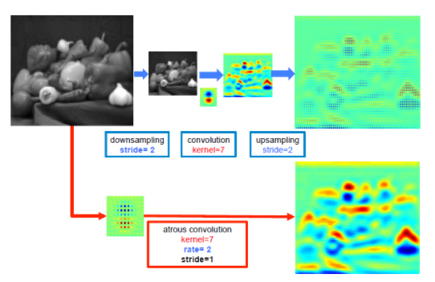

# DilatedConvolution  
DilatedConvolution  

## 1. DilatedConvolution  
### 1. 개요  
  
Dliated Convolution은 기존 컨볼루션 필터가 수용하는 픽셀 사이에 간격을 둔 형태다.  
Convolution Layer에 또 다른 파라미터인 dilation rate 를 도입했다.  
dilation rate는 커널 사이의 간격을 정의한다. 
dilation rate 가 2인 3x3 커널은 9개의 파라미터를 사용하면서, 5x5 커널과 동일한 view 를 가지게 된다.  

### 2. 장점  
- 입력 픽셀 수는 동일하지만, 더 넓은 범위에 대한 입력을 수용할 수 있게 된다. 즉 전체적인 특징을 잘 잡아낼 수 있어서 Segmentation(contextual info)에 좋다.  
- 적은 계산 비용으로 Receptive Field 를 늘리는 방법이다.  

### 3. 사용되는 분야  
Dilated convolution 은 특히 real-time segmentation 분야에서 주로 사용된다.  
넓은 view 가 필요하고, 여러 컨볼루션이나 큰 커널을 사용할 여유가 없을 때 사용한다.  
이 Dilated convolution 은 필터 내부에 zero padding 을 추가해서 강제로 Receptive Field 를 늘리게 되는데, 위 그림에서 진한 파란색 부분만 weight 가 있고 나머지 부분은 0으로 채워지게 된다.  
이 Receptive Field 는 필터가 한번 보는 영역으로 사진의 Feature 를 파악하고, 추출하기 위해서는 넓은 Receptive Field 를 사용하는 것이 좋다.  
dimension 손실이 적고, 대부분의 weight 가 0 이기 때문에 연산의 효율이 좋다.  
공간적 특징을 유지하는 Segmentation 에서 주로 사용되는 이유이다.  

  
위 그림을 참고해서 보면, Segmentation 문제에서 Dilated Convolution 을 통해 이득을 보는 경우를 볼 수 있다.  
단순히 Pooling - Convolution 후 Upsampling 하는 것과 Dilated Convolution(Atrous convolution)을 하는 것의 차이를 볼 수 있는데, 전자의 경우에서는 공간적 정보의 손실이 있는 것을 upsampling 하면 해상도가 떨어지게 된다.  
하지만 dilated convolution 의 그림을 보면, Receptive field 를 크게 가져가면서 convolution 을 하면 정보의 손실을 최대화 하면서 해상도는 큰 output 을 얻을 수 있다. 

### 4. Pytorch Code  
```{.python}
import torch.nn as nn
nn.Conv2d(C_in, C_out, kernel_size=kernel_size, stride=stride, padding=padding, dilation=dilation, groups=groups, bias=False)
```  