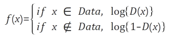

# GAN  
Generative Adversarial Networks  

## 1. MINMAX GAME  
딥러닝의 대표적인 연산은 CNN, RNN이 있는데 이들은 데이터에 존재하는 패턴을 인식하는데 주로 사용한다. 주어진 데이터가 연속적인 신호(음성, 영상 등)의 형태일 때 CNN을 사용하여 시공간 축에 따라 존재하는 패턴을 찾아낼 수 있다. 반면에 주어진 데이터가 불연속적인 시퀸스(자연어 등)일 때 RNN을 이용하여 시간에 따라 변화하는 패턴을 찾아낼 수 있다. 이러한 패턴을 인식하는 것이 아니라 창조하는 학습 방식이 바로 GAN이다.  
GAN은 가짜를 만들어내는 위조지폐범과 진짜인지 가짜인지를 구별하는 경찰이 서로 경쟁하면서 학습하는 방식이다. 최종적인 목표는 진짜같은 가짜를 만들어 내는 것이 목표다. 즉 경찰의 정확도를 최소화 하고 위조지폐범의 정확도를 최대화해야 한다. 여기서 경찰이 가짜와 진짜를 정확하게 구별할 수 있다고 가정하면 위조지폐범은 학습을 통해 진짜같은 가짜를 만들어야 한다. 위조지폐범이 진짜같은 가짜를 만드는데 성공했을 때 경찰의 정확도는 무조건 가짜, 무조건 진짜, 무작위로 대답하는 경우 모두 테스트를 진행함에 따라 확률이 0.5에 가까워진다.  
  
이처럼 경찰의 최악의 상황, 진짜와 가짜를 완벽히 구별하는 시점에서(MAX) 경찰의 판별 정확도를 최소화(MIN)하는 것을 MINMAX GAME이라고 한다.  

## 2. GAN의 구성요소
### 1. Generator Network  
생성자는 학습 데이터의 패턴을 흉내내어 판별자의 정확도를 최소화하는 것을 목표로한다. 랜덤 노이즈를 입렵 값으로 하여 출력을 학습 데이터와 유사하게 만드는 것이다.  
  
즉 생성자 네트워크는 랜덤 노이즈를 학습 데이터와 유사한 패턴으로 변화하는 함수를 학습한다. 네트워크의 형태는 MLP(Multi-layer perceptron), CNN, auto-encoder 등 어떠한 형태도 가능하고 목적에 따라 다양하게 사용한다.  

### 2. Discriminator Network  
판별자는 입력으로 주어진 데이터가 학습 데이터에 포함된 진짜인지, 생성자가 만들어낸 가짜인지를 판별하는 역할을 하며, 판별의 성공확률을 최대화하는 것이 목적이다.  
  
즉 판별자 네트워크는 진짜 혹은 가짜 데이터를 입력으로 받아, 입력받은 데이터가 학습 데이터에 포함된 진짜 데이터일 확률을 출력하고 해당 함수를 학습한다. 생성자와 마찬가지로 목적에 따라 다양한 네트워크 형태를 적용할 수 있다.  

## 3. 학습 과정  
GAN 방식은 판별자와 생성자가 번갈아 학습하는 방식이다. 학습을 처음 시작할 때는 판별자와 생성자가 엉망인 상태에서 시작한다. 이러한 상태에서는 판별자는 가짜와 진짜를 구별하지 못하고, 생성자는 엉뚱한 데이터를 생성하게 된다. 이를 해결하기 위해 판별자를 먼저 학습 시킨 후, 생성자가 판별자의 제약 안에서 학습하도록 해야 한다.  
정리하자면 우선 랜덤노이즈 m개를 생성하여 생성자 네트워크에 전달하고 변환된 데이터 m개를 얻는다. 학습 데이터셋에서 진짜 데이터 m개를 생성한다. 진짜, 가짜 각각 m개를 이용하여 판별자 네트워크를 최대화하는 방향으로 학습한다.  
그 후, 랜덤 노이즈 m개를 다시 생성한다. 생성자는 랜덤 노이즈 m개를 이용하여 판별자의 정확도를 최소화하도록 학습한다.  

### 1. Discriminator Training  
  
판별자는 진짜 혹은 가짜 데이터를 입력으로 받고, 그 입력이 진짜일 확률을 출력한다. 판별자의 정확도가 높은 경우, 입력데이터가 진짜인 경우 1에 가까운 큰 확률값을 출력하고 입력데이터가 가짜인 경우 0에 가까운 작은 확률값을 출력한다. 즉, 입력데이터가 진짜면 판별자가 출력하는 확률 D(x)를 최대화해야 하고 가짜면 판별자가 출력하는 확률 1-D(x)를 최대화해야 한다. 손실함수는 이에따라 손실을 최대화하는 방향으로 판별자를 학습시키고 기울기도 상승하는 방향으로 파라미터를 조정한다. 논문에 따라서는 log함수를 사용에 연산을 수행하는 경우도 있는데 이는 좀 더 안정적인 학습을 위한 방식이어서 손실을 최대화하는 개념은 동일하다.  

### 2. Generator Training  
  
생성자 네트워크의 학습은 판별자를 속이는 방법을 학습시키는 과정이다. 생성자의 입력으로 주어지는 랜덤 노이즈를 z라고 하고 결과를 G(z)라고 하면, 판별자가 생성된 데이터를 입력받아 출력하는 확률은 D(G(z))로 표기할 수 있다. 판별자가 G(z)를 가짜라고 판별할 확률 1-D(G(z))를 최소화 해야한다. 일반적인 기울기 하강법을 이용하여 생성자 네트워크를 학습하면된다. 이 때 판별자 네트워크의 파라미터는 수정하면 안된다.  
위 방식으로 진행하면 초기에 판별자의 능력이 너무 우수해서 생성자가 학습하기가 매우 어렵다. 결국 학습 초기에는 생성자가 무엇을 만들던 판별자는 쉽게 이를 판별하고 1-D(G(z))는 항상 1에 가까운 값을 가지기 때문이다. 그래프 상으로 보면 1-D(G(z))가 최대 값인 1에 가까울 수록 log{1-D(G(z))}의 기울기가 작아지기 때문에 파라미터를 조정하기위한 기울기를 얻기가 어렵다.  
  
이 문제를 해결하기 위해 1-D(G(z))를 최소화하는 대신에 D(G(z))를 최대화한다. 논리적으로는 똑같은 말이지만 그래프 상으로 보면 학습초기에 기울기가 수직에 가깝기 때문에 파라미터 조정을 얻기위한 기울기를 얻기가 쉬워져서 빠른 학습이 가능하다.  

## 4. 확률분포
  
GAN은 흔히 데이터의 확률 분포를 근사(approximate)한다는 말이 있다. 확률분포는 어떤 확률변수 X와 X에 대응하는 확률의 쌍이라고 할 수 있다. 예를 들어 주사위의 각 눈이 나올 확률을 표현하면 위와 같이 표현할 수 있다. 이처럼 확률변수 X가 셀 수 있는 값일 때, X의 확률분포 P(X)를 이산확률분포라고 한다.  
  
이와는 반대로 서울의 연평균 강수량을 예로들면 강수량이라는 확률변수는 0이상의 실수 값으로 표현이 가능하며 무수히 많기 때문에 셀 수가 없다. 그저 특정 확률에 가깝다로 표현할 수 있다. 이처럼 확률변수 X가 셀 수 없는 연속적인 값일 경우의 확률분포를 확률밀도함수라고 한다.  
  
GAN에서 사용하는 학습 데이터는 셀 수 없는 확률변수이며 확률밀도함수로 표현할 수 없다. 예를 들어 사람 얼굴의 확률밀도함수를 표현하면 위 그림과 같은데 밀도함수 내부에서 사람의 얼굴을 좌표로 수치화가 가능하고 비슷한 얼굴(평범한 얼굴)일 수록 밀도는 더 커지게된다. 생성자는 랜덤 노이즈의 확률분포에서 특정 값을 학습 데이터의 확률분포의 특정 수치로 변형시키는 것이 주된 목표라고 할 수 있다. 이러한 학습을 반복하게 되면 결국 생성자는 랜덤노이즈의 확률분포를 학습 데이터의 확률분포로 변환하는 함수륵 학습하게 된다. 학습이 완료된 시점에서는 판별자가 진짜로 알고있는 데이터의 확률분포와 생성자가 변환시킨 데이터의 확률분포가 일치하게 되어서 구분할 수 없게되고 정답을 맞힐 확률은 0.5가 된다.  

## 5. 문제점들
### 1. Model Oscillation  
  
GAN의 학습과정은 판별자와 생성자가 번갈아가며 학습을 한다. 이러한 과정에서 의도하지 않게 서로를 상쇄할 수 있는 가능성도 있다. 판별자와 생성자가 서로를 속고 속이며 학습이 진행되지 않고 제자리를 맴돌게 되면 양족 모두 학습이 진행되지 않는다. 이러한 상황을 모델이 진동한다고 한다.  

### 2. Mode collapsing  
  
통계학에서 Mode는 최빈값, 가장 빈도가 높은 값을 의미한다. 예를들어 MNIST 데이터셋에서 각각의 숫자 10개가 Mode에 해당한다. 그리고 데이터 셋에 여러개의 Mode가 있는 Multi-Modal 분포가 대부분이다. 하지만 GAN을 학습시키다 보면 생성자는 판별자를 속이기만 하면 되기때문에 특정 Mode만 계속 생성하게 되는 현상이 발생한다. 이러한 현상을 Mode collapsing라고 한다. 이를 해결하기 위해 기존 BCE Loss에서 다양한 Loss로 변화를 주거나 CGAN 같이 특정 조건 값을 주는 등 많은 해결방법을 제시하고 있다.