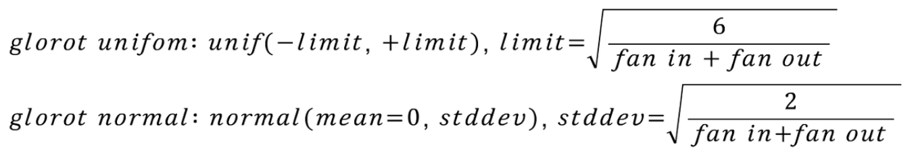
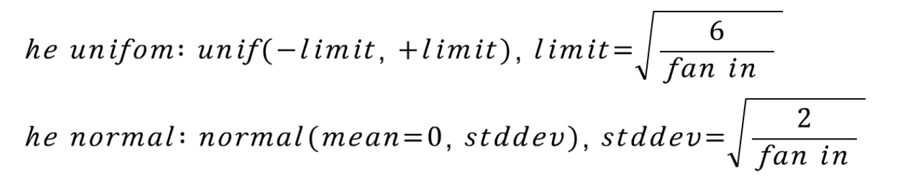

# Initialization  
딥러닝 네트워크에서 학습을 더 잘 되도록 최적의 초기화 방법을 사용하는 것은 중요하다. 딥러닝의 발전과 함께 Weight, Bias 값의 초기화 관련 연구도 계속해서 진행 중 이다.

## 1. Xavier Initialization  
    
### 1. 설명
이전 노드와 다음 노드의 개수에 의존하는 방법이다. Uniform 분포를 따르는 방법과 Normal분포를 따르는 두가지 방법이 사용된다. 핵심 아이디어는 fan in과 fan out을 모두 고려하여 확률 분포를 조정해준다는 것이다. lecun initialization 기법에서 2를 곱해준 뒤, fan in과 fan out의을 합한 크기로 나누어 준 값으로 확률 분포를 조정한다.  
    
tanh를 활성화 함수로 사용하는 신경망에서 많이 사용된다. 또한 glorot_uniform은 keras에서 기본 초기화 방법으로 사용된다. ReLU함수에서 사용 시 출력 값이 0으로 수렴하게 되는 문제점이 있다.  

### 2. 코드
```python
import torch.nn as nn

# 정규분포(Normal)
nn.init.xavier_normal_(input,gain=1.0)

# 균등분포(Uniform)
nn.init.xavier_uniform_(input,gain=1.0)
```

## 2. He Initialization  
  
### 1. 설명  
ReLU를 활성화 함수로 사용 시 Xavier 초기값 설정이 비효율적인 결과를 보이는 것을 확인했는데, 이런 경우 사용하는 초기화 방법을 He initialization이라고 한다. 이 방법 또한 정규분포와 균등분포 두가지 방법이 사용된다. 또한 ResNet을 학습시킬 때 이 기법을 사용하여 실제로 깊은 CNN 신경망을 학습시킬 때 잘 작동함을 보여준다.  
    
glorot 기법에서 다시 fan out을 제거한 모습이다. ReLU 함수가 0 이하의 activation 값들은 모두 제거하므로 fan in을 더 중요한 요소로 수식화 했다. 그 결과로 lecun initializaion에서 2를 곱해준 형태를 취해주게 된다. ReLU가 activation으로 사용되는 신경망을 초기화 할 때 많이 사용된다.

### 2. 코드  
```python
import torch.nn as nn

# 정규분포(Normal)
nn.init.kaiming_normal_(input, mode='fan_in', nonlinearity='relu')

# 균등분포(Uniform)
nn.init.kaiming_iniform_(input, mode='fan_in', nonlinearity='leaky_relu')
```