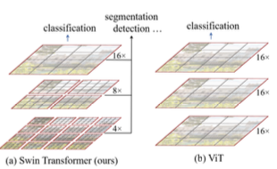
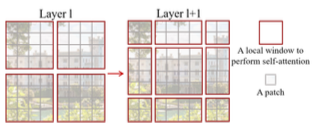
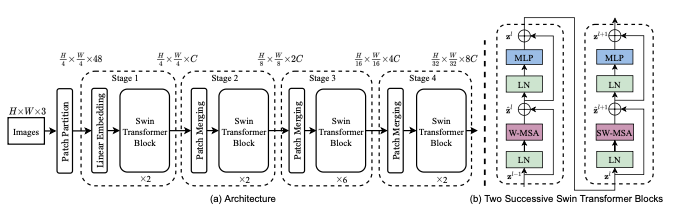

# SwinTransformer  
Swin Transformer: Hierarchical Vision Transformer using Shifted Windows  

## 1. 개요  
컴퓨터비전 분야에서 모델을 설계하는 과정에서, 오랫동안 CNN을 기반으로 설계를 진행해왔다. 반면에 natural language processing (NLP)분야는 비전분야와는 다른 방향으로 발전해왔고, 최근에 널리 퍼진 방식은 Transformer 방식이다. 데이터의 넓은 범위를 다루는 모델에 attention 기법을 사용하는 Transformer 방식은 NLP에서의 우수한 성능을 보여주었고, 비전분야에서도 관심을 가지게 되었다.  
하지만 도메인의 차이때문에 NLP 분야에서 컴퓨터 비전분야로 전환과정에서 많은 어려움이 있다. 그 중 하나는 규모다. 현재까지 존재하는 Transformer 모델은 고정된 규모내에서 동작하도록 설계되었다. 단어가 NLP분야에서 기본적인 원소로 다뤄지는 반면에, 비전분야에서는 기본적인 원소인 픽셀은 객체 탐지와 같이 대체로 규모가 크고 범위가 다양하기 때문에 전환과정에서 어려움이 있다. 다른 하나는 텍스트 처리과정의 단어와 비교하여 이미지의 픽셀은 해상도가 너무 크다는 점이다. 픽셀 단계에서 많은 연산량을 필요로 하는 것이 대부분이고, 고해상도 이미지는 이미지 사이즈의 제곱에 비례하여 self-attention의 계산 복잡도가 커지기 때문에 Transformer와 호환될 수 없다. 이 문제를 극복하기 위하여 Swin Transformer를 제안한다. Swin Transformer는 계층적인 feature maps과 이미지 크기에 선형적인 계산 복잡도를 가지고 있다.  

  

위 그림을 설명하자면, Swin Transformer는 작은 크기의 패치로 연산을 시작함으로써 계층적인 표현을 구성하며, 깊은 층에서는 점진적으로 이웃한 패치와 결합하게 된다. 이러한 계층적인 feature maps들을 이용하면 feature pyramid networks (FPN), U-NET과 같은 dense prediction 모델의 우수한 기술을 간편하게 이용할 수 있다. 선형 계산 복잡도는 non-overlapping window들의 self-attention 연산을 사용함으로서 가능해지며, windows들은 이미지의 조각(partition)들이다. 각각의 window의 패치의 개수는 각각 고정되어 있기 때문에 이미지 크기와 비교해서 선형적인 계산 복잡도를 가진다. 이러한 기법은 Swin Transformer를 컴퓨터 비전 분야에 범용적으로 적용할 수 있는 장점을 제공한다.  

  

Swin Transformer의 핵심은 위 그림과 같이 self-attention layer 사이의 window partitions 들의 shift다. Shifted window partitions들은 처리중인 layer의 window를 잇고, 그들 사이의 연결점을 제공하며 모델의 성능을 강화한다. 이러한 전략은 real-world에 관하여 효과적이다. window의 모든 query patches들은 같은 key set을 공유하고, 이 것은 하드웨어에서 메모리에 접근하는 것에 유용하다. 대조적으로 sliding window 기법은 서로 다른 query pixels들의 서로 다른 key sets들로 인하여 하드웨어에서 지연시간이 많이 발생한다. 본 논문에서 제안된 Swin Transformer 기법은 실제로 컴퓨터 비전분야의 다양한 tasks에서 좋은 성능을 보여주었고, SOTA모델과 비교하여 우수하며 계층적인 설계와 shifted window 접근방식은 모든 MLP 구조에 효과적이다.  

## 2. Method  
### 1. Network Overall Architecture  
  
Swin Transformer의 전체적인 구조는 위 그림(a)와 같다. 우선 RGB이미지를 VIT같은 patch splitting module을 이용하여 non-overlapping patchs들로 분리한다. 본 논문에서는 patch의 크기를 4x4로 설정하였으며 최종적으로 각각의 feature dimension은 4x4x3=48이 된다. Linear embedding layer는 임의의 차원을 위해, 이 raw-valued feature에 적용된다. 기존 Self-attention 계산이 수정된 몇몇 Transformer Blocks들은 이 patch tokens에 적용된다. Transformer Blocks들은 tokens의 개수를 유지하고, linear embedding layer와 함께 1단계로 분류된다.  

계층적인 representation을 생산하기 위하여 tokens들의 개수는 네트워크에서 더 깊은 영역인 patch merging layer를 통해 감소된다. 첫 번째 patch merging layer는 2x2 크기의 neighboring patches 그룹의 features들을 concat 연산을 수행하고, 4C-dimensional concatenated feaures들을 대상으로 linear layer를 적용한다. 이러한 방식은 2x2=4(2x downsampling of resolution) 배수로 토큰의 개수를 줄이고, 출력 차원은 2C로 설정된다. Swin Transformer Blocks들은 그 후 feature transformation을 위해 적용된다. 이 첫 번째 patch merging block과 feature transformation은 2단계로 분류된다. 이 절차는 3단계, 4단계에 2번 반복해서 적용이 된다. 이 단계는 VGG, ResNet 같은 일반적인 CNN 네트워크의 동일한 feature map 해상도와 같이 계층적인 representation을 생성한다. 그 결과 제안된 구조는 비전분야에서 사용되는 구조를 간단하게 대체할 수 있다.  

Swin Transformer는 shift windows를 기반 모듈을 이용하여 Transformer Block 내부의 multi-head self attention (MSA)를 대체함으로써 설계되었다. 위 그림(b)와 같이 Swin Transformer는 MSA기반 shifted window module, MLP, GELU로 구성되어있다. LayerNorm(LN) layer는 각각의 MSA, MLP 모듈 이전에 적용되고 각각의 모듈 이후에 residual connection 기법이 적용된다.