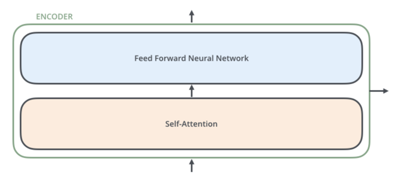

# Transformer  
Transformer  

## 1. 개요  
기존 모델은 CNN, RNN 두 가지를 Base로 설계한 모델이 전부였다. 하지만 2017 NIPS에서 Google이 Transformer라는 새로운 Base를 제안했다. 모델의 핵심은 multi-head sefl-attention을 이용한 sequential computation을 줄여 더 많은 부분을 병렬 처리가 가능하게 만들면서 동시에 더 많은 dependency를 모델링하는 점이다.  

## 2. 전체 구조  
  
번역의 경우를 예시로, 모델을 Block Box형태로 정의하면 모델은 하나의 문장을 입력으로 받아 다른 언어로 된 번역 문장을 출력할 것이다.  

  
Block Box 내부는 encoding, decoding, 사이를 이어주는 connection들이 있다. encoding 부분은 여러개의 encoder를 쌓아 올려 만드는 것이고, decoding 부분은 encoding 부분과 동일한 개수만큼의 decoder를 쌓은 것이다.  

  
  
encoder들은 모두 정확히 똑같은 구조를 가지고 있다. 하나의 encoder는 두 개의 sub-layer로 구성되어 있다. 인코더에 들어온 입력은 먼저 self-attention layer를 지나가게 된다. self-attention layer는 encoder가 하나의 특정한 단어를 encode하기 위해서 입력 내의 모든 다른 단어들과의 관계를 살펴본다. 입력이 self-attention layer를 통과하여 나온 출력은 다시 feed-forward 신경망으로 들어가게 된다. 똑같은 feed-forward 신경망이 각 위치의 단어마다 독립적으로 적용돼 출력을 만든다.  

  
decoder 또한 encoder에 있는 두 layer를 모두 가지고 있다. 다른 점은 두 층 사이에 encoder-decoder attention이 포함되어 있는 것이다. 이는 decoder가 입력 문장 중에서 각 타임 스텝에서 가장 관련 있는 부분에 집중할 수 있도록 해준다.  

## 3. 모델 작동 과정  
  
우선 모든 입력 단어들을 embedding 알고리즘을 이용해 벡터로 바꾼다. 모든 encoder들은 크기 512의 벡터의 리스트를 입력으로 받는다.  

  
각 위치에 있는 단어가 개별적인 path를 통해 encoder에서 흘러간다. self-attention layer에서 이 위치에 따른 path들 사이에 다 dependency가 있는데, feed-forward layer에서는 없기 때문에 feed-forward layer 내의 다양한 path들은 병렬 처리될 수 있다.  

  
encodersms 입력으로 리스트를 받는다. 이 리스트를 먼저 self-attention layer에, 그 다음으로 feed-forward 신경망에 통과시키고 그 결과물을 그 다음 encoder에게 전달한다. 각 위치의 단어들은 각각 다른 self-encoding 과정을 거친다. 그 다음으로 모두에게 같은 과정인 feed-forward 신경망을 거친다.  

## 4. Self-Attention  
### 1. 개요  
  
"그 동물은 길을 건너지 않았다 왜냐하면 그것은 너무 피곤했기 때문이다" 라는 문장을 예시로 든다. 이 문장에서 "그것"이 가리키는 것은 사람에게는 간단한 문제지만 신경망 모델에게는 간단하지 않은 문제다. 모델은 "그것은"이라는 단어를 처리할 때 self-attention을 이용하여 "그것"과 "동물"을 연결할 수 있다. 모델이 입력 문장 내의 각 단어를 처리해 나감에 따라, self-attention은 입력 문장 내의 다른 위치에 있는 단어들을 보고 거기서 힌트를 받아 현재 타켓 위치의 단어를 더 잘 encoding할 수 있다. Transformer에게는 self-attention이 현재 처리 중인 단어에 다른 연관 있는 단어들의 맥락을 붙여주는 method다. "그것"이라는 단어를 encoding할 때, attention 메커니즘은 입력의 여러 단어들 중에서 "그 동물"이라는 단어에 집중하고 이 단어의 의미 중 일부를 "그것"이라는 단어를 encoding할 때 이용한다.  

### 2. 벡터를 이용한 연산방식  
self-attention 계산의 가장 첫 단계는 encoder에 입력된 벡터들로부터 각 3개의 벡터를 만드는 것이다. 각 단어에 대하여 Query 벡터 Key 벡터, Value 벡터를 생성하는데, 이 벡터들은 입력 벡터에 대해서 세 개의 학습 가능한 행렬들을 곱함으로써 만들어진다. 이 새로운 벡터들은 기존의 벡터들 보다 더 작은 64의 크기를 가지고 있다. 이를 통해 multi-head attention의 계산 복잡도를 일정하게 만들 수 있다.  

  
x1에 weight행렬인 WQ를 곱하여 현재 단어와 연관된 query벡터인 q1을 생성한다. 같은 방법으로 각 단어에 대한 query, key, value 벡터를 만든다. query, key, value 벡터는 추상적인 개념으로 attention이 어떻게 계산되는지 알게 되면, 세 개의 벡터들이 어떤 역할을 하는지 알 수 있다.  

  
다음은 점수를 계산하는 과정이다. 단어와 입력 문장 속의 다른 모든 단어들에 대해서 각각 점수를 계산해야 한다. 점수는 현재 위치의 이 단어를 encode할 때 다른 단어들에 대해서 얼마나 집중을 해야 할지를 결정한다. 점수는 현재 단어의 query vector와 점수를 매기려 하는 다른 위치에 있는 단어의 key vector의 내적으로 계산된다.   

  
점수를 계산하고 난 뒤, 이 점수들을 8로 나눈다. 8이라는 숫자는 key 벡터의 사이즈인 64의 제곱 근이라는 식으로 계산된다. 나눗셈을 통해 더 안정적인 gradient를 가진다. 이 값들을 softmax 계산을 통과시켜 모든 점수들을 양수로 만들고 그 합을 1로 만든다. softmax 점수는 현재 위치의 단어의 encoding에 있어서 각 단어들의 표현이 얼마나 들어갈 것인지 결정한다.  

입력의 각 단어들의 value 벡터를 곱해준다. 집중을 하고 싶은 관련이 있는 단어들은 그래도 남겨두고, 관련이 없는 단어들은 0.001과 같은 작은 숫자(점수)를 곱해 없애버리기 위함이다.  

  
마지막으로 이 점수로 곱해진 weighted value 벡터들을 전부 합한다. 이 출력이 현재 위치에 대한 self-attention layer의 출력이다. 이 결과로 나온 벡터를 feed-forward 신경망으로 보낸다. 실제 구현에서는 이 모든 과정이 벡터가 아닌 행렬의 형태로 진행된다.

## 5. 출처  
본 글은 아래 블로그를 참고로하여 정리한 내용입니다.  
https://ahnjg.tistory.com/57  